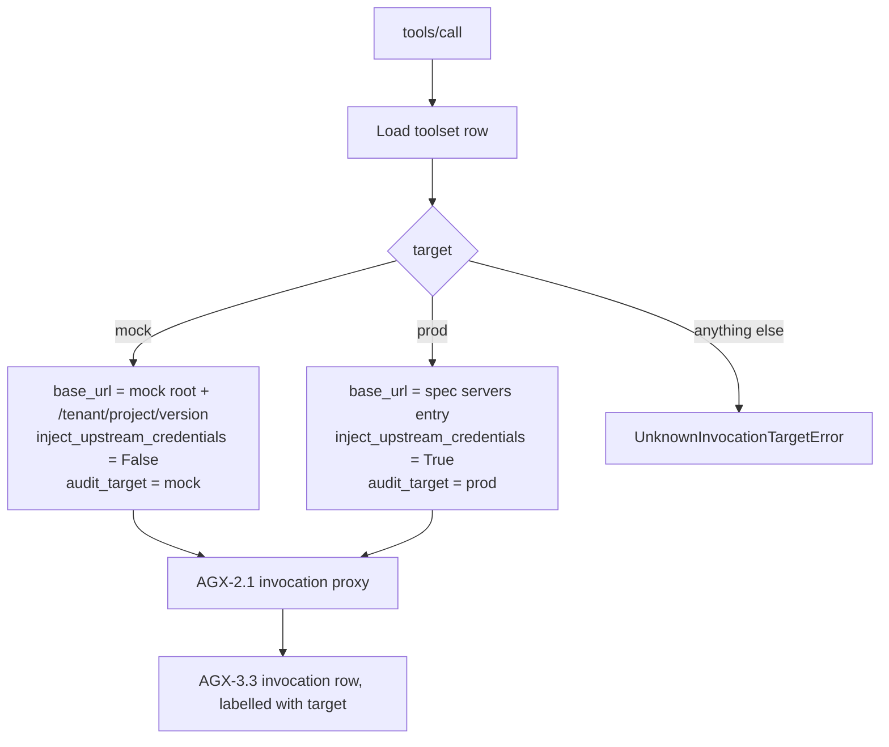

# Mock-target mode (AGX-2.4)

**Ticket:** AGX-2.4 ([#4536](https://github.com/apiome/apiome/issues/4536)).
Module: [`apiome_mcp.mock_target`](../src/apiome_mcp/mock_target.py).

A tenant toolset (`apiome.agent_toolsets`, AGX-1.2 / [#4530](https://github.com/apiome/apiome/issues/4530))
carries a `target` column with two values:

| `target` | `tools/call` goes to | Upstream vault (AGX-2.2) | Audit label (AGX-3.3) |
|---|---|---|---|
| `prod` | the spec's real upstream server | injected server-side | `prod` |
| `mock` | the hosted SIM mock for that version | **not consulted** | `mock` |

`mock` is the **agent sandbox**. The agent sees the identical toolset — same tool
names, same input schemas, same MCP endpoint — but every invocation lands on
`apiome-mock` instead of a production API. That is what makes a first demo, or a CI
job that exercises an agent, safe to run: there is nothing upstream to break, and no
upstream credential needs to exist.

## Resolution

One pure decision per invocation, with no I/O and no cached state:

```
(agent_toolsets.target, version slugs, config) -> InvocationRoute
```



`InvocationRoute` is everything the AGX-2.1 proxy ([#4533](https://github.com/apiome/apiome/issues/4533))
needs to know about *where* a call goes:

```python
from apiome_mcp.mock_target import MockCoordinates, resolve_route
from apiome_mcp.settings import get_settings

route = resolve_route(
    target=toolset_row["target"],                       # "prod" | "mock"
    upstream_base_url=spec_server_url,                  # ignored when target is mock
    mock_public_base_url=get_settings().mock_public_base_url,
    coordinates=MockCoordinates(tenant_slug, project_slug, version_label),
)

route.base_url                      # where to send the request
route.inject_upstream_credentials   # False in mock mode — skip the vault entirely
route.extra_headers                 # X-Api-Key for a private draft mock, else empty
route.audit_target                  # "mock" | "prod", for the AGX-3.3 row
```

## Promotion path

Switching a toolset from `mock` to `prod` **requires no recompile**. The route is
resolved per invocation from the toolset row, and nothing in this module reads or
produces a tool definition — `resolve_route` takes no tool, schema, or registry
argument, and a test pins that signature. So the compiled tools (AGX-1.1) are
identical under either target, and the promotion is: let the agent practise against
the mock → validate the behaviour → flip `target` → the same toolset and the same
agent key now hit production on the next call.

## URL shape

The SIM mock serves published versions at slug coordinates
(`apiome_mock.server`, SIM-1.1):

```
{APIOME_MCP_MOCK_PUBLIC_BASE_URL}/{tenant}/{project}/{version}
```

This is the same URL `apiome-rest` publishes to the Control Panel as a version's
`mock_base_url`, so an agent and a human hit the same mock.
[`tests/test_mock_target_parity.py`](../tests/test_mock_target_parity.py) fails the
build if the two templates drift — the same guard style as
[`EFFECTIVE_POLICY.md`](EFFECTIVE_POLICY.md)'s parity test.

Configure the root with **`APIOME_MCP_MOCK_PUBLIC_BASE_URL`** (see
[`CONFIGURATION.md`](CONFIGURATION.md)); it mirrors apiome-rest's
`APIOME_MOCK_PUBLIC_BASE_URL` and is validated at startup, so a misconfigured root
fails the process rather than silently misrouting agent traffic.

## Failure behaviour

Every failure is an `InvocationTargetError` (a `ValueError`), so the proxy can map
the whole family to one MCP error:

| Error | Cause |
|---|---|
| `UnknownInvocationTargetError` | `target` is present but is neither `prod` nor `mock`. **Never** falls back to a default — routing sandbox traffic to production, or production traffic to a mock, are both wrong in ways the calling agent cannot detect. A `NULL`/blank column *is* the AGX-1.2 default (`prod`). |
| `InvalidMockCoordinateError` | A slug is empty, over-long, or contains a separator, traversal marker, whitespace, or control character. Segments are validated then percent-encoded, so a slug cannot escape the version's mount point. |
| `InvalidBaseUrlError` | A base URL is not absolute `http`/`https` with a host, or carries a query string or fragment (appending a path to one would land the path inside the query). The full SSRF/method/size rails are AGX-2.3 ([#4535](https://github.com/apiome/apiome/issues/4535)); this is only the scheme floor. |
| `MissingRouteInputError` | The chosen target's required inputs are absent (`prod` without an upstream URL; `mock` without a mock root or coordinates). |

## Credentials

In `mock` mode the AGX-2.2 vault is **not consulted at all** — `inject_upstream_credentials`
is `False` and any configured upstream URL is ignored, so a sandbox toolset is fully
functional with no upstream credential stored. A *private* (unpublished draft) mock
still needs mock-runtime auth, SIM-2.5 ([#4446](https://github.com/apiome/apiome/issues/4446)):
pass `mock_api_key=` and it is carried as `X-Api-Key` on `extra_headers`. That is a
tenant key for the mock, never an upstream credential, and it never reaches the agent.

## Status

The routing decision, its configuration, and its guards ship here. Wiring it into a
live `tools/call` is AGX-2.1 ([#4533](https://github.com/apiome/apiome/issues/4533)),
which owns request construction, vault injection, and response mapping; the
`agent_toolsets` table and its `target` column are AGX-1.2
([#4530](https://github.com/apiome/apiome/issues/4530)). Both are open at the time of
writing, so the ticket's end-to-end criterion (an agent completing a list/create flow
against the mock) is met once AGX-2.1 consumes this module.

## Related

- [`AGX_COORDINATION.md`](AGX_COORDINATION.md) — catalog MCP (MTG) vs agent invocation (AGX); do not merge the two `tools/list` contracts.
- [`CONFIGURATION.md`](CONFIGURATION.md) — `APIOME_MCP_MOCK_PUBLIC_BASE_URL`.
- [`../../apiome-mock/README.md`](../../apiome-mock/README.md) — the SIM mock runtime this mode targets.
