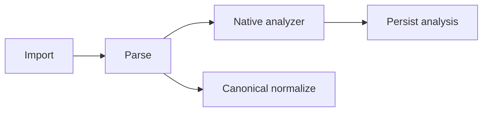

# Native-Analysis Extractors (CPDO-1.2)

> apiome#4795 — the extractors that fill the CPDO-1.1 contract
> ([payload_analysis.md](./payload_analysis.md)). Child of CPDO-EPIC-1 (#4790);
> feeds the projection manifest (CPDO-1.3) and the format-detail surfaces
> (CPDO-EPIC-2).

## Why

An import parses its source into the format's own AST, normalizes that AST into
the canonical model, and drops the AST on the floor. Everything the canonical
model has no word for exists only for the duration of one function call.

For EDI X12 the loss is not subtle. The normalizer reads
`interchange.functional_groups[0].transaction_sets[0]` — right for a canonical
model, since one interchange describes one schema — so a file carrying an 850
and a 997 in two functional groups imports as though the second were not there.
Nothing downstream can tell an interchange that had one transaction set from one
that had six.

So the AST is analysed **while it is still in hand**: after parse, before
persistence.



## Modules

| Module | Role |
|---|---|
| `app/payload_analyzer.py` | The shared machinery: `NativeNode`, the budgeted breadth-first walk, the status decision, the format-blind generic extractor, and `analyze_import` (the never-raising entry point). |
| `app/edix12_analysis.py` | The X12 extractor: interchange → functional group → transaction set → segment → element/composite. |
| `app/edix12_segment_scan.py` | CPDO-2.2's second reading of the interchange text: delimiters, segment offsets, element/component/repetition splitting. No `pyx12`, no AST. |
| `app/cobolcopybook_analysis.py` | The copybook extractor: record → group → field → 88-condition, with source lines. |
| `app/import_source.py` | The SPI: `analyzer_key`, `analyzer_version`, `analyzer_tool_versions()`, `analysis_capabilities()`, `analyze()`. |
| `app/import_source_pipeline.py` | Runs the analysis after parse and stores it after persistence. |
| apiome-db `V210__payload_analysis_capabilities_4795.sql` | The additive `capabilities` column. |

## The SPI

An adapter declares an analyzer by overriding four things; every one has a
working default, so a format with no extractor still produces a real record.

```python
class EdiX12ImportSource(ImportSource, register=True):
    analyzer_key = "edix12"
    analyzer_version = "1.0.0"

    def analyzer_tool_versions(self): ...     # {"pyx12": "4.0.0"}
    def analysis_capabilities(self): ...      # what it models, and does not
    def analyze(self, native_ast, *, source): ...
```

`analyze` must be **deterministic** — the same AST and bytes must produce the
same document, since an identical re-analysis is recognised by content
fingerprint rather than appended — and must put observed payload values only in
a node's `value`, never in `attributes`. The value-visibility policy governs the
former and cannot govern the latter.

## `NativeNode` and the budget

Analyzers do not build `AnalysisNode` trees. If they did, a large interchange
would materialise hundreds of thousands of validated models before anything
trimmed them: the budget would bound what is *stored* without bounding what is
*built*. `NativeNode` is the cheap description an analyzer emits, and its
children may be a **callable** so a subtree is realised only if the budget will
admit it.

`build_analysis_tree` walks those descriptions **breadth-first**, admitting
whole levels in source order until the node budget runs out. That ordering is
why an X12 record keeps every envelope even when its elements are dropped:
envelopes are the top of the tree, and the top of the tree is what a
breadth-first budget keeps.

Counting what was dropped means visiting it, so visiting is capped too
(`MAX_VISITED_NODES`, 50 000). Past that cap the record carries an
`analysis.visit_budget_exhausted` warning and its `droppedNodeCount` is a floor
— a stated lower bound rather than a comfortable number.

## Status, decided in one place

`build_analysis_document` is the only thing that decides a record's status, so
every extractor reports absence and partiality identically:

| Condition | Status | Reason |
|---|---|---|
| No source bytes to name | `unavailable` | `no_source_captured` |
| The analyzer produced nothing | `unavailable` | `unsupported_format` |
| The budget dropped something | `partial` | `bounds_exceeded` |
| A `warning`/`error` about an unmodelled construct | `partial` | `unsupported_format` |
| Otherwise | `available` | — |

An `info` warning is commentary and leaves the record `available`: it describes
*how* something was described, not that something is missing.

## The X12 extractor

```text
interchange            ISA — delimiters, control number, sender/receiver
  functional_group     GS  — functional id, version, group control number
    transaction_set    ST  — set id (850/810/…), transaction control number
      segment          BEG, N1, PO1 … in position order
        element        BEG01 … with presence and length
        composite      BEG05 — with its component sub-elements
```

**Every group and transaction set is kept.** The node budget is raised, if
needed, to at least the number of envelope nodes the interchange contains, so
the guarantee holds by construction rather than by the shape of a typical file.

**Composites are modelled, not flattened.** `pyx12` reports a composite's
components as separate values sharing one element position (refdes
`CLM05-1`/`CLM05-2`); they are regrouped under a `composite` node.

**Envelope identity sits in `attributes`; payload values sit in `value`.** The
sender, receiver, control numbers and delimiters label the tree and are already
what the canonical model keeps in its `x12_envelope` extras. Element values are
payload, and stay where the visibility policy can reach them.

### The second reading (CPDO-2.2, #4798)

`pyx12` answers questions about *values*, and three facts it cannot answer are
read from the interchange text instead by `app/edix12_segment_scan.py` and
**aligned** to the AST segment by segment: where a segment sits
(`offset`/`length`/`line`), which element positions were written and left empty,
and how a repeated value divides. Both readings are in source order, so aligning
them is a match on segment ids; a single unmatched id abandons the scan whole and
the record falls back to path-and-ordinal locations, because half-aligned
positions would put a reader in front of the wrong bytes.

That adds, per record: exact source ranges on every envelope and segment; element
nodes for positions written and left empty (`value_present` true, `value_length`
zero), with `elementPositionCount` recorded beside the parser's `elementCount`;
`repetition` children under an element the declared repetition separator splits;
`repeatIndex`/`repeatCount` per segment within its transaction set; the component
and repetition separators, `ISA09`/`ISA10`/`ISA14`/`ISA15` (with the usage
indicator's word), `GS04`/`GS05`/`GS07`, `ST03`, and the `IEA01`/`GE01`/`SE01`
control totals beside the counts observed. `ISA11` is honoured as a repetition
separator only from version `00501` — at `00401` that position is an ordinary
code, and splitting on it would invent occurrences.

A control-total mismatch is recorded, never reconciled, and never makes the
record `partial`: the analysis is complete, and the status vocabulary means "what
the analyzer could not do" rather than "what the interchange got wrong".

An interchange carrying more than one transaction set gets an `info`
`x12.canonical_projection_subset` warning naming the set the canonical model was
derived from and how many it was not, so the conversion's scope is stated rather
than left to be inferred from two screens.

Declared unsupported for every record: `x12.hl_hierarchy` (HL segments are all in
the tree, their nesting is not inferred; an interchange carrying them gets an
`info` warning), `x12.ta1_acknowledgement` and `x12.iea_trailer` (dropped by the
parser before the extractor sees the AST — a `TA1` the source carried is named in
an `info` warning, and the trailers' control totals are recovered),
`x12.implementation_guide_validation`.

Declared **per record**, supported only where the scan aligned:
`x12.byte_offsets`, `x12.empty_elements`, `x12.repeating_elements`,
`x12.envelope_control_totals`. The adapter's `analysis_capabilities()` — the
format-wide statement CPDO-2.4's registry publishes ahead of an import — declares
all four supported, because the analyzer produces them for any interchange it can
read.

## The COBOL copybook extractor

```text
record            01 CUSTOMER-RECORD
  group           05 CUSTOMER-NAME
    field         10 FIRST-NAME  PIC X(20)
  field           05 STATUS      PIC X
    condition     88 ACTIVE      VALUE 'A'
```

Attributes carry `level`, `picture`, `usage`, `occursMin`/`occursMax`,
`dependingOn` and the 88-level `conditionValue` — and a clause the field did not
carry is **omitted** rather than recorded as `null`, so a key that is present was
observed.

**Source lines are recovered.** The parsed tree carries no positions, so
`iter_definition_lines` re-reads the source and the extractor matches names to
lines in traversal order; a name that repeats (`FILLER`, most often) resolves to
its own occurrence. A field that cannot be placed keeps its structural location
and loses only its line — a wrong line number would be worse than none.

**Unmodelled clauses are found by scanning the source**, because a `REDEFINES`
the parser ignored leaves no trace in the parsed tree at all. Each one found is a
`warning`, which makes the record `partial` with a stated reason; a copybook that
uses none of them is `available`, and means it. `REDEFINES`, level-66 `RENAMES`,
`COPY` and `COPY … REPLACING` are scanned for; `VALUE` on ordinary fields,
sign/synchronized clauses, computed storage lengths and clauses continued onto a
following line are declared in capabilities with nothing to scan for.

## The generic extractor

Every other format gets the format-blind walk: mappings become `object` nodes,
sequences `array`, leaves `scalar`, and anything else an `opaque` leaf naming its
Python type (never its `repr`, which is neither deterministic nor safe).
Dataclasses and Pydantic models are described as objects, so a typed native AST
reads as usefully as a parsed JSON document. Its capabilities declare
`generic.format_semantics` unsupported, so a reader looking for an X12 envelope
in such a record learns that its absence is the analyzer's boundary.

## Import integration

The analysis runs between **parse** and **normalize**, and is stored after
**persistence** — it is scoped to a revision, and the revision is what
persistence creates.

Nothing about it can fail an import:

* an analyzer that raises becomes a declared `failed` record naming the analyzer
  (the failure message carries the exception *type* only — a parser error quotes
  the source span that broke it, and that span may be a credential);
* an analyzer that overruns the intake stage wall clock is degraded the same way;
* a store fault leaves the committed import alone and emits
  `PAYLOAD_ANALYSIS_STORE_FAILED`.

Every outcome is explicit. The job emits `PAYLOAD_ANALYZED` (at `warn` when the
status is `failed`) and, on a successful write, `PAYLOAD_ANALYSIS_STORED`; the
completed job's summary carries an `analysis` block with status, analyzer, node
counts, the unsupported list, and whether it was stored.

A **re-import** is safe to run repeatedly. A catalog re-import under the same
version label reuses its revision, and an identical analysis is recognised by
content fingerprint rather than appended; changed source appends the next
sequence and the superseded record stays readable for anything that cited it.

## What is hashed

`source_hash` names the bytes the analyzer actually read: the intake as
submitted, or the remote-`$ref`-resolved text when resolution rewrote it, or the
uploaded archive bytes for a fileset. Under an enforcing secret-scrub policy
(IXH-1.4 / MFI-29.6) the copy the catalog *stores* has its credential values
replaced, so the two are not always byte-identical. The hash names what was
analysed, because that is the only claim it can honestly make.
