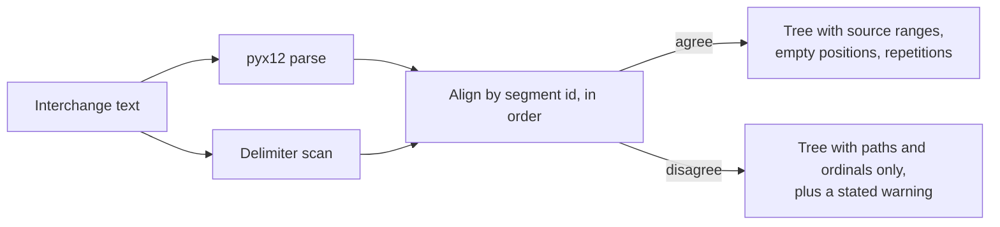

# EDI X12 interchange and transaction-set inspector (CPDO-2.2, #4798)

> Builds on the **Format details** tab ([CATALOG_FORMAT_DETAILS.md](./CATALOG_FORMAT_DETAILS.md),
> CPDO-2.1 #4797) and the payload analysis it reads
> ([payload_analysis.md](../../apiome-rest/docs/payload_analysis.md) CPDO-1.1 #4794,
> [payload_analyzers.md](../../apiome-rest/docs/payload_analyzers.md) CPDO-1.2 #4795).
> Parallel with the COBOL copybook inspector (CPDO-2.3, #4799).

## Why

CPDO-2.1's tree is format-blind by design: any analyzer's nodes become rows, any analyzer's
attributes become key/value pairs. That is the right floor and, for an interchange, not the ceiling.
An X12 file is an *envelope* — declared delimiters, control totals that either agree with the body or
do not, functional groups carrying transaction sets identified by number and version, segments that
repeat, element positions that were written and left empty. Reading those off generic rows is work a
reader should not have to do, and three of them were not in the record at all:

| Fact | Before CPDO-2.2 |
|---|---|
| Where a segment sits in the file | Not recorded — `pyx12` exposes no positions, so nodes located by envelope path and ordinal |
| Which element positions were **written and left empty** | Not recorded — `values_iterator` skips an element with no value, so `BEG*00*SA*PO-1**20260115` arrived as four elements and `BEG04` was indistinguishable from absent |
| How a repeated element divides | Not recorded — the whole repeated run arrived as one string |

## The second reading

All three are still in the source text, which the analysis already holds in order to hash it.
`app/edix12_segment_scan.py` reads them from there: a delimiter-aware scan with **no `pyx12` import
and no AST**, so it is a second, independent reading of the same bytes rather than a
re-interpretation of the first. `app/edix12_analysis.py` then **aligns** the two.

**The alignment is the safety property.** Both readings are in source order, so walking them
together is a match on segment ids and nothing more. A single unmatched id abandons the whole scan:
half-aligned positions would put a reader in front of the wrong bytes, which is worse than putting
them in front of none. A record therefore either carries positions that were **checked against the
parse** or carries none — and its `capabilities` block says which, per record.

Delimiters come from the interchange's own ISA header, read by *counting element separators* rather
than by the fixed 106-character layout. `ISA11` is honoured as a repetition separator only from
version `00501`: at `00401` that position is the Interchange Control Standards Identifier
(conventionally `U`), and splitting on it would invent occurrences from every value containing a `U`.

## What the pane shows

| Piece | Where |
|---|---|
| The scanner (delimiters, offsets, splitting) | `apiome-rest/src/app/edix12_segment_scan.py` |
| The extractor that aligns and emits the tree | `apiome-rest/src/app/edix12_analysis.py` |
| Every UI derivation | `apiome-ui/src/app/utils/catalog-x12-analysis.ts` |
| The panel | `apiome-ui/.../catalog/CatalogX12InspectorPanel.tsx` |
| Range highlighting in the raw viewer | `apiome-ui/.../catalog/CatalogSourceViewer.tsx` |
| Tests | `test_edix12_segment_scan.py`, `test_edix12_analysis.py`, `catalog-x12-analysis.test.ts`, `catalog-x12-inspector-panel.test.tsx`, `catalog-source-viewer-range.test.tsx` |

### Envelope controls

Sender, receiver, control number, date and time, and the **usage indicator spelled out** — `T` and
`P` is the difference between a test file and a customer's real claims, and no reader should have to
look the code up. An indicator the analyzer does not recognise renders as `Unrecognised code` rather
than as a guess.

### Declared delimiters

All four, each with its code point (`* U+002A`), so a look-alike character is identifiable. An
interchange at a version that defines **no** repetition separator says exactly that — which is a
different statement from "the record does not carry one", and the pane keeps them apart.

### Control totals: declared versus observed

`IEA01`, `GE01` and `SE01` declare how many functional groups, transaction sets and segments the
sender counted. The trailer *segments* are removed by the parser before the analysis runs, but what
they declared is recovered from the scan and recorded beside the observed count, so an interchange
that disagrees with itself can be seen to.

Three rules:

- a **missing** declaration is not agreement — an interchange truncated before its `IEA`, or a
  trailer whose count could not be read as a number, has nothing to disagree with, and shows as
  "declared nothing readable" rather than as a tick;
- a mismatch does **not** make the record `partial`. The analysis is complete; the *source* is what
  is odd, and the analysis-status vocabulary means "what the analyzer could not do", not "what the
  interchange got wrong";
- `SE01` counts `ST` through `SE` inclusive, so the comparable observed figure
  (`envelopeSegmentCount`) includes both envelope segments.

### Every group and every transaction set

The canonical model reads the first functional group's first transaction set, because a canonical
model describes one schema. The inspector lists **all** of them, with the set ids, control numbers,
`GS08` versions and `ST03` implementation-convention claims they declare, flags the one the
conversion came from, and states the difference in words:

> The canonical model and the converted OpenAPI are derived from transaction set 850 (0001) alone.
> This interchange carries 2 transaction sets across 2 functional groups; the other 1 is described
> here and nowhere else.

An interchange with one transaction set gets the opposite sentence, so the reader always knows which
case they are in rather than inferring it from a missing warning.

### Repeated segments and empty elements

Both are stated wherever they are rendered:

- a repeated segment carries `repeatIndex`/`repeatCount` and a label — `HL (3 of 4)` — numbered
  **within its transaction set**, which is the scope a reader reads a segment in. Each transaction
  set's table also summarises which of its segment ids repeat and how often, read from the segments'
  own `repeatCount` so a bounded analysis reports what the source had rather than what survived;
- an element position written and left empty is a node with `valuePresent: true` and
  `valueLength: 0`, badged **Present, empty** on its row. A position the source never wrote is not a
  node at all;
- a repeated element carries its occurrences as `repetition` children and states its count, instead
  of one run-on value.

**Four value states, four sentences.** CPDO-2.1 already kept withheld / observed-empty / absent /
nothing-recorded apart; CPDO-2.2 made the first two reachable for X12 at the same time, so the
distinction had to become load-bearing rather than theoretical. The store no longer marks a
zero-length observed value as `redacted` under the `structural` policy — there was nothing in it to
withhold, and flagging it would make an empty element indistinguishable from a suppressed one. Under
`none` it *is* counted, because stripping the presence fact does withhold something.

### Source ranges

Every interchange, group, transaction set and segment carries the exact `offset`/`length`/`line` it
was read from, so selecting a segment **highlights those characters** in the Source & Code tab
rather than centring a line. That distinction is the whole point for X12: an interchange is routinely
written on one line, where a line jump reveals the file and points at nothing.

The range is a *refinement* of the line jump and never a replacement. The viewer reveals the line
first, so an editor with no model — the offline `<pre>` fallback — still lands the reader somewhere
real. Elements locate by path and ordinal: the scan positions **segments**, and the pane says so
rather than offering a jump it cannot honour.

The bytes still stream through the pre-existing `/api/catalog/{id}/source` proxy. This work adds no
path to raw content and changes no authorization.

## Observed, never validated

An inspector showing segment ids, element positions and version codes looks exactly like a
conformance report. It is not one, and the pane says so on **every** X12 record without exception:

> Everything here is what the interchange itself declared. No 4010 or 5010 implementation guide was
> consulted, no segment or element was checked against one, and an ST03 implementation convention
> reference is recorded as the sender's claim rather than as a verified fact.

`x12.implementation_guide_validation` stays in the analyzer's *unsupported* list, so CPDO-2.4's
capability panel says the same thing from its own source of truth.

## Redaction

The inspector reads **envelope structure only** — ids, control numbers, delimiters, counts, positions
and repeat counts, all of which live in a node's `attributes`. Every observed element, component and
repetition value lives in `value`, which is the only field `apply_value_visibility` governs. A record
stored at `full` therefore changes nothing the inspector renders, and a test asserts exactly that.

The two node kinds CPDO-2.2 added (`repetition`, and composites now reachable on more segments) are
redacted like any other value-bearing node; a new kind that quietly escaped the policy would be a
disclosure surface.

## Capability declaration

Capabilities are recorded **per record** (CPDO-1.2), and CPDO-2.2 is the reason that matters. Four
constructs are readable only from an interchange text the analysis could align to its parse:

`x12.byte_offsets` · `x12.empty_elements` · `x12.repeating_elements` · `x12.envelope_control_totals`

A record whose alignment failed declares all four **unsupported**, because for that record they are.
The format-wide answer — what the analyzer models given an interchange it can read — is the adapter's
`analysis_capabilities()`, which is what CPDO-2.4's registry publishes ahead of any import; its
`edix12` entry moved to `byte_offsets` source-location quality in registry version `2`.

## What this does not do

- It does not validate against an implementation guide, and does not intend to.
- It does not infer `HL` hierarchy. Every `HL` segment is in the tree, in order; the nesting its
  elements encode is not built, and an `info` warning says so.
- It does not model `TA1` acknowledgements or the `SE`/`GE`/`IEA` trailers as tree nodes. `TA1`
  segments the parser drops are named in a warning; the trailers' control totals are recovered.
- It does not describe conversion beyond naming the transaction set the projection came from. What
  the projection keeps or drops is the **Convert to OpenAPI** graph's job (CPDO-3.1, #4801).
