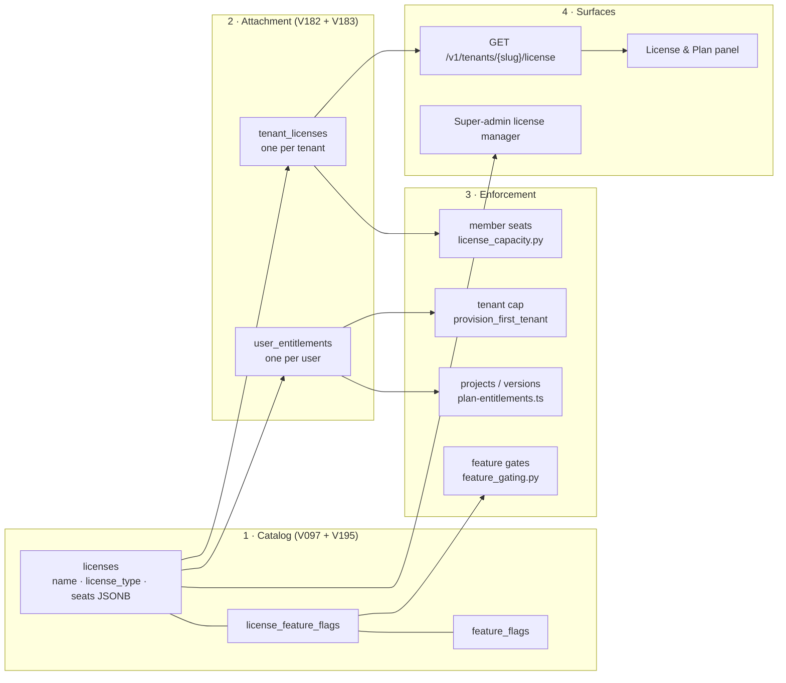

# Licensing model (platform reference)

The canonical description of how licensing works in Apiome, and of who owns which part of it.
Written for OLO-5.6 (#4216) to reconcile three overlapping strands of work:

| Strand | What it was | Where it landed |
|---|---|---|
| **V097 license catalog** | plans (Free/Paid/Sponsor), capacity JSON, feature flags, `user_entitlements` | shipped, `apiome-db/scripts/V097__license_catalog_feature_flags_and_user_t.sql` |
| **#64 "Add a license table"** | a license table carrying project / publish / AI limits | the table already existed (V097); the three limits it asked for were added as catalog keys in **V195** — closed, see [Reconciliation record](#reconciliation-record) |
| **#3484 [Epic] Platform Foundations & Licensing** | tenant licensing for commercial tiers | still open — owns **paid plans, billing and upgrades**; OLO-EPIC-5 (#4210) shipped the free tier and the enforcement seams beneath it |

> **In one line:** a **catalog** of plans (V097 + V195) is **attached** to a tenant (V182/V183),
> **enforced** at the write paths, and **reported** through one REST surface and one settings panel —
> while a separate **user entitlement** answers only "how many tenants may this person create?".

For the table-level view (columns, FKs, invariants) see
[`apiome-db/docs/LICENSING_ER.md`](../apiome-db/docs/LICENSING_ER.md).

---

## 1. Two licensed subjects

Licensing has two subjects, and confusing them is the single most common mistake in this area.

| | **User entitlement** | **Tenant license** |
|---|---|---|
| Table | `apiome.user_entitlements` (V071, catalog-linked in V097) | `apiome.tenant_licenses` (V182, OLO-5.1) |
| Answers | *How many tenants may this person create?* | *What may this organization do?* |
| Cardinality | one row per user | at most one row per tenant (`tenant_id` is `UNIQUE`) |
| Consulted when | creating a tenant | everything the tenant does afterwards |
| Plan source | `license_id` → `licenses` (legacy rows keep raw limit columns) | `license_id` → `licenses` |

Both point at the **same** `apiome.licenses` catalog; they license different things. Keeping both is
deliberate, not transitional: `user_entitlements` predates tenant licensing and has live consumers
(V071/V097, the signup path), and a user-scoped cap cannot be expressed as a tenant-scoped one.

---

## 2. The chain



### 2.1 Catalog — what plans exist

`apiome.licenses` is the plan catalog. Every capacity limit is a key in the `seats` JSONB so new
limits need no schema change (V097's explicit design). The canonical key set, after **V195** (#64):

| Key | Subject | Meaning | Free | Paid | Sponsor |
|---|---|---|---|---|---|
| `max_tenants` | user | tenants the holder may create | 1 | 5 | 20 |
| `max_users_per_tenant` | tenant | member seats | 5 | 25 | 100 |
| `max_projects` | user (see [§3](#3-where-each-limit-is-enforced)) | projects | 1 | 10 | −1 |
| `max_versions` | user (see [§3](#3-where-each-limit-is-enforced)) | published versions | 3 | 50 | −1 |
| `max_ai_requests` | tenant | AI-assistant requests | 0 | 1000 | −1 |

`-1` (any negative value) means **unlimited**; a **missing** key falls back to the Free-tier default
(1 project / 3 versions / 0 AI requests / 5 seats). Operator edits made through the admin license
manager are never clobbered by migrations — V195 fills keys in only where absent.

Bundled features per tier (`license_feature_flags`), accumulated across migrations:

| Tier | Flags | Seeded by |
|---|---|---|
| Free | `designer` | V097 |
| Paid, Sponsor | `designer`, `paths`, `ai_assistant`, `repositories` | V097 |
| Paid, Sponsor | `primitives-registry` | V116 |
| Paid, Sponsor | `scribe`, `slate`, `hosted` | V191 |
| Paid, Sponsor | `authoring` (umbrella) | V192 |

Adding a commercial surface therefore means: seed its flag row, bundle it onto Paid/Sponsor, and gate
the surface — Free gets it only via an explicit per-tenant or per-user override.

### 2.2 Attachment — who holds which plan

* **Tenants.** `apiome.tenant_licenses` (V182) holds one row per tenant. V183 makes the attachment
  unconditional: `apiome.attach_free_license(tenant_id)` is the one service function that attaches
  Free, an `AFTER INSERT` trigger on `tenants` calls it for *every* create path in the insert's own
  transaction, and V183 backfilled every pre-existing tenant. It is idempotent, so it never
  downgrades a tenant that already holds a plan.
* **Users.** `user_entitlements` rows are seeded at signup (`insertFreeTierEntitlements`,
  `apiome-ui/lib/db/oauth-signup.ts`) and can be re-pointed at another catalog plan by the
  super-admin license manager.

Reading a tenant's plan tolerates a missing row: every consumer falls back to the Free defaults, so
enforcement can never strand a tenant that predates the backfill.

### 2.3 Enforcement — where limits bite

See [§3](#3-where-each-limit-is-enforced) for the full grid. Two conventions hold everywhere:

* **Structured, stable error codes.** Blocked callers get a machine-readable `code`
  (`license-seats-exhausted`, `tenant-cap-reached`) so the UI renders upgrade guidance instead of a
  raw API error (`apiome-ui/src/app/ade/dashboard/tenants/licenseErrors.ts`).
* **One accounting source.** Seat *reporting* and seat *enforcement* call the same helpers
  (`license_capacity.member_seat_limit`, `Database.count_member_seats_in_use`), so the panel can
  never show capacity the guard will refuse.

Seat accounting: `active` and `pending` memberships occupy a seat (an outstanding invite reserves
one); `suspended` members (V121) and soft-deleted users do not.

### 2.4 Surfaces — how it is read and administered

| Surface | Where | Who |
|---|---|---|
| `GET /v1/tenants/{tenant_slug}/license` (OLO-5.4) — plan, seats used/max, quotas, effective features | `apiome-rest/src/app/license_routes.py` | any member holding `billing:view` (all built-in roles) |
| **License & Plan** panel — plan card, seat meter, feature list, upgrade CTA stub | `apiome-ui/src/app/ade/dashboard/tenants/TenantLicensePanel.tsx` | tenant administration panel |
| Member/invite screens surfacing seat usage and 5.3 errors (OLO-6.3) | `apiome-ui/src/app/ade/dashboard/tenants/` | tenant admins |
| Super-admin license manager — CRUD plans, flags, flag packages; assign plans **to users** | `apiome-ui/src/app/admin/dashboard/licenses/` | super-admin |

The upgrade CTA is deliberately a stub: there is no checkout, because billing is #3484's.

---

## 3. Where each limit is enforced

| Limit | Subject counted | Enforced by | On exceed |
|---|---|---|---|
| `max_users_per_tenant` | active + pending members of the tenant | `apiome-rest/src/app/license_capacity.py` (member add / invite / reinstate) | `403` `license-seats-exhausted` |
| `max_tenants` | tenants the user belongs to | `Database.provision_first_tenant` + `onboarding_routes` (REST); `getMaxTenantsForUser` gates the UI affordance | `403` `tenant-cap-reached` |
| `max_projects` | projects across **all tenants the user belongs to** | `apiome-ui/lib/db/plan-entitlements.ts` (`getPlanBlockMessageForNewProject`), called from `helper.ts` / `import-transaction.ts` | write refused with a plan message |
| `max_versions` | versions across all tenants the user belongs to | same module (`getPlanBlockMessageForNewVersion`) | write refused with a plan message |
| `max_ai_requests` | — | **not enforced** — stored, reported and admin-editable only; there is no usage meter yet | n/a |
| Feature flags | tenant / user | `apiome-rest/src/app/feature_gating.py`, `Database.tenant_has_feature_flag`; UI via `lib/db/feature-entitlements.ts` | `403` |

Two intentional asymmetries, called out so they are not "fixed" by accident:

1. **Project and version quotas are user-scoped, not tenant-scoped.** They count a user's projects
   across every tenant they belong to, sourced from `user_entitlements` (preferring the joined
   catalog `seats` over the mirrored columns, which can lag). The tenant license surface *reports*
   the tenant plan's `max_projects` / `max_versions` for display, but does not enforce them. Moving
   these quotas to tenant scope is a #3484 decision — it changes what customers may do.
2. **The tenant cap reads the raw column, not the catalog.** `provision_first_tenant` and the UI's
   `getMaxTenantsForUser` both read `user_entitlements.max_tenants` directly (Free default when the
   row is missing) and deliberately ignore the seats JSONB, so the UI affordance and the REST guard
   agree. `getEntitlements` (project/version path) prefers the catalog. Any change here must be made
   in both places at once.

**Operator kill switch.** `settings.license_enforcement_enabled` (env
`APIOME_LICENSE_ENFORCEMENT_ENABLED`, default `true`) turns the **member-seat** guard into a
pass-through without a redeploy, restoring pre-OLO-5.3 behaviour. It does **not** affect the
tenant-cap check in first-tenant provisioning, which is transactional.

---

## 4. Feature composition

A tenant's effective feature set (V097, unchanged by V182):

```
license_feature_flags(plan)  ∪  tenant_feature_flags(enabled = true)
                             ∖  tenant_feature_flags(enabled = false)
```

with `user_feature_flags` applying per-user grant/revoke on top, and a flag whose global master
switch (`feature_flags.enabled`) is off never effective for anyone. `tenant_licenses` only decides
*which plan* feeds the left-hand side. The REST surface reports which layer decided each flag via
`source` (`license` | `tenant-override`); per-user overrides are excluded there by design — it is the
tenant's view, not one member's.

---

## 5. Ownership boundary

### Shipped by OLO-EPIC-5 (#4210) — free tier + seams

| Item | Ticket | Artifact |
|---|---|---|
| Tenant→license attachment model | OLO-5.1 (#4211) | V182 `tenant_licenses` |
| Auto-issue Free on tenant creation + backfill | OLO-5.2 (#4212) | V183 trigger + `attach_free_license` |
| Seat and tenant-cap enforcement with structured 403s | OLO-5.3 (#4213) | `license_capacity.py`, `provision_first_tenant` |
| License REST surface | OLO-5.4 (#4214) | `license_routes.py` |
| License panel in tenant settings | OLO-5.5 (#4215) | `TenantLicensePanel.tsx` |
| Plan quota limits (projects / versions / AI) | #64 | V195 catalog keys + `license_quotas` |
| Member management ↔ license alignment | OLO-6.3 (#4220) | seat usage on member/invite screens |
| This reconciliation | OLO-5.6 (#4216) | this document |

### Remaining in #3484 — paid plans, billing, upgrades

| Gap | Why it is not here |
|---|---|
| **No tenant plan-change path.** Nothing writes `tenant_licenses` except `attach_free_license`; there is no API or admin screen to move a tenant onto Paid/Sponsor. | A plan change is a commercial transaction, not a seam. |
| **No billing/checkout.** The upgrade CTA is a stub; no payment provider, subscription, invoice, proration or dunning exists. | #3484 scope. |
| **No AI usage metering.** `max_ai_requests` is stored and reported but nothing counts requests against it. | Needs a metering store + reset window (monthly), i.e. billing-period semantics. |
| **No plan history.** `tenant_licenses` keeps only the current attachment (`notes` records its provenance); upgrades/downgrades leave no audit trail. | Wanted for billing reconciliation, not for the free tier. |
| **Project/version quotas are user-scoped.** See [§3](#3-where-each-limit-is-enforced). | Re-scoping changes entitlements customers already have. |
| **Sponsor issuance is manual.** Sponsor exists in the catalog with no workflow to grant it. | Depends on the plan-change path above. |

---

## Reconciliation record

**#64 "Add a license table" — closed, absorbed.** The table #64 asked for already existed as the
V097 catalog (`licenses` + `license_feature_flags` + `user_entitlements`), and OLO-5.1 added the
missing half — the tenant attachment. The substance of #64 that was genuinely absent was its three
limits: project count, publish/version count, and AI functionality. `max_projects` and
`max_versions` already had enforcement code but no seeded values, so every tier silently fell back
to the Free defaults (a paid plan granted no more than a free one); `max_ai_requests` did not exist.
**V195** populated all three per tier and documented the canonical key set on the `seats` column, so
#64 closes as *implemented* — its schema by V097 + V182, its limits by V195 — not as superseded.
No new table was added, by design: capacity lives in `seats` JSONB precisely so new limits need no
migration to the schema.

**#3484 [Epic] Platform Foundations & Licensing — stays open.** OLO-EPIC-5 delivered the parts of
#3484 that a free tier needs: the tenant licensing tables, default issuance, enforcement of seats
and tenant caps, and read surfaces. What remains under #3484 is everything commercial — paid plan
assignment, billing, upgrades, and AI metering — as listed in [§5](#5-ownership-boundary). #3484's
own diagram (tenant → license → project quotas / publish limits / AI caps) is now realized in
storage and reporting for all three, and in enforcement for seats, tenants, projects and versions.

---

## References

* **Migrations** — V071 (`user_entitlements`), V097 (catalog + flags), V098 (flag packages),
  V182 (`tenant_licenses`), V183 (auto-issue Free + backfill), V195 (quota keys).
* **REST** — `apiome-rest/src/app/license_routes.py`, `license_capacity.py`, `feature_gating.py`,
  `onboarding_routes.py`.
* **UI** — `apiome-ui/src/app/ade/dashboard/tenants/TenantLicensePanel.tsx`,
  `apiome-ui/lib/db/plan-entitlements.ts`, `lib/db/entitlement-limits-from-license-seats.ts`,
  `src/app/admin/dashboard/licenses/`.
* **Data model** — [`apiome-db/docs/LICENSING_ER.md`](../apiome-db/docs/LICENSING_ER.md).
* **Issues** — #4210 (OLO-EPIC-5), #4211–#4216 (OLO-5.1–5.6), #64, #3484, #4220 (OLO-6.3).
