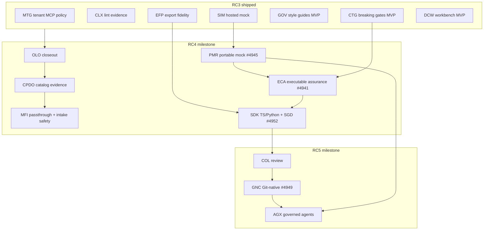

# PLAN — Next Features for RC4

> **Status:** Execution plan (updated 2026-07-22 after backlog triage)  
> **Audience:** release planning for **Apiome 07-2026 RC4**  
> **Sources:** open GitHub issues on `apiome/apiome` (+ Designer issues on `apiome/private-suite`), `private-suite/docs/roadmaps/ROADMAP_NEXT_PRODUCT_SEQUENCE.md`, `ROADMAP_FINAL_RC2.md`, and completion evidence (MTG / CLX / EFP / SIM / GOV / CTG / DCW).  
> **GitHub milestones:** [RC4](https://github.com/apiome/apiome/milestone/1) · [RC5](https://github.com/apiome/apiome/milestone/2) · [Future](https://github.com/apiome/apiome/milestone/3)

---

## 1. Assessment summary

| Metric | Count | Notes |
|---|---:|---|
| Open issues (`apiome/apiome`) | **823** | Was ~841 before triage; −30 closed, +12 new epics |
| Milestone coverage | **100%** | Every open issue is on RC4, RC5, or Future |
| `mvp` / `v2` label coverage | **100%** | No open issue lacks an MVP/V2 band label |
| [RC4](https://github.com/apiome/apiome/milestone/1) open | **79** (~78 `mvp`) | Critical path for this release |
| [RC5](https://github.com/apiome/apiome/milestone/2) open | **124** (~83 `mvp`) | COL / GNC / AGX and near-term leftovers |
| [Future](https://github.com/apiome/apiome/milestone/3) open | **620** | Long-tail MFX/MFI, conceptual backlog, true v2 |
| Dominant Future backlog | MFX + MFI long-tail | Emitters/adapters — not RC4 |

**Verdict:** RC3 closed the *evidence and governance substrate* (lint posture, export fidelity, tenant MCP policy). Backlog triage then made the remaining work schedulable. RC4 converts that substrate into **honest catalog conversion evidence**, **portable/executable contracts**, and the **first paid client artifacts (SDKs)** — without absorbing the MFX/MFI long tail.

### 1.1 Ticket triage completed (2026-07-22)

Housekeeping that Phase 0 of this plan called for is **done**:

| Action | Result |
|---|---|
| Create milestones | **RC4**, **RC5**, **Future** created and assigned to all open issues |
| Fill missing `mvp` / `v2` labels | Applied across the backlog (0 unlabeled remaining) |
| Create missing epics | **ECA** #4941–#4944 · **PMR** #4945–#4948 · **GNC** #4949–#4951 · **SGD** #4952 |
| Close completed umbrellas/epics | SIM #4411, MTG #4759, GOV-EPIC-2 #4425, CTG-EPIC-1 #4459, RC1 Phases 0–3 (#3603–#3606) |
| Close superseded duplicates | 22 conceptual `[Epic]` tickets replaced by modern roadmaps (mock/SDK/COL/CTG/GOV/MFI-MFX) |

**Closed as completed (MVP shipped):**

| # | Title |
|---|---|
| 4411 | [SIM] Hosted Mock Servers & Portal Try-It Console (umbrella) |
| 4945 | [PMR] Portable Mock Runtime (umbrella) — all nine issues #4741–#4749 shipped |
| 4946–4948 | PMR-EPIC-1…3 |
| 4759 | [MTG] MCP Configurability in Tenants (umbrella) — leftover: #4764 v2 |
| 4425 | [GOV-EPIC-2] Governance UI |
| 4459 | [CTG-EPIC-1] Breaking-Change Semantics |
| 3603–3606 | RC1 Phases 0–3 |

**Closed as duplicate / superseded (representative):** #956, #1005, #1011, #1126–#1144, #1150–#1169, #1294, #1318–#1319, #1331, #1372, #1384, #1410, #1422, #1438, #1478, #1737 — each comments pointing at the owning modern umbrella (SIM/PMR, SDK/SGD, COL, CTG/ECA, GOV/CLX, MFI/MFX).

**New epic parents (use these in boards and PR links):**

| Track | Umbrella | Child epics |
|---|---|---|
| Executable contracts | [ECA #4941](https://github.com/apiome/apiome/issues/4941) | #4942 Foundation · #4943 Runners/CI · #4944 Evidence/Gates |
| Portable mock | [PMR #4945](https://github.com/apiome/apiome/issues/4945) — ✅ complete | #4946 Runtime · #4947 Fixtures · #4948 CI/attestation (all closed) |
| Git-native collab | [GNC #4949](https://github.com/apiome/apiome/issues/4949) (RC5) | #4950 Sync · #4951 Team flow |
| SDK compatibility | [SGD #4952](https://github.com/apiome/apiome/issues/4952) | owns #4735 (MVP) / #4736 (v2) |

### 1.2 What RC3 effectively shipped (do not re-plan)

| Theme | Umbrella / label | Evidence |
|---|---|---|
| Tenant MCP governance | MTG **#4759 closed** | MVP shipped; WHATS_NEW RC3; leftover **#4764** (Future/v2) |
| Catalog & MCP lint excellence | CLX | All CLX-1…4 epics closed (2026-07-14/15) |
| Export fidelity projection | EFP | All EFP issues closed (2026-07-15) |
| Hosted mock + Try-It | SIM **#4411 closed** | Children closed; portable work continues under PMR #4945 |
| Style guides MVP | GOV | GOV-2.x / GOV-EPIC-2 closed; #4431/#4432 shipped; GOV-3.x remains (Future) |
| Breaking-change CI MVP | CTG | CTG-1.x / CTG-EPIC-1 closed; CI/publish leftovers on RC5; CTG-4.x Future |
| Designer workbench MVP | DCW (private-suite) | DCW-0.1–0.4 and DCW-1.1–3.3 closed |

### 1.3 Remaining portfolio (grouped by milestone)

| Band | Initiatives | Milestone |
|---|---|---|
| **A — Foundation closeout** | OLO remaining polish; CPDO; MFI-22.7; MFI-29.3–29.6 | **RC4** |
| **B — Executable everywhere** | PMR (#4945); ECA (#4941) | **RC4** |
| **C — Monetizable consumption** | SDK jobs + TS/Python + UI/CLI + SGD #4952 | **RC4** (stretch after A+B) |
| **D — Team workflows** | COL; GNC (#4949) | **RC5** |
| **E — Category bet** | AGX managed invocation | **RC5** (after PMR + COL basics) |
| **F — Breadth / defer** | MFX/MFI long-tail, GOV-3, CTG-4, MTG-5, Authoring polish | **Future** |

---

## 2. RC4 product thesis

**RC4 exit demo (one sentence):** A newly provisioned user imports a non-OpenAPI (or multi-file) source, inspects **format-native catalog evidence** and an explainable Convert-to-OpenAPI projection graph, publishes under existing lint/breaking gates, runs the **same mock semantics locally/CI via a portable bundle**, verifies an **executable contract suite** against that mock, and downloads a **reproducible TypeScript or Python SDK** with a compatibility manifest.

That continues the suite thesis from `ROADMAP_NEXT_PRODUCT_SEQUENCE.md`: *heterogeneous definitions → trusted, governed, executable contracts → human / SDK / agent consumption.*

**Board filter:** `milestone:RC4 is:open` (prefer `label:mvp` for the critical path).

---

## 3. Ordered execution plan

Phases are dependency-ordered. Within a phase, **MVP tickets ship before v2**. Parallel tracks are called out explicitly. All tickets below are on milestone **RC4** unless noted.

### Phase 0 — Housekeeping & umbrella hygiene — **DONE**

| Order | Action | Status |
|---:|---|---|
| 0.1 | Close completed umbrellas (SIM, MTG, GOV-EPIC-2, CTG-EPIC-1, RC1 0–3) | **Done** |
| 0.2 | Close superseded conceptual epics | **Done** (22 duplicates) |
| 0.3 | Create RC4 / RC5 / Future milestones and assign all open issues | **Done** |
| 0.4 | Ensure `mvp` / `v2` labels on every open issue | **Done** |
| 0.5 | Create ECA / PMR / GNC / SGD epic parents | **Done** (#4941–#4952) |

Remaining open leftovers intentionally **not** closed: MTG-EPIC-5 #4764, GOV-3.x (GOV-1.5 #4431 and GOV-1.6 #4432 shipped), CTG-2.4/3.4/4.x, MFX studio polish (RC4), long-tail MFX/MFI (Future).

---

### Phase 1 — Front-door & entitlement closeout (OLO) · umbrella **#4184**

**Why first:** every later RC4 demo assumes a correctly identified actor, tenant, and license. Core OLO epics are largely implemented; remaining tickets are polish/hardening that block “private beta” credibility.

| Order | Work | Issues | Notes |
|---:|---|---|---|
| 1.1 | Sign-in/sign-up/link audit events | **#4191** OLO-1.6 | Completes EPIC-1 auditability |
| 1.2 | Link/unlink Azure in profile | **#4196** OLO-2.4 | Provider parity UX |
| 1.3 | Login a11y + visual tests | **#4203** OLO-3.5 | Ships with front door |
| 1.4 | Onboarding resumability + telemetry | **#4209** OLO-4.5 | First-run reliability |
| 1.5 | License reconcile with #3484 / #64 | **#4216** OLO-5.6 | One licensing source of truth |
| 1.6 | Member management / license alignment | **#4220** OLO-6.3 | Team-seat honesty |
| 1.7 | Multi-tenant e2e fixtures | **#4221** OLO-6.4 | Parallel with 1.6 |
| 1.8 | Auth threat-model checklist | **#4225** OLO-7.3 | Release gate |

**Exit evidence:** new user → OAuth → first tenant → Free license enforced → tenant switch → journey test green; epics #4185–#4222 closed or reduced to docs-only leftovers.

**Defer:** full Stripe billing, SCIM/SSO enterprise (portfolio enterprise readiness).

---

### Phase 2 — Catalog honesty: payload detail & conversion observability (CPDO) · **#4790–#4793**

**Why now:** EFP made *export* fidelity explainable; CPDO makes *import/catalog → OpenAPI* equally honest — especially EDI X12 and COBOL — which is the remaining credibility gap in the multi-format moat.

| Order | Work | Issues | Parallel? |
|---:|---|---|---|
| 2.1 | Revision-scoped payload analysis contract | **#4794** CPDO-1.1 | N — foundation |
| 2.2 | Native-analysis extractors at import — **Done** | **#4795** CPDO-1.2 | N — after 2.1 |
| 2.3 | Projection manifest & graph API — **Done** | **#4800** CPDO-1.3 | Y with early UI skeleton |
| 2.4 | Format capability / parsing-limit registry — **Done** | **#4796** CPDO-2.4 | Y with 2.3 |
| 2.5 | Format detail tab + evidence navigation — **Done** | **#4797** CPDO-2.1 | After 2.1–2.2 |
| 2.6 | X12 inspector — **Done** | **#4798** CPDO-2.2 | Y with 2.7 |
| 2.7 | COBOL copybook inspector — **Done** | **#4799** CPDO-2.3 | Y with 2.6 |
| 2.8 | Projection graph renderer + a11y fallback — **Done** | **#4801** CPDO-3.1 | After 2.3 |
| 2.9 | Conversion evidence drawer + remediation — **Done** | **#4802** CPDO-3.2 | After 2.8 |
| 2.10 | Conversion provenance history — **Done** | **#4803** CPDO-3.3 | Y late |
| 2.11 | Fixture/contract corpus — **Done** | **#4804** CPDO-4.1 | Growing from 2.2 |
| 2.12 | Perf / redaction / observability — **Done** | **#4805** CPDO-4.2 | Before RC4 freeze |
| 2.13 | User guide | **#4806** CPDO-4.3 | Docs track |

**Epics:** #4790 (foundation) → #4791 (detail) → #4792 (convert UX) → #4793 (rollout).

**Exit evidence:** catalog item shows immutable analysis; Convert-to-OpenAPI shows retained/inferred/dropped/unavailable nodes with source pointers; API/CLI/UI agree for a fixed revision.

**Related but sequenced adjacent:**

| Issue | Title | RC4 note |
|---|---|---|
| **#4008** MFI-22.7 | OpenAPI-native passthrough detection | **Include** — honest “already OpenAPI” path |
| **#4009** MFI-22.8 | Per-format conversion packs | Stretch / partial — only packs needed for CPDO fixtures |
| MFI-EPIC-25/26 leftovers | Catalog UI parity | Only if they block CPDO tabs (mostly RC5/`mvp` residual) |

---

### Phase 3 — Intake safety (MFI-29 remainder) · epic **#4384**

MVP slices 29.1/29.2 are closed. Remaining tickets harden real-world intake and should ship before portable/CI mocks amplify imported secrets.

| Order | Work | Issues | Priority |
|---:|---|---|---|
| 3.1 | SSRF-guarded remote `$ref` resolver | **#4391** MFI-29.4 | **Must** |
| 3.2 | Secret scrubbing on intake | **#4393** MFI-29.6 | **Must** |
| 3.3 | Git-repo intake for adapter formats | **#4390** MFI-29.3 | Should |
| 3.4 | Bulk import of independent specs | **#4392** MFI-29.5 | Should |

**Defer (Future):** MFI-EPIC-31 drift (#4386), MFI-EPIC-32 collections/HAR (#4387).

---

### Phase 4 — Export Studio RC4 polish (MFX) · epics **#4347 / #4353**

Five MVP emitters’ core tickets are largely closed; epics remain open for options/v2. RC4 should **not** chase Orchestra/UBL/CRD long-tail. Finish Studio polish that makes the moat demoable:

| Order | Work | Issues |
|---:|---|---|
| 4.1 | Deep links & resumable Studio state | **#4351** MFX-41.4 |
| 4.2 | Re-verify on change + result caching | **#4359** MFX-42.6 |
| 4.3 | Mockup/design/a11y parity | **#4352** MFX-41.5 |
| 4.4 | Large-output guards (if blocking demos) | **#4365** MFX-43.5 |

**Defer (Future):** MFX-EPIC-37…46 breadth (Orchestra, delivery channels, batch schedules, test-drive tooling, viz modes) unless a customer demo requires a specific target.

**Optional emitter polish (hotfix track only):** OpenAPI 3.2 #4342; GraphQL federation #4344; Connect-RPC flavor #4343.

---

### Phase 5 — Portable Mock Runtime (PMR) · umbrella **#4945** — ✅ **Complete**

Hosted SIM is closed. Package the same semantics for CLI/Docker/CI so ECA and SDK validation have a deterministic offline target.

| Order | Work | Issues | Epic | MVP? |
|---:|---|---|---|---|
| 5.1 | Mock bundle format (version-pinned, secret-free) — **Done** | **#4741** PMR-1.1 | #4946 | Y |
| 5.2 | CLI + Docker mock runtime — **Done** | **#4742** PMR-1.2 | #4946 | Y |
| 5.3 | Declarative matching & templates — **Done** | **#4744** PMR-2.1 | #4947 | Y |
| 5.4 | Fixture packs & data lifecycle — **Done** | **#4745** PMR-2.2 | #4947 | Y |
| 5.5 | Mock CI action + conformance corpus — **Done** | **#4748** PMR-3.1 | #4948 | Y |
| 5.6 | Serverless mock adapter — **Done** | **#4743** PMR-1.3 | #4946 | N |
| 5.7 | Callback & webhook simulation — **Done** | **#4746** PMR-2.3 | #4947 | N |
| 5.8 | Guarded proxy capture & replay — **Done** | **#4747** PMR-2.4 | #4947 | N |
| 5.9 | Release-proof mock attestation — **Done** | **#4749** PMR-3.2 | #4948 | N |

**Defer (Future):** none — the PMR epic is complete.

**Exit evidence:** same fixture corpus passes against hosted SIM and `apiome mock` / Docker; CI job starts pinned mock, runs corpus, tears down.

---

### Phase 6 — Executable Contract Assurance (ECA) · umbrella **#4941**

CTG already classifies and gates diffs. ECA makes a published version *runnable* and policy-backed.

| Order | Work | Issues | Epic | Depends on |
|---:|---|---|---|---|
| 6.1 | Version contract-suite compiler — **Done** | **#4729** ECA-1.1 | #4942 | Published canonical model |
| 6.2 | Environment & target registry — **Done** | **#4730** ECA-1.2 | #4942 | Secrets/SSRF from MFI-29.4 |
| 6.3 | Verification evidence schema — **Done** | **#4731** ECA-1.3 | #4942 | 6.1 + 6.2 |
| 6.4 | HTTP contract runner — **Done** | **#4732** ECA-2.1 | #4943 | Prefer PMR/SIM as first target |
| 6.5 | CLI `apiome verify contract` — **Done** | **#4733** ECA-2.2 | #4943 | 6.4 |
| 6.6 | Evidence-backed policy evaluator — **Done** | **#4734** ECA-3.1 | #4944 | 6.3 + CTG publish classification |

**Stretch / RC5:** CTG-3.4 breaking-publish guardrail #4478; CTG-4.x consumer/live/scheduled (Future).

**Exit evidence:** compile suite → run vs PMR mock → deliberate break fails → JUnit/JSON evidence → policy decision cites evidence IDs.

---

### Phase 7 — SDK Generation MVP (capacity-gated) · umbrellas **#4457** + **#4952**

Only start after Phases 5–6 have a stable mock + verify loop (generators reuse export/job patterns and should be proven against the contract suite).

| Order | Work | Issues |
|---:|---|---|
| 7.1 | Generator job service & artifact store | **#4481** SDK-1.1 |
| 7.2 | Generator SPI & sandboxing | **#4482** SDK-1.2 |
| 7.3 | Spec preprocessing for codegen | **#4483** SDK-1.3 |
| 7.4 | Fixture corpus & snapshot CI | **#4484** SDK-1.4 (grows with 7.5–7.6) |
| 7.5 | TypeScript client generator | **#4485** SDK-2.1 |
| 7.6 | Python client generator | **#4486** SDK-2.2 |
| 7.7 | Generator compatibility manifest | **#4735** SGD-2.1 (under #4952) |
| 7.8 | CLI `apiome generate sdk` | **#4492** SDK-3.2 |
| 7.9 | Generate SDK dialog | **#4491** SDK-3.1 |

**Defer (RC5/Future):** Go/stubs/snippets (#4487–#4490), package publishing (#4495+), Browse Get SDK (#4493), Terraform/MCP artifact (#4498–#4499), SGD beacon #4736.

**Exit evidence:** regenerate TS+Python for pinned corpus with stable digests; clients pass ECA suite against PMR mock; unsupported constructs appear in SGD manifest (never silent).

---

## 4. Explicitly out of RC4 (milestone RC5 / Future)

| Initiative | Entry points | Milestone | Why wait |
|---|---|---|---|
| Collaboration MVP | COL #4508 / #4513–#4522 | **RC5** | Durable review before Git sync |
| Git-native collaboration | GNC #4949 / #4737–#4740 | **RC5** | Depends on COL + three-way sync risk |
| Agent Experience | AGX #4503 / #4529–#4540 | **RC5** | Needs PMR, secrets, quotas; MTG ceilings already shipped |
| GOV leftovers | GOV-3 #4438–#4442 (#4431/#4432 shipped) | **Future** | Cross-format after CPDO |
| CTG leftovers | #4474, #4478; CTG-4.x | **RC5** / **Future** | Recipes/guardrail near-term; consumer/live later |
| MFX delivery/batch/MCP export | #4327–#4341 | **Future** | After Studio MVP polish |
| MFI drift & collections | #4386, #4387 | **Future** | After intake safety + ECA alerting |
| MTG profiles/ops | #4764 | **Future** | v2 after MTG MVP close |
| Authoring APX/UXE leftovers | private-suite | n/a (suite) | Do not block OSS RC4 golden path |
| Enterprise SSO/SCIM / air-gap | portfolio Phase 7 | **Future** | After team workflows exist |

**RC5 opener (now milestone-backed):** COL-1/2 MVP → GNC-2.1/2.2 (#4950) → AGX-1/2/3 MVP.

---

## 5. Staffing / parallelization

| Track | Phases | Modules |
|---|---|---|
| **Identity** | 1 | apiome-ui, apiome-rest, apiome-db |
| **Catalog evidence** | 2 (+ #4008) | apiome-rest, apiome-ui, apiome-cli, apiome-db |
| **Intake security** | 3 | apiome-rest, apiome-cli |
| **Export Studio polish** | 4 | apiome-ui (thin rest) |
| **Mock portability** | 5 · #4945 | apiome-mock, apiome-cli, CI |
| **Contract runtime** | 6 · #4941 | apiome-rest, apiome-cli, apiome-db |
| **Codegen** | 7 · #4457 + #4952 | apiome-rest, generators, apiome-ui, apiome-cli |

Safe concurrency:

- Phase 1 ∥ early Phase 2 (after CPDO-1.1 schema lands)
- Phase 3 ∥ Phase 4
- Phase 5 backend ∥ Phase 2 UI finish
- Phase 6 starts when PMR-1.1/1.2 produce a runnable target
- Phase 7 starts when ECA-2.x can validate generated clients

Unsafe concurrency: AGX with unfinished secret/SSRF rails; SDK packaging before SPI/sandbox; GNC write-back before COL approvals.

---

## 6. RC4 release checklist

### Backlog hygiene
- [x] GitHub milestones RC4 / RC5 / Future created and assigned
- [x] Every open issue has `mvp` or `v2` (or `v2-enterprise`)
- [x] Stale completed umbrellas closed (SIM / MTG / GOV-EPIC-2 / CTG-EPIC-1 / RC1 0–3)
- [x] Superseded conceptual epics closed as duplicates
- [x] ECA / PMR / GNC / SGD epic parents filed (#4941–#4952)

### Product exit
- [ ] OLO remaining tickets closed or waived with documented risk
- [ ] CPDO epics #4790–#4793 meet MVP definition in their roadmap
- [ ] MFI-29.4 + 29.6 closed; no secrets in catalog/analysis defaults
- [ ] Export Studio deep-link + re-verify polish demoable
- [x] PMR MVP under #4945 (#4741, #4742, #4744, #4745, #4748) green in CI — and the v2 set (#4743, #4746, #4747, #4749) with it; `Apiome Mock` runs lint, format, mypy, and the corpus on every change
- [ ] ECA MVP under #4941 (#4729–#4734) green against PMR
- [ ] (Stretch) SDK TS+Python + SGD-2.1 (#4735 / #4952) + CLI/UI retrieve same artifact
- [ ] OpenAPI version bumped for all REST contract changes (`AGENTS.md`)
- [ ] `apiome-ui/public/WHATS_NEW.md` updated for **RC4**

---

## 7. Ticket index (RC4-critical)

Filter: [`milestone:RC4 is:open`](https://github.com/apiome/apiome/milestone/1). Prefer `label:mvp`.

### Must-ship

| # | Title |
|---|---|
| 4191 | OLO-1.6 Sign-in/sign-up/link audit events |
| 4203 | OLO-3.5 Login a11y + visual tests |
| 4209 | OLO-4.5 Onboarding resumability + telemetry |
| 4216 | OLO-5.6 Reconcile licensing with #3484 / #64 |
| 4220 | OLO-6.3 Member management / license alignment |
| 4221 | OLO-6.4 Multi-tenant e2e fixtures & tests |
| 4225 | OLO-7.3 Auth threat-model checklist review |
| 4794 | CPDO-1.1 Revision-scoped payload analysis contract |
| 4806 | CPDO-4.3 User guide and format-detail documentation |
| 4391 | MFI-29.4 SSRF-guarded remote `$ref` resolver |
| 4393 | MFI-29.6 Secret scrubbing on intake |
| 4351 | MFX-41.4 Deep links & resumable Studio state |
| 4359 | MFX-42.6 Re-verify on change + result caching |

### Epic parents (tracking)

| # | Title |
|---|---|
| 4941 | [ECA] Executable Contract Assurance (umbrella) |
| 4942–4944 | ECA-EPIC-1…3 |
| 4952 | [SGD] SDK Generation Delivery & Compatibility (umbrella) |

### Should-ship

| # | Title |
|---|---|
| 4390 | MFI-29.3 Git-repo intake for adapter formats |
| 4392 | MFI-29.5 Bulk import of independent specs |
| 4352 | MFX-41.5 Mockup extension + design/a11y parity pass |
| 4365 | MFX-43.5 Large-output guards + viewer actions |

### Stretch (RC4 if capacity; otherwise start of RC5)

| # | Title |
|---|---|
| 4481–4486 | SDK-1.x + TS/Python generators |
| 4735 | SGD-2.1 Generator compatibility manifest |
| 4491–4492 | SDK UI + CLI |
| 4478 | CTG-3.4 Breaking-publish guardrail (**RC5**) |

---

## 8. Relationship to prior plans

| Document | Role vs this plan |
|---|---|
| GitHub milestones RC4 / RC5 / Future | **Scheduling source of truth** after 2026-07-22 triage |
| `ROADMAP_FINAL_RC2.md` | Historical RC2→GA sequence; early phases stale (SIM/GOV/CTG MVP done) |
| `ROADMAP_NEXT_PRODUCT_SEQUENCE.md` | Authoritative portfolio order — RC4 = Phase 0 remainder + PMR + ECA (+ SDK stretch) |
| Individual `ROADMAP_*.md` files | Implementation detail / acceptance criteria — execute against those for ticket scope |

---

*Last updated: 2026-07-22 · Target release: Apiome RC4 · Triage applied same day*
