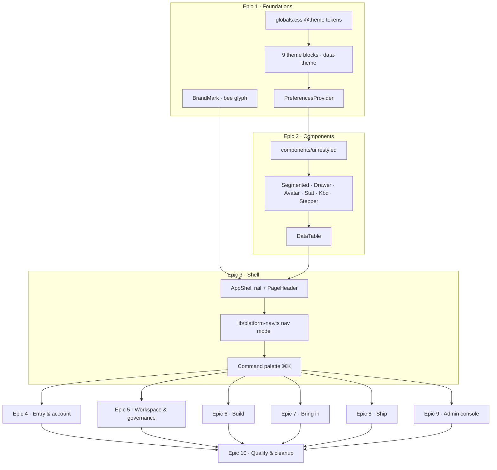

# Roadmap — apiome-ui Visual Redesign ("Hive")

## 0. Roadmap request

> Using the docs/DESIGN.md file to help with the design guidelines, update all of the
> screens in the apiome-ui application to follow the new design features for each
> section outlined in docs/mockups directory. They must look as close to or identical
> to the UI/UX design of those new mockups to satisfy the requirements for the visual
> redesign of Apiome. Use the Apiome glyphs and graphics to feature the Bee in the logo
> where appropriate. Include the redesign of the sidebar in this update, but do not
> include the Tools section, as this is not implemented yet.

### 0.1 Source-of-truth corrections applied while planning

| Item in request | Actual location / state | Action taken |
| --- | --- | --- |
| `docs/DESIGN.md` | The design language lives at **`docs/mockups/DESIGN.md`** (there is no `docs/DESIGN.md`) | All issues cite `docs/mockups/DESIGN.md` by section |
| "each section outlined in docs/mockups" | 53 mockups in 11 folders | 51 in scope; `tools/` excluded per request |
| Tools section | `docs/mockups/tools/database.html`, `tools/migration.html` (routes `/ade/database`, `/ade/migration`) | **Out of scope.** Tracked in §7 Deferred |
| Bee in the logo | Assets exist (`Apiome-02/05/07.png`, `bee-logo.png`); mockups use a CSS hexagon placeholder (`.brand-mark`) | New issue **HIVE-1.5** promotes the real bee glyph into a `BrandMark` component used app-wide |
| Studio / designer screens | Commercial product, separate repository | Excluded; rail and launcher only reserve host-injected slots |

### 0.2 Prior art — existing GitHub issues to reconcile (do **not** duplicate)

| Issue | Title | State | Overlap | Disposition |
| --- | --- | --- | --- | --- |
| [#1326](https://github.com/apiome/apiome/issues/1326) | [Epic] Theme & Workspace Customization | OPEN | Theme engine, CSS custom properties, keyboard-shortcut manager, workspace layout persistence | **Absorb.** HIVE-1.1/1.2/1.3 supersede "Theme Engine & CSS Custom Properties"; HIVE-3.7 supersedes "Keyboard Shortcut Manager"; HIVE-3.1 supersedes "Workspace Layout Persistence" (rail state). Close #1326 as superseded, or re-parent its remaining children (preference import/export, customizable toolbar) as post-redesign follow-ups. |
| [#540](https://github.com/apiome/apiome/issues/540) | Add theme preference personalization | OPEN | User-selectable theme | **Absorb into HIVE-1.4** (Preferences pane). Close on HIVE-1.4 merge. |
| [#3938](https://github.com/apiome/apiome/issues/3938) | V2-MCP-24.7: Design-system foundation & shared MCP UI primitives | CLOSED | `components/ui/mcp/*` primitives | **Reuse, don't rebuild.** HIVE-2.5 re-tokens these in place. |
| [#3941](https://github.com/apiome/apiome/issues/3941) | V2-MCP-24.10: Dark-theme variant + density polish | CLOSED | MCP dark/density | **Reuse.** Superseded by the global token layer; verify no regression in HIVE-7.7/7.8. |
| [#4199](https://github.com/apiome/apiome/issues/4199) | apiome: [OLO-3.1] Login page redesign | CLOSED | Login layout | HIVE-4.1 is a re-skin of the shipped layout, not a re-architecture. Keep the SSO-first structure. |

---

## 1. MVP Definition

### 1.1 What "MVP" means for a visual redesign

A partial re-skin is worse than none: a redesigned shell wrapped around legacy pages reads
as broken. The MVP is therefore the **smallest slice that is internally consistent end to
end** for the daily-driver path, not the smallest number of issues.

**MVP = a signed-in user can go login → launcher → home → projects → versions → import
without ever seeing a pre-redesign surface.**

### 1.2 MVP scope (in)

| Epic | Included | Why it is load-bearing |
| --- | --- | --- |
| **1 — Foundations** | 1.1 – 1.6 (all) | Nothing else can be built without tokens, themes, preferences and the brand mark |
| **2 — Components** | 2.1 – 2.7 (all) | Every page is assembled from these; partial delivery causes mixed styling |
| **3 — Shell & navigation** | 3.1 – 3.8 (all) | The sidebar redesign is explicitly in the request; the shell frames every route |
| **4 — Entry & account** | 4.1, 4.5, 4.6, 4.7 | Login, launcher, home, profile — the first four screens a user sees |
| **6 — Build** | 6.1, 6.2, 6.4 | Projects, versions, import — the core daily workflow |
| **10 — Quality** | 10.1, 10.2 | Visual-regression harness and a11y gate must exist before the long tail lands |

### 1.3 Post-MVP (required for "all screens", not for first ship)

Epics **5** (workspace & governance), **7** (catalog / repositories / MCP), **8** (ship),
**9** (admin console), the remainder of **4** and **6**, and **10.3 – 10.6**.

### 1.4 MVP exit criteria

- [ ] `docs/mockups/DESIGN.md` §3 tokens exist in `globals.css` as `@theme`; no component reads a raw hex outside the brand/format/method allow-list
- [ ] All nine themes switch by `html[data-theme]` swap only; layout and type are byte-identical between themes
- [ ] Font-size preference scales the whole interface (no hard-coded `px` font sizes in shipped components)
- [ ] `TopHeader` + `ConditionalHeader` + `DashboardSideNav` are deleted; one `AppShell` renders the rail on every `/ade/**` route
- [ ] The bee glyph appears in the rail brand, auth panel, launcher and favicon
- [ ] Login, launcher, home, profile, projects, versions and the import wizard match their mockups at ≥95 % visual parity (10.1 harness)
- [ ] Zero `window.confirm` / `window.prompt` on MVP routes
- [ ] axe: no serious/critical violations on MVP routes; High-contrast theme passes AAA text contrast

### 1.5 Non-goals

- Re-architecting data fetching, routing, permissions or the data model — this is a **visual** redesign
- The Studio / designer / paths commercial surfaces (separate repository)
- `/ade/database` and `/ade/migration` (Tools) — see §7
- New features beyond the "Adds" list in each mockup's Notes panel

---

## 2. Architecture of the change



### 2.1 Layer contract

```
┌──────────────────────────────────────────────────────────────┐
│ Epic 1  tokens · themes · preferences · brand                │  ← no UI change visible
├──────────────────────────────────────────────────────────────┤
│ Epic 2  primitives (Button, Input, Badge, DataTable, Drawer…)│  ← styling changes everywhere
├──────────────────────────────────────────────────────────────┤
│ Epic 3  AppShell · rail · PageHeader · palette               │  ← layout changes everywhere
├──────────────────────────────────────────────────────────────┤
│ Epics 4–9  one issue per route, mockup-for-mockup            │  ← parallelisable
├──────────────────────────────────────────────────────────────┤
│ Epic 10  visual-regression · a11y · motion · cleanup         │  ← gates the release
└──────────────────────────────────────────────────────────────┘
```

### 2.2 Conventions every page issue inherits

Each Epic 4–9 issue is a **mockup-for-mockup port** and inherits these acceptance criteria
without restating them:

1. Open the mockup's **Notes** panel (bottom-right → *Notes*). Everything under **Keeps
   (1:1)** must still work; everything under **Adds** must be implemented; every state
   under **States** must be reachable.
2. Structure comes from `DESIGN.md` §5.3 (page header), §8 (patterns), §7 (component map).
3. No raw hex, no hard-coded `px` font sizes; status strings use `Badge[data-status]`.
4. One primary button per page header.
5. Replace any `window.confirm` / `window.prompt` on the route with a real dialog.
6. Passes the 10.1 visual-parity check and the 10.2 axe gate.

---

## 3. Epic summary

| Epic | Name | GitHub | Issues | MVP issues | Depends on | Theme |
| --- | --- | --- | --- | --- | --- | --- |
| 1 | Design foundations: tokens, themes, preferences, brand | #5264 | 6 | 6 | — | Invisible groundwork |
| 2 | Component library | #5265 | 7 | 7 | 1 | Primitives every page uses |
| 3 | Application shell & navigation (incl. **sidebar**) | #5266 | 8 | 8 | 1, 2 | The frame |
| 4 | Entry & account surfaces | #5267 | 9 | 4 | 3 | First impressions |
| 5 | Workspace & governance surfaces | #5268 | 8 | 0 | 3 | Admin-of-tenant work |
| 6 | Build surfaces | #5269 | 6 | 3 | 3 | Daily driver |
| 7 | Bring-in surfaces (catalog · repositories · MCP) | #5270 | 9 | 0 | 3 | Widest surface area |
| 8 | Ship surfaces | #5271 | 3 | 0 | 3 | Publish & export |
| 9 | Admin console | #5272 | 7 | 0 | 3 | Separate shell variant |
| 10 | Quality, accessibility & cleanup | #5273 | 6 | 2 | all | Release gate |
| — | **Total** | 10 epics | **69** | **30** | | |

---

## Epic 1 — Design foundations: tokens, themes, preferences, brand — [#5264](https://github.com/apiome/apiome/issues/5264)

**Goal:** land the token layer, the nine themes, the preference system and the bee brand
mark. No route changes shape yet — this epic is deliberately invisible except for colour.

| # | GitHub | Title | Summary | Labels | Parallel | MVP | Complexity | Affected modules |
| --- | --- | --- | --- | --- | --- | --- | --- | --- |
| 1.1 | #5274 | Token layer in `globals.css` (`@theme`) | Port `hive.css :root` to Tailwind v4 `@theme`; alias legacy vars for one release | `ui`, `typescript` | N | Y | M | `src/app/globals.css`, `postcss.config.mjs` |
| 1.2 | #5275 | Nine theme blocks + `data-theme` resolution | Replace ad-hoc `.theme-*` rules with per-theme token swaps; ThemeProvider sets `data-theme` + `data-theme-choice` | `ui`, `typescript` | N | Y | M | `src/app/globals.css`, `src/app/providers/ThemeProvider.tsx`, `src/app/config/themes.ts` |
| 1.3 | #5276 | `PreferencesProvider` — font scale, density, motion, rail | New provider owning `data-font-scale`/`data-density`/`data-motion`/`data-rail`; localStorage keys + legacy aliases | `ui`, `typescript` | N | Y | M | `src/app/providers/PreferencesProvider.tsx` (new), `src/app/layout.tsx`, `src/app/ade/layout.tsx` |
| 1.4 | #5277 | Preferences pane replaces `ThemeSelector` | Right drawer: theme grid, 6-stop font slider, density, switches; closes #540 | `ui`, `a11y`, `typescript` | N | Y | M | `src/app/components/ade/PreferencesDrawer.tsx` (new), delete `ThemeSelector.tsx` |
| 1.5 | #5278 | `BrandMark` component — bee glyph & wordmark | Single component for bee glyph / wordmark / lockup with theme-aware asset swap; favicon + app icons | `ui` | Y | Y | S | `src/app/components/brand/BrandMark.tsx` (new), `public/*.png`, `src/app/icon.tsx` (new) |
| 1.6 | #5279 | `rem` audit — remove hard-coded `px` type & control sizes | Sweep components for `px` font-size/height so the font-size preference actually scales | `ui`, `refactor` | N | Y | L | `src/app/components/**`, `src/app/ade/**` |

```
Epic 1 dependency chain (strictly serial except 1.5)

1.1 tokens ──► 1.2 themes ──► 1.3 preferences ──► 1.4 pane ──► 1.6 rem audit
                                                     ▲
                              1.5 BrandMark ─────────┘ (parallel from day 1)
```

### `apiome: [HIVE-1.1] Design token layer in globals.css (@theme)` — [#5274](https://github.com/apiome/apiome/issues/5274)
**Problem statement.** `globals.css` defines a handful of ad-hoc custom properties
(`--background`, `--surface`, `--border-subtle`…) and every component hard-codes Tailwind
palette classes (`bg-white dark:bg-gray-800`, `text-slate-500`, `border-gray-200`). There
is no single place to change a surface colour, and the nine themes can only alter two
variables, which is why they currently look nearly identical.

**Solution / scope.** Port the complete token set from `docs/mockups/assets/hive.css :root`
(the authority; documented in `docs/mockups/DESIGN.md` §3.1) into a Tailwind v4 `@theme`
block so tokens are available both as CSS variables and as utility classes.

- Surfaces: `--color-canvas`, `--color-rail`, `--color-surface`, `--color-subtle`, `--color-inset`, `--color-overlay`
- Ink: `--color-fg`, `-muted`, `-subtle`, `-faint`; lines: `--color-border`, `-strong`
- Accent roles: `--color-ink` (primary button), `--color-accent` (+ `-soft`, `-fg`), `--color-honey` (+ `-soft`, `-fg`)
- Semantic: `ok` / `warn` / `danger` / `violet` / `orange` / `rose` / `neutral`, each with `-soft` and `-fg`
- Radii `--radius-xs…xl`, shadows `--shadow-xs…lg` + `--shadow-raised`, motion `--ease-*` / `--dur-*`, layout `--rail-w`, `--page-max`
- Keep the existing `--background` / `--foreground` / `--surface` names as **aliases** pointing at the new tokens for one release so nothing breaks mid-migration
- Reconfigure Radix Themes on both layouts: `accentColor="blue"`, `grayColor="sand"`, `radius="large"`, `panelBackground="solid"`

**Acceptance criteria.**
- [ ] Every token in `DESIGN.md` §3.1 resolves in the browser at `:root`
- [ ] Legacy variable names still resolve (aliases) and no visual regression ships in this issue alone
- [ ] `@source` directives still cover `apiome-ui/src` and `lib` so sibling apps keep working
- [ ] A documented allow-list is the *only* place raw hex may appear: brand colours, `.fmt--*` format pills, `.method--*` HTTP chips
- [ ] Radix `Theme` props updated in `src/app/layout.tsx` and `src/app/ade/layout.tsx`

**Parallelism / dependencies.** Blocks everything. Must merge first and alone.

**Technical stack.** Tailwind v4 (`@tailwindcss/postcss` 4.2), Radix Themes 3.3, Next 16.

---

### `apiome: [HIVE-1.2] Nine theme token blocks and data-theme resolution` — [#5275](https://github.com/apiome/apiome/issues/5275)
**Problem statement.** `ThemeProvider` writes `theme-{id}` classes plus `data-theme`, sets
only `--background`/`--foreground`, and force-writes `body.style`. The dark-based theme list
is hard-coded in an array. Themes therefore differ by two colours instead of a full palette.

**Solution / scope.** Each theme becomes a token swap, per `DESIGN.md` §4.2.

- Author `html[data-theme="dark" | "high-contrast" | "blueprint" | "whiteboard" | "solarized" | "nord" | "darcula"]` blocks that redefine only the tokens that change (port from `hive.css` §4)
- `light` is the `:root` default; `system` resolves live from `prefers-color-scheme`
- `ThemeProvider` sets `data-theme` (**resolved**) and `data-theme-choice` (**raw**, incl. `system`) on `<html>`, plus `color-scheme`
- Stop writing `body.style.backgroundColor/color`; stop toggling nine `theme-*` classes
- Keep next-themes driving the `.dark` class for existing `dark:` utilities during migration
- Dark-based themes flip `--ink` light so the primary button keeps highest contrast

**Acceptance criteria.**
- [ ] Switching theme changes **only** colour: a screenshot diff between two themes shows identical element geometry
- [ ] "Follow system" re-resolves live when the OS preference changes (no reload)
- [ ] `.fmt--*` and `.method--*` keep fixed hues in every theme
- [ ] High-contrast passes AAA for body text; borders remain visible at `--border-strong`
- [ ] No `theme-*` class remains in the codebase

**Parallelism / dependencies.** Depends on 1.1. Blocks 1.3.

---

### `apiome: [HIVE-1.3] PreferencesProvider — font scale, density, motion, rail` — [#5276](https://github.com/apiome/apiome/issues/5276)
**Problem statement.** There is no font-size or density preference. `SidebarDensityToggle`
exists but only affects three legacy sidebars (`localStorage['apiome.sidebar.density']`), and
the request explicitly asks for a font-size adjustment alongside theme switching.

**Solution / scope.** One provider owning all device-local UI preferences
(`DESIGN.md` §4.1), applied as attributes on `<html>`:

| Attribute | Values | Effect | Storage key |
| --- | --- | --- | --- |
| `data-font-scale` | `xs sm md lg xl 2xl` → 14/15/16/17/18/20 px root | scales the whole UI (all sizing is rem) | `hive.fontScale` |
| `data-density` | `comfortable` \| `compact` | swaps spacing tokens (row 46→38, control 36→32, page pad 32→24) | `hive.density` |
| `data-motion` | `auto` \| `reduce` | zeroes transitions; OS `prefers-reduced-motion` also honoured | `hive.motion` |
| `data-rail` | `expanded` \| `collapsed` | sidebar default width | `hive.rail` |

- Read-through aliases for the existing `app-theme` / `theme` / `apiome.sidebar.density` keys so nobody loses a setting
- SSR-safe: emit a tiny blocking inline script in `<head>` that applies the attributes before first paint (no flash)
- Export `usePreferences()` for components that need the current values

**Acceptance criteria.**
- [ ] Dragging the font-size slider rescales rail, tables, dialogs and body copy together
- [ ] Compact density reduces table row height and page padding without reflowing content off-screen
- [ ] No flash of default theme/scale on hard reload
- [ ] Reduce-motion disables dialog/drawer/rail transitions
- [ ] Legacy keys are migrated on first read and then written under the new names

**Parallelism / dependencies.** Depends on 1.2. Blocks 1.4 and 1.6.

---

### `apiome: [HIVE-1.4] Preferences pane replaces the Select Theme dialog` — [#5277](https://github.com/apiome/apiome/issues/5277)
**Problem statement.** `ThemeSelector` is a modal grid of nine cards that only sets a theme.
The request asks for "a settings pane that allows for the different themes to be swapped,
along with the font size adjustment". Closes **#540**; supersedes part of **#1326**.

**Solution / scope.** Right-hand drawer (520 px), reachable from the rail footer, the user
menu and `⌘,` — behaviour mirrored from `docs/mockups/assets/hive.js → renderSettings()`
and pictured in `docs/mockups/foundations/settings-pane.html`.

Tabs **Appearance · Account · Notifications · Shortcuts**; Appearance contains, in order:
1. **Theme** — 3-column radiogroup of cards (swatch preview, name, one-line description), applies immediately, no Save
2. **Font size** — 6-stop slider with a live preview card showing a real row of data
3. **Density** — segmented Comfortable / Compact
4. Switches — Reduce motion · Collapse sidebar by default · Monospace for identifiers · Show keyboard hints

Footer reads "Saved automatically". Account tab links to Profile / Linked accounts (never
duplicates them). Shortcuts tab opens the 3.7 sheet.

**Acceptance criteria.**
- [ ] Opens from rail footer, user menu and `⌘,`; closes on `Esc`, backdrop click and Done
- [ ] Theme cards are a real radiogroup (`role="radiogroup"` / `aria-checked`), arrow-key navigable
- [ ] Every control applies instantly and persists across reload and across routes
- [ ] Focus is trapped while open and restored to the trigger on close
- [ ] `ThemeSelector.tsx` is deleted and all call sites updated (`TopHeader`, `AdeHome`)

**Parallelism / dependencies.** Depends on 1.3. Ships the user-visible half of Epic 1.

---

### `apiome: [HIVE-1.5] BrandMark component — bee glyph, wordmark and favicon` — [#5278](https://github.com/apiome/apiome/issues/5278)
**Problem statement.** The bee/honeycomb mark exists as four PNGs
(`Apiome-02.png` light wordmark, `Apiome-05.png` dark wordmark, `Apiome-07.png` 512 px bee
glyph, `bee-logo.png` 256 px) but is used ad-hoc in four files with manual dark-mode
swapping, and there is no glyph-only mark for tight spaces. The mockups render a CSS
hexagon placeholder (`.brand-mark`) — the request is explicit that the **bee** should
feature in the logo where appropriate.

**Solution / scope.** One component, three variants, theme-aware:

```
<BrandMark variant="glyph"   size={26} />   bee-only  → rail brand, favicon, avatars, empty-state art
<BrandMark variant="wordmark" />            "apiome"  → auth panel, launcher header, admin login
<BrandMark variant="lockup"  sub="Platform" /> glyph + wordmark + subtitle → rail top
```

- Ship an **SVG** trace of the bee glyph (from `Apiome-07.png`) so it stays crisp at 20–72 px and can inherit `currentColor` for the honeycomb ring; keep the PNG as raster fallback
- Theme-aware wordmark: `Apiome-02` on light themes, `Apiome-05` on dark-based themes, driven by `data-theme` rather than the current `dark:hidden` pair
- Replace the hexagon placeholder wherever `.brand-mark` appears in a ported page
- Add `src/app/icon.tsx` (Next metadata route) generating the favicon and PWA icons from the glyph; set `apple-icon`
- Honey accent (`--color-honey`) is reserved for brand moments only — never for warnings (`DESIGN.md` §2)

**Acceptance criteria.**
- [ ] Bee glyph renders crisply at 20, 26, 44 and 72 px in light and dark themes
- [ ] Rail brand, auth brand panel, launcher hero and admin login all use `BrandMark`
- [ ] Browser tab shows the bee favicon; installed-PWA icon uses the glyph
- [ ] No component imports `Apiome-0*.png` directly any more
- [ ] `alt` / `aria-label` present; decorative instances marked `aria-hidden`

**Parallelism / dependencies.** Independent of 1.1–1.4; can start immediately. Blocks 3.1 and 4.1.

**Technical stack.** `next/image`, Next 16 metadata icon routes, inline SVG.

---

### `apiome: [HIVE-1.6] rem audit — remove hard-coded px type and control sizes` — [#5279](https://github.com/apiome/apiome/issues/5279)
**Problem statement.** The font-size preference only works if every dimension is relative.
Components today mix `text-sm`, inline `fontSize: '0.65rem'`, `style={{ width: 280 }}`,
`size={20}` icon props and fixed `h-12` heights. `DashboardSideNav` alone hard-codes width
280 px and a 0.65 rem label.

**Solution / scope.** Mechanical sweep with a lint backstop.

- Replace hard-coded font sizes with the `DESIGN.md` §3.2 scale tokens
- Replace fixed control/row heights with `--control-h` / `--row-h` / `--nav-item-h`
- Keep `px` only where it is genuinely physical: hairlines, icon stroke widths, shadow offsets, canvas geometry
- Add an ESLint rule (or a `stylelint`-style CI grep) that fails on `fontSize:` with a `px` literal in `src/app/components/**`
- Icon sizes move to the §3.5 convention (16 dense / 18 rail / 15 button)

**Acceptance criteria.**
- [ ] Setting font scale to Largest (20 px) scales every MVP route with no clipped text or overlapping controls
- [ ] Setting Compact density visibly tightens tables and page padding
- [ ] CI check fails on a newly introduced hard-coded `px` font size
- [ ] No horizontal document scrollbar appears at any scale on MVP routes (`DESIGN.md` layout invariant)

**Parallelism / dependencies.** Depends on 1.3. Can proceed per-directory in parallel with Epic 2 once the token layer is stable.

---

## Epic 2 — Component library — [#5265](https://github.com/apiome/apiome/issues/5265)

**Goal:** every primitive a redesigned page needs, styled from tokens, before any page is
ported. `docs/mockups/foundations/design-system.html` is the visual acceptance reference;
`DESIGN.md` §7 maps each mockup class to its production component.

| # | GitHub | Title | Summary | Labels | Parallel | MVP | Complexity | Affected modules |
| --- | --- | --- | --- | --- | --- | --- | --- | --- |
| 2.1 | #5280 | Re-token existing `components/ui` primitives | Button/Input/Select/Textarea/Badge/Card/Alert/Dialog/Tabs/Switch/Checkbox/Radio to tokens + new variants | `ui`, `typescript` | N | Y | L | `src/app/components/ui/*.tsx` |
| 2.2 | #5281 | New primitives: Segmented, Drawer, Avatar, Kbd | Four missing primitives used across the shell and most pages | `ui`, `a11y`, `typescript` | Y | Y | M | `src/app/components/ui/{Segmented,Drawer,Avatar,Kbd}.tsx` (new) |
| 2.3 | #5282 | `DataTable` + retire `dashboardScreenClasses` | Sticky caps header, hover row actions, selection + bulk bar, footer/pager, dense variant | `ui`, `dashboard`, `typescript` | N | Y | L | `src/app/components/ui/DataTable.tsx` (new), delete `dashboardScreenClasses.ts` |
| 2.4 | #5283 | Status vocabulary: `Badge[data-status]`, FormatPill, MethodChip | One mapping from app enum strings to tone; consolidate `ui/catalog` + `ui/mcp` pills | `ui`, `catalog`, `mcp` | Y | Y | M | `src/app/components/ui/Badge.tsx`, `ui/catalog/*`, `ui/mcp/*` |
| 2.5 | #5284 | Feedback set: EmptyState (hex art), ErrorState, Skeleton conventions | Humane empty states with brand art; skeletons shaped like content | `ui`, `a11y` | Y | Y | M | `src/app/components/ui/{EmptyState,ErrorState,Skeleton,LoadingState}.tsx` |
| 2.6 | #5285 | Metrics set: Stat, Ring, Sparkline, Meter, Progress | Token-driven inline-SVG chart kit, no new dependency | `ui`, `dashboard` | Y | Y | M | `src/app/components/ui/metrics/*` (new) |
| 2.7 | #5286 | Replace every `window.confirm` / `window.prompt` | Real `ConfirmDialog` / form dialogs incl. type-to-confirm for destructive actions | `ui`, `a11y`, `refactor` | Y | Y | M | `src/app/ade/dashboard/{roles,members}/**`, `admin/dashboard/**`, `components/dialogs/*` |

```
Epic 2 fan-out — 2.1 first, then the rest in parallel

           ┌── 2.2 Segmented · Drawer · Avatar · Kbd
           ├── 2.4 status vocabulary
2.1 ───────┼── 2.5 empty / error / skeleton
re-token   ├── 2.6 stat · ring · sparkline · meter
           ├── 2.7 confirm dialogs
           └── 2.3 DataTable ──► unblocks every list page (Epics 5–9)
```

### `apiome: [HIVE-2.1] Re-token existing components/ui primitives` — [#5280](https://github.com/apiome/apiome/issues/5280)
**Problem statement.** The 25 primitives in `components/ui` encode Tailwind palette classes
directly (`bg-white dark:bg-gray-800 border-gray-200`). They cannot respond to a theme token
swap, and their sizes are fixed, so Epic 1's preferences have no effect on them.

**Solution / scope.** Restyle in place — **no API breaks** — against `DESIGN.md` §7 and the
gallery in `foundations/design-system.html`.

- **Button**: variants `primary` (ink) · `accent` · `ghost` · `soft` · `danger` · `danger-soft` · `link` · `honey`; sizes `sm/default/lg/icon`; `pill`; optional trailing `Kbd`; 36 px default height from `--control-h`
- **Input / Textarea / Select / FormField**: inset hairline, azure focus ring (`--shadow-focus`), label above / hint below / inline error with icon, `is-invalid` state
- **Badge**: `data-status` attribute API (see 2.4) plus `outline`, `ink`, `mono`, `lg`, `dot` modifiers
- **Card**: `header/body/footer` slots, `hover`, `flat`, `soft`, `honey`, `link`, `selected`
- **Alert → banner**: `info/ok/warn/danger/honey/neutral` tones with title + body + actions row
- **Dialog**: 20 px radius, `sm 440 / default 560 / lg 760 / xl 960 / full 1200`, tinted footer, destructive confirm layout
- **Tabs**: underline with count pills + `pills` and vertical variants (replace `tabStyles`)
- **Switch / Checkbox / RadioGroup**: token sizing; `switch` supports mixed/indeterminate; **scope selectors to direct children** so form fields can nest inside a choice label
- **Tooltip**: 11 px ink pill, 6 px offset

**Acceptance criteria.**
- [ ] Every primitive renders correctly in all nine themes and both densities
- [ ] Public props unchanged; no consumer needs edits in this issue
- [ ] `foundations/design-system.html` §Buttons/Forms/Badges/Cards/Overlays is reproducible with real components
- [ ] Focus-visible ring is the azure 3 px token on every interactive primitive
- [ ] Jest snapshots refreshed; no behavioural test changes

**Parallelism / dependencies.** Depends on 1.1–1.2. Blocks 2.2–2.7 and every page epic. Land as a stack of small PRs (one per primitive family) to keep review tractable.

---

### `apiome: [HIVE-2.2] New primitives — Segmented, Drawer, Avatar, Kbd` — [#5281](https://github.com/apiome/apiome/issues/5281)
**Problem statement.** Four patterns recur across the mockups with no production equivalent:
segmented controls (view toggles, density, Cards/Table), right-side drawers (the redesign's
core progressive-disclosure device), hex/initial avatars (workspaces and people) and
keyboard chips.

**Solution / scope.**
- **Segmented** — radiogroup semantics, 3 px inset track, raised active thumb, `sm` variant, icon+label
- **Drawer** — Radix Dialog rendered as a right side-sheet, widths 520 / 680 / 860, header/body/footer, slide-in animation, focus trap, `Esc` close, optional "Open full page ↗"
- **Avatar** — `xs/sm/default/lg/xl`, circle or `hex` clip, deterministic colour from an id, `brand` and `honey` gradients, `AvatarStack` with overlap
- **Kbd** — shortcut chip, hidden globally when the "Show keyboard hints" preference is off

**Acceptance criteria.**
- [ ] Drawer traps focus, restores it, and stacks correctly over a dialog
- [ ] Segmented is arrow-key navigable and announces the selected option
- [ ] Avatar hex variant matches the mockups' `clip-path` silhouette; colour is stable for a given id
- [ ] Kbd chips disappear when the preference is off
- [ ] All four appear in the design-system route (10.5)

**Parallelism / dependencies.** Depends on 2.1. Blocks 3.1 (rail uses Avatar), 3.3, 5.1 (tenants drawer), 5.5 (audit drawer).

---

### `apiome: [HIVE-2.3] DataTable primitive and retirement of dashboardScreenClasses` — [#5282](https://github.com/apiome/apiome/issues/5282)
**Problem statement.** Every list screen re-implements a table from the string constants in
`dashboardScreenClasses.ts` (`dashboardThClass`, `dashboardTrHoverClass`…). Sorting,
selection, bulk actions, paging and empty states are re-coded per page with subtle
differences. The mockups standardise all of it.

**Solution / scope.** One composable table (`DESIGN.md` §8 "List page").

- `<DataTable>` with `toolbar` (search, filter chips, view segmented, sort), sticky caps `<th>` with sort affordance + `aria-sort`, `cell-primary` / `cell-sub` cells, hover-revealed row actions, row selection with a **sticky bulk bar**, `table-foot` with count + pager, `dense` variant
- Wide tables scroll inside their own container (`table-wrap--scroll-x`) — never the page
- Built-in `empty` / `loading` (skeleton rows shaped like content) / `error` slots
- Filter state helpers that serialise to the URL (the lint workspace already does this — generalise it)
- Delete `dashboardScreenClasses.ts` and migrate its consumers as each page epic lands (keep it until Epic 9 completes, then remove in 10.6)

**Acceptance criteria.**
- [ ] Renders the Projects, API keys and Catalog tables from the mockups with no page-local table CSS
- [ ] Keyboard: arrow-key row movement, `X` select, `↵` open, `.` row actions
- [ ] Selecting rows reveals the bulk bar; clearing selection hides it
- [ ] Sort/filter/page state round-trips through the URL
- [ ] Sticky header stays put while the body scrolls inside the card

**Parallelism / dependencies.** Depends on 2.1. Blocks most of Epics 5–9.

---

### `apiome: [HIVE-2.4] Status vocabulary — Badge[data-status], FormatPill, MethodChip` — [#5283](https://github.com/apiome/apiome/issues/5283)
**Problem statement.** Status colours are chosen per page. A published version is emerald in
one table and green-600 in another; catalog formats use `ui/catalog/FormatPill` while MCP
uses `ui/mcp/HealthPill`, each with its own palette. A user cannot learn the colour language.

**Solution / scope.** One mapping from real app enum strings to tone, per `DESIGN.md` §3.1.

| Vocabulary | Values |
| --- | --- |
| Version lifecycle | `draft` neutral · `review` warn · `published` ok · `deprecated` orange · `sunset` danger · `archived` outline |
| Visibility | `private` violet · `public` ok |
| Health / jobs | `healthy`/`ok`/`completed` ok · `degraded`/`running`/`pending` warn · `down`/`failed`/`error` danger · `unknown` neutral |
| Lint severity | `error` danger · `warning` warn · `info`/`hint` accent |
| Keys / members | `active` ok · `revoked` danger · `disabled` outline · `suspended` warn |
| Maturity | `preview`/`beta` accent · `new` honey |

- `<Badge status="published">` sets `data-status` and picks the tone from CSS, so adding a value is a token change not a component change
- **FormatPill** keeps fixed hues per format (OpenAPI, AsyncAPI, GraphQL, protobuf, JSON Schema, WSDL, X12, copybook, Avro, RAML, WIT, Postman, MCP) in every theme — identity beats tint
- **MethodChip** for GET/POST/PUT/PATCH/DELETE/HEAD with fixed hues
- Fold `ui/mcp/HealthPill`, `FreshnessPill`, `RecencyPill`, `GradeGlyph` and `ui/catalog/GradeChip` onto the shared base without changing their call sites

**Acceptance criteria.**
- [ ] A given status string renders the same tone on every screen
- [ ] Format and method pills are hue-stable across all nine themes
- [ ] Colour is never the only signal — a dot, icon or text label accompanies it
- [ ] Existing MCP/catalog pill call sites compile unchanged

**Parallelism / dependencies.** Depends on 2.1. Parallel with 2.2/2.3/2.5/2.6.

---

### `apiome: [HIVE-2.5] Feedback set — EmptyState with hex art, ErrorState, skeleton conventions` — [#5284](https://github.com/apiome/apiome/issues/5284)
**Problem statement.** Empty states are inconsistent ("No records found" vs a gradient orb
with a heading), errors are often a bare red string, and loading is usually a centred
spinner even inside tables — which causes layout jump.

**Solution / scope.**
- **EmptyState**: honeycomb art (hex stack + Lucide icon, `BrandMark` glyph for brand moments), title, ≤ 46 ch description, one primary + one secondary action; `inline` and `dashed` variants for in-card and in-table use
- **Copy rules** from `DESIGN.md` §10: teach, don't report — "Nothing published yet — publish a version to see it here."
- **ErrorState / error banner**: what happened + what to do + retry
- **Skeletons**: shaped like the final content (rows for tables, cards for grids); spinners only for indeterminate in-place work
- Gated states get the lock treatment: "Pick a workspace first" + "Go to Tenants"

**Acceptance criteria.**
- [ ] Every MVP route's empty, loading, error and gated states use these components
- [ ] No spinner inside a table body
- [ ] Empty-state copy passes the §10 voice check (sentence case, verb button, ≤ 14-word description)
- [ ] `role="status"` / `aria-live` on loading and error regions

**Parallelism / dependencies.** Depends on 2.1. Parallel with 2.2–2.4, 2.6, 2.7.

---

### `apiome: [HIVE-2.6] Metrics set — Stat, Ring, Sparkline, Meter, Progress` — [#5285](https://github.com/apiome/apiome/issues/5285)
**Problem statement.** Home, Projects, Catalog, MCP analytics, telemetry and the lint
workspace all draw score rings, sparklines and quota meters with bespoke inline SVG and
hard-coded colours. `mermaid` and `@xyflow/react` are already heavy dependencies; nothing
more should be added for simple charts.

**Solution / scope.** A small token-driven inline-SVG kit — no new dependency.

- **Stat** / **StatGrid**: label + icon, tabular-nums value with optional unit, delta chip (up/down/flat), footnote
- **Ring**: 0–100 with tier colouring (≥90 ok · 75–89 accent · 60–74 warn · <60 danger); `sm/default/lg`; also renders a letter grade
- **Sparkline**: line + soft fill, tone variants, fixed aspect, accepts a plain number array
- **Meter**: labelled progress with 80 % warn tick and 100 % cap (seat usage, quota)
- **Progress**: determinate/striped, tone variants (import jobs, export stages)
- All accept `aria-label` / `role="meter"` and degrade to a readable number for screen readers

**Acceptance criteria.**
- [ ] Quality rings on Projects and Catalog match the mockups' tier colours
- [ ] Seat meter turns warn at ≥80 % and danger at 100 %
- [ ] Charts inherit theme tokens — verified in dark, Nord and High-contrast
- [ ] Every chart exposes its value as text to assistive tech
- [ ] No new runtime dependency added

**Parallelism / dependencies.** Depends on 2.1. Parallel with 2.2–2.5, 2.7.

---

### `apiome: [HIVE-2.7] Replace every window.confirm and window.prompt` — [#5286](https://github.com/apiome/apiome/issues/5286)
**Problem statement.** Roles and Members use native `window.prompt` for create/duplicate and
`window.confirm` for delete/offboard; the admin console uses `window.confirm` throughout.
Native dialogs are unstyled, unthemed, untranslatable, not screen-reader friendly, and
impossible to make match the mockups.

**Solution / scope.**
- Audit every `window.confirm` / `window.prompt` / `alert` in `apiome-ui/src`
- Replace prompts with proper form dialogs (label, validation, hint) and confirms with `ConfirmDialog`
- Destructive confirms follow `DESIGN.md` §8: red primary, the object **named** in the title, a consequence sentence, and **type-to-confirm** for tenants, projects and permanent deletes
- Keep the existing `useDialog()` imperative API so call sites change minimally

**Acceptance criteria.**
- [ ] `grep -rn "window.confirm\|window.prompt" apiome-ui/src` returns nothing
- [ ] Every destructive action names its object and states the consequence
- [ ] Type-to-confirm on permanent project delete, tenant delete and admin user delete
- [ ] Dialogs are focus-trapped and `Esc`-dismissible (except while a request is in flight)

**Parallelism / dependencies.** Depends on 2.1. Touches files that page epics also touch — land **before** Epics 5 and 9 to avoid conflicts.

---

## Epic 3 — Application shell & navigation (the sidebar redesign) — [#5266](https://github.com/apiome/apiome/issues/5266)

**Goal:** replace the 280 px gradient sidebar **and** the second 48 px platform bar with one
calm rail plus a sticky page header. This is the epic the request calls out explicitly
("Include the redesign of the sidebar in this update").

**Reference:** `docs/mockups/foundations/shell.html` (toggle *Callouts* for the numbered
anatomy), `DESIGN.md` §5 and §6.

| # | GitHub | Title | Summary | Labels | Parallel | MVP | Complexity | Affected modules |
| --- | --- | --- | --- | --- | --- | --- | --- | --- |
| 3.1 | #5287 | `AppShell` + collapsible rail | 264/64 px rail, grouped nav, raised active pill, collapse + tooltips, persisted | `ui`, `dashboard`, `a11y` | N | Y | L | `src/app/components/shell/AppShell.tsx` (new), `src/app/ade/dashboard/layout.tsx` |
| 3.2 | #5288 | Nav model in `lib/platform-nav.ts` | Jobs-to-be-done groups, tenant gating, host-injected commercial slots | `ui`, `typescript` | N | Y | M | `apiome-ui/lib/platform-nav.ts` |
| 3.3 | #5289 | Workspace switcher in the rail | Replaces the header tenant pill: search, roles, licence chips, suspended, create-cap | `ui`, `dashboard` | N | Y | M | `src/app/components/shell/WorkspaceSwitcher.tsx` (new), from `TopHeader.tsx` |
| 3.4 | #5290 | Rail footer user menu + What's new + build badge | Profile, linked accounts, preferences, what's new, shortcuts, admin, sign out | `ui` | N | Y | M | `src/app/components/shell/UserMenu.tsx` (new), `WhatsNewDialog.tsx` |
| 3.5 | #5291 | `PageHeader` component | Sticky translucent header: breadcrumb, title+badge, description, actions, optional tabs | `ui` | Y | Y | M | `src/app/components/shell/PageHeader.tsx` (new) |
| 3.6 | #5292 | Command palette (`⌘K`) | Jump / Actions / Recent groups, `>` commands, typeahead | `ui`, `a11y` | Y | Y | M | `src/app/components/shell/CommandPalette.tsx` (new), `cmdk` |
| 3.7 | #5293 | Global shortcut map + shortcuts sheet (`?`) | One registry, contextual hints, sheet; supersedes #1326's shortcut manager | `ui`, `a11y` | Y | Y | M | `src/app/hooks/useShortcuts.ts` (new), `components/shell/ShortcutSheet.tsx` |
| 3.8 | #5294 | Retire TopHeader, ConditionalHeader, DashboardSideNav | Delete the old chrome once every `/ade` route renders inside AppShell | `ui`, `refactor` | N | Y | M | delete `ade/TopHeader.tsx`, `ConditionalHeader.tsx`, `dashboard/DashboardSideNav.tsx` |

```
Rail anatomy (264 px expanded · 64 px collapsed) — foundations/shell.html

┌────────────────────────────┐
│ ① BrandMark  apiome        │  bee glyph + wordmark + "Platform"
│              Platform      │
│ ② [AC] Acme Corp      ⌄    │  workspace switcher (role · plan)
│ ③ 🔍 Search or jump to  ⌘K │  opens the command palette
├────────────────────────────┤
│    Home                    │
│ ④ BUILD                    │  group labels collapse (persisted)
│    Projects                │  active = raised white pill + azure icon
│    Primitives & types      │
│    BRING IN                │
│    Catalog · Repositories  │
│    MCP servers             │
│    SHIP                    │
│    Published · Sunset      │
│    Export studio           │
│    GOVERN                  │
│    Style guides            │
│    Lint posture  [Preview] │
│    Access audit            │
│    WORKSPACE               │
│    Members · Roles         │
│    API keys · Tenants      │
├────────────────────────────┤
│ ⑤ Help & docs              │
│    Preferences         ⌘,  │
│    [AL] Ada Lovelace   ⋯   │
└────────────────────────────┘
       ⑥ collapse handle on hover · ⌘\
```

### `apiome: [HIVE-3.1] AppShell and the collapsible rail` — [#5287](https://github.com/apiome/apiome/issues/5287)
**Problem statement.** Today `/ade/**` renders **two** chromes: `TopHeader` (min-h-12,
z-10048, logo + version badge + nav tabs + tenant pill + profile menu, wrapping onto three
rows below ~sm) and `DashboardSideNav` (fixed 280 px, inline gradient, six ALL-CAPS sections,
no collapse, no density). Together they consume ~330 px of chrome before any content, and
the two navigation systems overlap (Home/Control Panel exist in both).

**Solution / scope.** One `AppShell` = rail + page, per `DESIGN.md` §5.1–5.2.

- CSS-grid shell: `grid-template-columns: var(--rail-w) minmax(0,1fr)`; collapsed swaps to `--rail-w-collapsed` with a 260 ms transition
- Rail regions top→bottom: brand (1.5) → workspace switcher (3.3) → search trigger (3.6) → grouped nav (3.2) → footer (3.4)
- Nav item: 32 px tall, 18 px icon + 13 px label, hover = 5 % ink tint, **active = raised white pill** (`--shadow-raised`) with azure icon; tenant-gated items at 45 % opacity with an explanatory tooltip
- Group labels are click-to-collapse and persist (`hive.navCollapsed`)
- Collapse: hover handle at the rail edge, `⌘\`, or the Preferences default; collapsed rail shows icon-only with hover tooltips and hairlines between groups
- Responsive: < 900 px forces icon mode; the rail is never a hamburger drawer on desktop
- `<nav aria-label="Primary">`, `aria-current="page"` on the active item, skip-to-content link

**Acceptance criteria.**
- [ ] Exactly one chrome renders on `/ade/**`; total chrome above content ≤ 96 px
- [ ] Collapse state persists across reload and routes; `⌘\` toggles it
- [ ] Collapsed rail shows a tooltip for every item on hover and keyboard focus
- [ ] Gated items are non-interactive, announced as disabled, and explain why
- [ ] Rail scrolls independently of page content; no double scrollbar
- [ ] Matches `foundations/shell.html` at ≥95 % visual parity

**Parallelism / dependencies.** Depends on 1.5, 2.1, 2.2, 3.2. Blocks 3.3, 3.4, 3.8 and every page epic.

---

### `apiome: [HIVE-3.2] Nav model in lib/platform-nav.ts` — [#5288](https://github.com/apiome/apiome/issues/5288)
**Problem statement.** Navigation is split across `DashboardSideNav.tsx` (a hard-coded array
grouped Account / Administration / Access & IAM / Governance / Specifications) and
`platform-nav.ts` (Home / Control Panel / commercial tabs). Grouping reflects internal
org structure, not user intent, and gating logic is duplicated.

**Solution / scope.** One declarative model, per `DESIGN.md` §6.

| Group | Items | Routes |
| --- | --- | --- |
| — | Home | `/ade/dashboard` |
| **Build** | Projects, Primitives & types | `/ade/dashboard/projects`, `/primitives` |
| **Bring in** | Catalog, Repositories, MCP servers | `/ade/dashboard/{catalog,repositories,mcp}` |
| **Ship** | Published, Sunset timeline, Export studio | `/ade/dashboard/published`, `/versions/sunset-timeline`, `/export/studio` |
| **Govern** | Style guides, Lint posture *(Preview)*, Access audit | `/ade/dashboard/{style-guides,lint-workspace,audit}` |
| **Workspace** | Members, Roles, API keys, Tenants | `/ade/dashboard/{members,roles,api-keys,tenants}` |
| user menu | Profile, Linked accounts | `/ade/dashboard/{profile,linked-accounts}` |

- **Tools** (`/ade/database`, `/ade/migration`) is **deliberately absent** — see §7 Deferred
- Commercial suite entries are **injected by the host at runtime** from entitlements; this repo reserves the slot and never hard-codes a route into a separate product
- One `isActive(href, pathname)` resolver replacing the per-item special cases (Projects also matches `/versions*` except the sunset timeline, etc.)
- `disabled` derives from `current_tenant_id` with a `reason` string for the tooltip

**Acceptance criteria.**
- [ ] Nav renders from the model; no component hard-codes a nav item
- [ ] Active-state rules preserved exactly (Projects ↔ Versions, Repositories/Primitives/Catalog/MCP subtree matching, sunset timeline standalone)
- [ ] Tenant gating produces identical disabled items to today
- [ ] No `/ade/studio*` or Tools route appears anywhere in the model
- [ ] Unit tests cover active-state resolution for all 20 routes

**Parallelism / dependencies.** Depends on nothing but 1.x. Blocks 3.1.

---

### `apiome: [HIVE-3.3] Workspace switcher in the rail` — [#5289](https://github.com/apiome/apiome/issues/5289)
**Problem statement.** The tenant switcher is a gradient pill in the top bar with a pulsing
dot, and it disappears with the bar. It carries real complexity worth preserving: search,
role badges (owner/admin/editor/viewer), licence plan chips, suspended memberships,
current-tenant check and a create-tenant entry gated on a plan cap.

**Solution / scope.** Move it to the rail top as a 44 px row (hex avatar + name + "role · plan"
+ chevron) opening a 300 px menu; all behaviour from `TopHeader.tsx` is preserved.

- Search input filtering name **and** slug; "No matching tenants" empty line
- Rows: hex `Avatar`, name, `SUSPENDED` chip (row disabled + explanatory title), role badge, licence chip, check on current
- Footer: **Create workspace** with `{used}/{max}` and the cap-reached tooltip
- Selecting persists `current_tenant_id`, writes the last-active cookie and refreshes
- Collapsed rail shows just the hex avatar; the menu still opens

**Acceptance criteria.**
- [ ] Every capability of the current switcher works (search, roles, licences, suspended, cap)
- [ ] `role="menu"` with roving focus; `Esc` closes and restores focus to the trigger
- [ ] Works collapsed and expanded
- [ ] Create-workspace opens the existing `CreateTenantDialog` (restyled by 2.1)

**Parallelism / dependencies.** Depends on 3.1, 2.2 (Avatar).

---

### `apiome: [HIVE-3.4] Rail footer user menu, What's new and build badge` — [#5290](https://github.com/apiome/apiome/issues/5290)
**Problem statement.** Profile menu, theme entry, version badge and What's New live in the
top bar and are lost when it is retired. The admin console is only reachable by typing `/admin`.

**Solution / scope.** Footer of the rail: **Help & docs** · **Preferences** (`⌘,`) · user button
(avatar + name + email) opening a 260 px menu:

Profile · Linked accounts · Preferences · What's new *(honey dot when unread)* · Keyboard
shortcuts (`?`) · — · Admin console ↗ · All apps · — · Sign out · build string footer
(`v0.241.0 RC` / `NEXT_PUBLIC_APP_BUILD_LABEL`).

- What's New keeps fetching `/WHATS_NEW.md`; unread state from the last-seen version in localStorage
- Sign out keeps calling `signOutEverywhere('/login')`
- Admin console entry is visible to all (the route already gates itself) — it replaces the "type the URL" discovery problem

**Acceptance criteria.**
- [ ] Every TopHeader profile-menu item has a home in the new menu
- [ ] Version badge opens What's New, and the honey dot clears after viewing
- [ ] Menu is keyboard navigable and closes on `Esc`
- [ ] Works in the collapsed rail

**Parallelism / dependencies.** Depends on 3.1.

---

### `apiome: [HIVE-3.5] PageHeader component` — [#5291](https://github.com/apiome/apiome/issues/5291)
**Problem statement.** Every screen hand-rolls a white `<header>` with an `h2`, a lucide
icon, a subtitle and a right-hand CTA cluster. Spacing, title size and action ordering drift
between pages, and long titles collide with action buttons.

**Solution / scope.** One sticky, translucent (backdrop-blur) header per `DESIGN.md` §5.3.

```
┌──────────────────────────────────────────────────────────────────────┐
│ Acme Corp › Build › Projects                    [Import] [+ New] N   │  ← breadcrumb + actions
│ Projects                                                             │  ← 24px/600/-0.02em
│ 4 projects · avg quality 84 · 3 active · 1 deleted                   │  ← ≤14-word description
│ ── Overview ── Versions 6 ── Lint 2 ─────────────────────────────────│  ← optional tab row
└──────────────────────────────────────────────────────────────────────┘
```

- Slots: `breadcrumb`, `title` (+ status badge), `description`, `actions`, `tabs`
- Exactly **one** `primary` action; the rest secondary/ghost/overflow
- Title block gets `min-width: 0` and the action cluster wraps, so long titles never cause horizontal overflow
- Content max-width 1440 px; `narrow` variant (920 px) for form/reading pages

**Acceptance criteria.**
- [ ] All MVP routes use it; no page renders its own `<header>` bar
- [ ] Long titles + 4 actions at 1280 px produce no horizontal scroll
- [ ] Sticky header stays legible over scrolled content in all themes
- [ ] Breadcrumb links are real navigation with `aria-label="Breadcrumb"`

**Parallelism / dependencies.** Depends on 2.1. Parallel with 3.1–3.4.

---

### `apiome: [HIVE-3.6] Command palette (⌘K)` — [#5292](https://github.com/apiome/apiome/issues/5292)
**Problem statement.** There is no global search or command surface. Reaching a project
means Home → Projects → filter → click; there is no keyboard path between sections.

**Solution / scope.** `cmdk` (already a dependency) in a 640 px dialog, per `DESIGN.md` §5.4.

- Groups **Jump to** (nav destinations from 3.2) · **Actions** (New project, Import a spec, Create API key, Change theme…) · **Recent** (last projects/versions from activity)
- `>` prefix filters to commands only; fuzzy match on title + section
- Footer legend: ↑↓ navigate · ↵ open · tab actions
- Opens from `⌘K`, the rail search trigger, and the palette entry in the shortcuts sheet
- Recent items are per-tenant and stored locally

**Acceptance criteria.**
- [ ] `⌘K` opens from any `/ade` route; `Esc` closes and restores focus
- [ ] Arrow keys move a visible active row; `↵` navigates
- [ ] Actions respect tenant gating (disabled with a reason)
- [ ] Announced as a dialog; results list is an ARIA listbox

**Parallelism / dependencies.** Depends on 3.2 (needs the nav model). Parallel with 3.1.

---

### `apiome: [HIVE-3.7] Global shortcut map and shortcuts sheet (?)` — [#5293](https://github.com/apiome/apiome/issues/5293)
**Problem statement.** Shortcuts are ad-hoc per component (`SuiteNavMenu` typeahead, dialog
`Esc`) with no registry, no discoverability and no way to see what exists. #1326 tracked a
"Keyboard Shortcut Manager" that never shipped.

**Solution / scope.** One registry + one sheet, per `DESIGN.md` §8.

| Scope | Bindings |
| --- | --- |
| Global | `⌘K` palette · `⌘,` preferences · `⌘\` rail · `/` focus search · `Esc` close · `?` sheet |
| Jump | `G` then `H` home · `P` projects · `C` catalog · `L` lint · `M` members |
| List | `N` new · `I` import · `↑↓` move · `↵` open · `X` select · `.` row actions |
| Dialog | `⌘↵` save · `Esc` cancel |

- `useShortcuts()` registers scoped bindings and unregisters on unmount; suppressed while typing in an input
- The sheet is generated from the registry, so it can never drift from reality
- `Kbd` chips on buttons/menus read from the same registry and hide with the preference

**Acceptance criteria.**
- [ ] `?` opens the sheet from anywhere except a text field
- [ ] No binding fires while focus is in an input/textarea/contenteditable
- [ ] Sheet content is generated, not hand-written
- [ ] Sequence shortcuts (`G` then `P`) time out after 1 s

**Parallelism / dependencies.** Depends on 2.2 (`Kbd`). Parallel with 3.6.

---

### `apiome: [HIVE-3.8] Retire TopHeader, ConditionalHeader and DashboardSideNav` — [#5294](https://github.com/apiome/apiome/issues/5294)
**Problem statement.** The old chrome must not linger behind a flag: two navigation systems
would double-render and drift. This issue is the deliberate point of no return.

**Solution / scope.** Once 3.1–3.7 are in and every `/ade` route renders inside `AppShell`:

- Delete `components/ade/TopHeader.tsx`, `ConditionalHeader.tsx`, `dashboard/DashboardSideNav.tsx`
- Simplify `ade/layout.tsx` (no more `ConditionalHeader`; keep `AuthenticatedLayout`, `FirstTenantOnboardingGuard`, `PushConflictBannerProvider`)
- Keep `SuiteNavMenu` **only** if the commercial host still consumes it via the `@` alias; otherwise delete (verify against private-suite before removing)
- Update `e2e/navigation.spec.ts` and any selector referencing the old chrome
- `components/sidebar/*` (`SidebarShell`, `SidebarDensityToggle`) survives only for `/admin` and Tools until 9.1 and the deferred Tools work replace it

**Acceptance criteria.**
- [ ] Deleted files have zero imports repo-wide (including `private-suite` via the `@` alias — verify before merge)
- [ ] `/ade` (launcher) still renders without a rail; every other `/ade/**` route renders with one
- [ ] Navigation e2e passes against the new structure
- [ ] No dead CSS left behind for the old header/sidebar

**Parallelism / dependencies.** Depends on **all** of 3.1–3.7 and on Epics 4–9 pages being at least shell-migrated. Coordinate with the private-suite repo before deleting shared components.

---

## Epic 4 — Entry & account surfaces — [#5267](https://github.com/apiome/apiome/issues/5267)

**Goal:** the screens a user sees before and just after signing in. Highest brand leverage —
this is where the bee mark does the most work.

| # | GitHub | Title | Summary | Labels | Parallel | MVP | Complexity | Affected modules |
| --- | --- | --- | --- | --- | --- | --- | --- | --- |
| 4.1 | #5295 | Sign-in / create-account redesign | Split brand panel (bee + format chips) + SSO-first card; keeps all 17 error copies | `ui`, `auth` | Y | Y | M | `src/app/login/LoginClient.tsx`, `login/*.module.css` |
| 4.2 | #5296 | Two-factor screen | Method switcher, 6-digit mono input, error states | `ui`, `auth` | Y | N | S | `src/app/login/2fa/TwoFactorClient.tsx` |
| 4.3 | #5297 | Finish OAuth sign-up | Masked email, Free-plan box, name/org/slug with availability | `ui`, `auth` | Y | N | S | `src/app/signup/oauth/OauthSignupClient.tsx` |
| 4.4 | #5298 | First-tenant onboarding wizard | 4 steps with the new stepper, slug availability line, Free-plan review | `ui`, `auth` | Y | N | M | `src/app/components/auth/onboarding/*` |
| 4.5 | #5299 | `/ade` launcher redesign | Brand-forward hero, app grid, host-injected commercial slot, resources | `ui` | Y | Y | M | `src/app/components/ade/AdeHome.tsx` |
| 4.6 | #5300 | Home (`/ade/dashboard`) redesign | Greeting, first-run checklist, stat strip, continue cards, activity, attention | `ui`, `dashboard` | Y | Y | M | `src/app/ade/dashboard/page.tsx`, `FirstRunChecklist.tsx` |
| 4.7 | #5301 | Profile redesign | Identity hero, account details, security + 2FA, sign-in methods, session | `ui`, `auth` | Y | Y | M | `src/app/ade/dashboard/profile/*` |
| 4.8 | #5302 | Linked accounts redesign | Provider table + cards, PAT management, unlink flows | `ui`, `auth`, `integrations` | Y | N | S | `src/app/ade/dashboard/linked-accounts/*` |
| 4.9 | #5303 | Help & docs page | New route backing the rail's Help entry: guide search, shortcuts, support | `ui`, `documentation` | Y | N | S | `src/app/ade/dashboard/help/page.tsx` (new) |

### `apiome: [HIVE-4.1] Sign-in / create-account redesign` — [#5295](https://github.com/apiome/apiome/issues/5295)
**Mockup:** `docs/mockups/auth/login.html` · **Route:** `/login`

**Problem statement.** The login page already has good bones (SSO-first, collapsed
credentials, 17 mapped error codes) but its visual language — animated aurora blobs, film
grain, a 28 px glass card with a gradient hairline — belongs to a different product than the
rest of the app and does not use the bee.

**Solution / scope.** Keep the information architecture exactly; replace the skin.

- **Left brand panel** (lg+): hex canvas (`hex-bg`) + honey glow, `BrandMark` **bee lockup**, eyebrow "The API design environment", headline "Design. Version. Publish your APIs.", paragraph, floating format chips (OpenAPI · AsyncAPI · GraphQL · gRPC · Avro · WSDL · TypeSpec · OData)
- **Right card**: heading + sub, intro-video link, one SSO button per enabled provider, "or use your email" divider that expands the credentials form, primary submit, mode toggle footer, trust badges, terms line
- Preserve: provider registry resolution, all `auth-error-copy.ts` messages, banner roles (`role="alert"` / `role="status"`), the collapsed-until-clicked credentials behaviour, `data-testid="login-card"` and `login-banner`
- Retire the aurora/grain CSS module in favour of tokens
- Keep the BETA watermark behind `NEXT_PUBLIC_BETA_MODE` but restyle as a honey badge

**Acceptance criteria.**
- [ ] All 17 error codes render with their existing copy and retry affordances
- [ ] SSO loading state ("Connecting… / Redirecting to authentication provider") preserved
- [ ] Sign-up variant keeps name + "How did you hear about us?" fields
- [ ] Bee mark visible in the brand panel and on the mobile card
- [ ] `e2e/login-a11y.spec.ts` snapshots regenerated; axe passes
- [ ] Matches the mockup at ≥95 % parity

**Parallelism / dependencies.** Depends on 1.5, 2.1, 2.5. Independent of the shell (auth pages have no rail). Regenerating `e2e/login-a11y.spec.ts-snapshots` is part of this issue.

---

### `apiome: [HIVE-4.2] Two-factor screen redesign` — [#5296](https://github.com/apiome/apiome/issues/5296)
**Mockup:** `docs/mockups/auth/two-factor.html` · **Route:** `/login/2fa`

**Problem statement.** Same visual mismatch as 4.1; the method switcher and the 6-digit input
need the new form language.

**Solution / scope.** Centred card on the hex canvas: `BrandMark` glyph, icon tile
(ShieldCheck for TOTP, Mail for email OTP), heading + description, method switcher tabs
(only when both methods are offered), 6-digit monospace input (numeric inputmode,
autocomplete `one-time-code`, digits-only, max 6), submit, error alert, back link.

Preserve the sessionStorage contract (`apiome:2fa-methods`, `apiome:2fa-callbackUrl`), all
error copy, and the "clear code + error on method switch" behaviour.

**Acceptance criteria.**
- [ ] Both TOTP and email-OTP flows work end to end, including resend
- [ ] Submit disabled until 6 digits; `role="tablist"` switcher is keyboard navigable
- [ ] All existing error strings preserved
- [ ] Paste of a 6-digit code fills and submits cleanly

**Parallelism / dependencies.** Depends on 1.5, 2.1. Parallel with 4.1.

---

### `apiome: [HIVE-4.3] Finish OAuth sign-up redesign` — [#5297](https://github.com/apiome/apiome/issues/5297)
**Mockup:** `docs/mockups/auth/signup-oauth.html` · **Route:** `/signup/oauth`

**Problem statement.** Token-gated completion screen with an outdated card style; the slug
field needs the new availability affordance shared with onboarding.

**Solution / scope.** Card with `BrandMark`, masked email + provider glyph, Free-plan info
box (1 organization, 1 project, 3 versions), fields Your name / Organization name /
Organization URL slug (lowercase-forced, auto-derived until edited, live availability chip),
URL preview line, primary "Create account", back link. Submitting, slug-taken and
expired-token states.

**Acceptance criteria.**
- [ ] Slug auto-derives from org name until hand-edited; clearing re-enables derivation
- [ ] Availability states: checking / available / taken / unverifiable (fails open)
- [ ] Expired token still redirects to `/login?error=SignupSessionExpired`
- [ ] Free-plan copy unchanged

**Parallelism / dependencies.** Depends on 2.1. Shares the slug-field component with 4.4 — build it here, reuse there.

---

### `apiome: [HIVE-4.4] First-tenant onboarding wizard redesign` — [#5298](https://github.com/apiome/apiome/issues/5298)
**Mockup:** `docs/mockups/auth/onboarding.html` · **Guard:** `FirstTenantOnboardingGuard`

**Problem statement.** The wizard is functionally complete (4 steps, server-persisted
resume, debounced slug probe) but visually predates the design language and its progress
indicator is a bespoke `<ol>`.

**Solution / scope.** Same four steps — Welcome → Organization → Review → Done — rebuilt on
the shared `Stepper` (2.2) with the new card, form and button language.

- Welcome: Building2 tile, "Let's set up your first tenant", check-again + sign-out
- Organization: reuses the 4.3 slug field with the four availability states
- Review: `<dl>` of org + slug, Free-plan card (Tenants 1 · Projects 1 · Versions 3) and the sample-project bullet
- Done: success tile, "{tenant} is ready", go-to-dashboard
- Not dismissible; resume behaviour and funnel events unchanged

**Acceptance criteria.**
- [ ] All four steps, resume-on-reload and server-side state persistence unchanged
- [ ] Every validation string preserved
- [ ] Stepper announces current step to assistive tech
- [ ] Cannot be bypassed by deep-linking any `/ade` route

**Parallelism / dependencies.** Depends on 2.1, 2.2, 4.3 (slug field).

---

### `apiome: [HIVE-4.5] /ade launcher redesign` — [#5299](https://github.com/apiome/apiome/issues/5299)
**Mockup:** `docs/mockups/home/launcher.html` · **Route:** `/ade`

**Problem statement.** `AdeHome` is a zinc page with radial glows and gradient app cards
that shares no vocabulary with the rest of the app, and its Designer Suite card links
directly into the commercial product.

**Solution / scope.** Brand-forward launcher on the hex canvas with a honeycomb ornament.

- Minimal top row (no rail here): `BrandMark` + version badge (opens What's new) + preferences + account chip + sign out
- Hero: time-of-day greeting, "Your API specification workspace", summary chips (tenant · role · plan, project + published counts)
- Applications grid: **Control Panel** → `/ade/dashboard`; **a host-injected commercial slot** (entitlement-gated, rendered from `getCommercialAccessForSession().homeCards`, never hard-coded); **Developer Suite** (listed, disabled, "coming soon"); **Browser** → `BROWSE_APP_URL` in a new tab
- Resources row (Help & tutorials · Community *soon* · Marketplace *soon*) + dashed "On the roadmap" card
- Footer: version + © 2021 – 2026 NobuData LLC

**Acceptance criteria.**
- [ ] Commercial cards render from entitlements; no route into a separate product is hard-coded
- [ ] Disabled cards are non-interactive with `aria-label "{name} (coming soon)"`
- [ ] External cards open in a new tab and say so
- [ ] Bee mark features in the header and hero ornament
- [ ] No rail renders on `/ade` (matches today's `ConditionalHeader` behaviour)

**Parallelism / dependencies.** Depends on 1.5, 2.1. Parallel with 4.6.

---

### `apiome: [HIVE-4.6] Home (/ade/dashboard) redesign` — [#5300](https://github.com/apiome/apiome/issues/5300)
**Mockup:** `docs/mockups/home/overview.html` · **Route:** `/ade/dashboard`

**Problem statement.** The dashboard is six stat cards plus a Recent Activity list that
occupies the left half of a two-column grid — **the right half is empty**. There is no path
from the overview into work.

**Solution / scope.** Keep every existing widget; fill the dead space with useful, existing data.

- **Keeps:** six stats (Tenants / Projects / Versions / Published / Classes / Properties with their subtitles from `getDashboardStats`), Recent Activity (10 rows, type icon, tenant badge, relative time), `FirstRunChecklist` (same five steps, same completion derivation, same dismiss key)
- **Adds:** greeting header; "Pick up where you left off" cards (project · latest version · lifecycle · quality from the stored lint report); Quick actions (routes that already exist); "Needs attention" fed by sunset timeline, lint gate failures and key expiry; publishing pulse bars
- First-run checklist becomes the honey card with hex progress; Designer-dependent steps are omitted (matching today's behaviour when no Designer URL is configured)

**Acceptance criteria.**
- [ ] Six stats and activity list preserved exactly, including loading skeletons
- [ ] Checklist dismiss still persists to `ade.dashboard.firstRunChecklist.dismissed`
- [ ] No empty grid regions at any breakpoint
- [ ] "Needs attention" links resolve to real routes and is hidden when empty
- [ ] Matches the mockup at ≥95 % parity

**Parallelism / dependencies.** Depends on 3.1, 3.5, 2.6. Parallel with 4.5.

---

### `apiome: [HIVE-4.7] Profile redesign` — [#5301](https://github.com/apiome/apiome/issues/5301)
**Mockup:** `docs/mockups/account/profile.html` · **Route:** `/ade/dashboard/profile`

**Problem statement.** Profile is a dense three-column grid of cards whose 2FA section
(`TwoFactorSettings`) contains six nested boxes and five dialogs — the most complex form
cluster in the app, and the one most in need of the new form language.

**Solution / scope.** Identity hero + account details + right column (Security · Sign-in
methods · Session), with a page-level tab strip **Profile · Linked accounts · Preferences**
(the third opens the 1.4 pane).

- Preserve every 2FA capability: enrolled/not-enrolled states, sign-in methods list, email-OTP box, backup-codes count + regenerate, trusted-device state + forget, recovery guidance alert, disable flow
- Dialogs restyled, behaviour unchanged: Edit name · Change password (with requirements list) · Enable 2FA (password → QR + code → backup codes) · Regenerate backup codes · Disable 2FA
- Copy-to-clipboard affordances on User ID and Tenant ID keep their 2 s confirmation

**Acceptance criteria.**
- [ ] All five dialogs work with unchanged validation copy
- [ ] QR enrollment and backup-code capture unchanged
- [ ] Dialogs cannot be dismissed mid-request
- [ ] Long email addresses and tenant ids truncate without breaking layout

**Parallelism / dependencies.** Depends on 3.1, 3.5, 2.1, 2.7. Parallel with 4.8.

---

### `apiome: [HIVE-4.8] Linked accounts redesign` — [#5302](https://github.com/apiome/apiome/issues/5302)
**Mockup:** `docs/mockups/account/linked-accounts.html` · **Route:** `/ade/dashboard/linked-accounts`

**Problem statement.** Provider cards and the linked-accounts table use bespoke layouts; the
"only sign-in method" guard is an amber note that is easy to miss.

**Solution / scope.** Linked-accounts `DataTable` (Account · Linked · Last login · Actions,
with the last-method guard disabling Unlink and explaining why) + provider cards for
add-a-provider, including the GitHub/GitLab Personal Access Token row.

Dialogs: Add/Update PAT (with the provider-specific scope guidance alerts), Unlink confirm,
Remove PAT confirm. Empty state when nothing is linked.

**Acceptance criteria.**
- [ ] Last-remaining-method still blocks unlink with the explanatory tooltip
- [ ] PAT add/update/remove flows and their scope copy preserved
- [ ] `?linked=true` / `?error=` query handling and URL cleanup unchanged
- [ ] Coming-soon providers render disabled at reduced opacity

**Parallelism / dependencies.** Depends on 3.1, 3.5, 2.3, 2.7. Parallel with 4.7.

---

### `apiome: [HIVE-4.9] Help & docs page` — [#5303](https://github.com/apiome/apiome/issues/5303)
**Mockup:** `docs/mockups/foundations/help.html` · **Route:** `/ade/dashboard/help` *(new)*

**Problem statement.** The rail footer (3.4) links to **Help & docs**, but no such route
exists today. Help is scattered: an intro-video link on login, a YouTube card and two
"coming soon" cards on the launcher, and no in-app path to the written guides in `docs/guide`.

**Solution / scope.** A small landing route so the rail link resolves and help stops being
launcher-only.

- Search over the guide set (`docs/guide/*.md` — import a spec, edit paths, cut a version, lint & quality, export fidelity, MCP quickstart, CLI quickstart, CI recipes)
- Cards: Get started (reopens the Home checklist) · User guide · API & CLI reference · Video walkthroughs (external) · Community *(soon)* · Contact support (surfacing tenant id + build for support tickets)
- Shortcuts-at-a-glance strip that opens the full sheet (3.7)
- What's new entry point

**Acceptance criteria.**
- [ ] The rail's Help & docs link resolves to a real page
- [ ] Guide search returns results and links out correctly
- [ ] Support card shows the current tenant id and build label
- [ ] Launcher resource cards link here rather than duplicating content

**Parallelism / dependencies.** Depends on 3.1, 3.7. Small; can be picked up any time after Wave 2.

---

## Epic 5 — Workspace & governance surfaces — [#5268](https://github.com/apiome/apiome/issues/5268)

**Goal:** the tenant-administration and policy screens. Two of them (Roles, Members) carry
the worst of the legacy interaction patterns (`window.prompt`), so 2.7 must land first.

| # | GitHub | Title | Summary | Labels | Parallel | MVP | Complexity | Affected modules |
| --- | --- | --- | --- | --- | --- | --- | --- | --- |
| 5.1 | #5304 | Tenants + manage drawer | Replace the hidden-DOM admin panel with a real drawer (members/licence/MCP/policy) | `ui`, `dashboard` | Y | N | XL | `src/app/ade/dashboard/tenants/*` |
| 5.2 | #5305 | Members | Seat meter, member table, invite dialog, suspend/offboard confirms | `ui`, `dashboard` | Y | N | M | `src/app/ade/dashboard/members/*` |
| 5.3 | #5306 | Roles | Roles list + permission matrix editor with save bar | `ui`, `security` | Y | N | L | `src/app/ade/dashboard/roles/*` |
| 5.4 | #5307 | API keys | Keys table, scope-preset create dialog, reveal-once secret, revoke | `ui`, `security` | Y | N | M | `src/app/ade/dashboard/api-keys/*` |
| 5.5 | #5308 | Access audit + detail drawer | Filter chips, event table, **new** per-event drawer, CSV export | `ui`, `security` | Y | N | M | `src/app/ade/dashboard/audit/*` |
| 5.6 | #5309 | Style guides list | Guides table, assignment chips, create/duplicate/assign dialogs | `ui`, `governance` | Y | N | M | `src/app/ade/dashboard/style-guides/page.tsx` |
| 5.7 | #5310 | Style guide detail | Rule catalog, custom-rules editor + dry run, policy tab, sticky save bar | `ui`, `governance` | Y | N | L | `src/app/ade/dashboard/style-guides/[guideId]/*` |
| 5.8 | #5311 | Lint posture workspace | Summary, queue with bulk decisions + undo, trends, quality ranks, saved views | `ui`, `governance` | Y | N | L | `src/app/ade/dashboard/lint-workspace/*` |

### `apiome: [HIVE-5.1] Tenants and the manage drawer` — [#5304](https://github.com/apiome/apiome/issues/5304)
**Mockup:** `docs/mockups/workspace/tenants.html` · **Route:** `/ade/dashboard/tenants`

**Problem statement.** The "Manage" action toggles a **hidden DOM block** (`classList` on
`#tenant-{id}`) rather than React state, and a single `isMembersExpanded` / `memberFilter`
pair is shared across every tenant panel — so expanding members for one tenant expands it
for all. Inside that block sit three of the densest panels in the product (License & Plan,
MCP Settings with per-key capabilities, Policy history).

**Solution / scope.** Replace the hidden block with a real `Drawer` (`--xl`, 860 px) scoped
to one tenant, with vertical sections:

1. **Members** — filter, table (Name · Email · Role pills · actions), Add member
2. **License & plan** — plan card + type badge, Upgrade (coming-soon toast), seat meter with the ≥80 % warn and 100 % danger states, plan limits, features list with source/enabled pills
3. **MCP settings** — default mode, anonymous switch, capability profile, toolset cards with master switches (supporting the **mixed** state) and advanced per-tool rows, sticky dirty bar (Discard / Save)
4. **Per-key capabilities** — key select, Inherit/Custom radios, ceiling-capped toolset switches, live effective summary, Create MCP key + reveal-once secret
5. **Policy history** — newest-first rows with expandable before/after diffs

Dialogs: Add member · Edit member roles · Edit tenant (with the slug-change confirm) ·
Remove member (admin-warning variant) · Disable toolset · Create MCP key.

**Acceptance criteria.**
- [ ] Per-tenant state is isolated — expanding one tenant's members does not affect another
- [ ] No `classList`/DOM toggling remains; state is React-owned
- [ ] Every capability of the current panel is present, including the mixed-state toolset switches and the ceiling rules
- [ ] Non-current tenants still show the "select this tenant first" lock notes
- [ ] Slug-change confirm still enumerates before/after and the published-URL warning

**Parallelism / dependencies.** Depends on 2.2 (Drawer), 2.3, 2.7, 3.1. The largest single issue in the roadmap — consider splitting into 5.1a (list + drawer frame + members) and 5.1b (licence + MCP + policy) if it exceeds one sprint.

---

### `apiome: [HIVE-5.2] Members redesign` — [#5305](https://github.com/apiome/apiome/issues/5305)
**Mockup:** `docs/mockups/workspace/members.html` · **Route:** `/ade/dashboard/members`

**Problem statement.** Uses `window.prompt`/`confirm` for offboarding; pending invitations
are indistinguishable from active members; there is no visible seat capacity even though the
licence enforces one.

**Solution / scope.** Seat meter (with the at-capacity banner and its `license-seats-exhausted`
copy) + `DataTable` (User · Role select · Status · Last active · Joined · actions), pending
rows with resend, suspend/reinstate, and an invite **dialog** replacing the prompt. Member
detail drawer for a quick look. SSO/SCIM cards stay as honest "coming soon" placeholders.

**Acceptance criteria.**
- [ ] No native prompt/confirm remains
- [ ] Seat meter matches licence data and turns warn/danger at the thresholds
- [ ] Pending invitations are visually distinct and resendable
- [ ] Offboarding an admin still shows the elevated warning

**Parallelism / dependencies.** Depends on 2.3, 2.7, 3.1.

---

### `apiome: [HIVE-5.3] Roles redesign` — [#5306](https://github.com/apiome/apiome/issues/5306)
**Mockup:** `docs/mockups/workspace/roles.html` · **Route:** `/ade/dashboard/roles`

**Problem statement.** New/duplicate/delete run through `window.prompt`/`confirm`, and the
permission matrix is a wide raw table that is hard to scan and has no unsaved-changes guard.

**Solution / scope.** Two-pane layout: roles list (built-in vs custom, member counts) and a
permission matrix editor (resources × view/create/edit/delete/publish) using the `.perm`
cell with granted / partial / denied / locked states. Sticky save bar with a dirty count,
Discard, and an unsaved-changes guard on navigation. Real dialogs for New / Duplicate /
Delete. Built-in roles are read-only with an explanatory note.

**Acceptance criteria.**
- [ ] Matrix cells are real toggle buttons with `aria-pressed` and accessible names
- [ ] Built-in roles cannot be edited or deleted; the reason is stated
- [ ] Navigating away with unsaved changes prompts
- [ ] Delete names the role and states the member impact

**Parallelism / dependencies.** Depends on 2.7, 3.1.

---

### `apiome: [HIVE-5.4] API keys redesign` — [#5307](https://github.com/apiome/apiome/issues/5307)
**Mockup:** `docs/mockups/workspace/api-keys.html` · **Route:** `/ade/dashboard/api-keys`

**Problem statement.** Keys table and creation flow need the new language; the one-time
secret reveal is the most safety-critical moment in the product and deserves explicit design.

**Solution / scope.** `DataTable` (Name · Prefix · Scopes · Status · Last used · Created ·
Expires · Enabled switch · actions) with expired/disabled row tints; create dialog with the
four scope presets as radio cards (`*`, `diff:read`, `lint:read`, both); reveal-once secret
dialog with the "this is the only time you'll see this" warning and copy button; disable and
delete confirms; expiring-key banner. Empty and no-tenant states.

**Acceptance criteria.**
- [ ] Secret is shown exactly once, with copy, and cannot be re-revealed
- [ ] Scope presets produce the same scope strings as today
- [ ] Expired and revoked keys are visually distinct and non-actionable
- [ ] Prefix is monospace and copyable

**Parallelism / dependencies.** Depends on 2.3, 2.7, 3.1.

---

### `apiome: [HIVE-5.5] Access audit redesign with event detail drawer` — [#5308](https://github.com/apiome/apiome/issues/5308)
**Mockup:** `docs/mockups/workspace/audit.html` · **Route:** `/ade/dashboard/audit`

**Problem statement.** The audit page is five filter pills, a five-column table and a CSV
export — with **no way to see an event's detail**. The server supports a `styleGuide` filter
the UI never exposes.

**Solution / scope.** Keep the filters and CSV export; add search, a date range and paging;
colour event badges by action prefix (`role.*`, `permission.*`, `member.*`, `admin.*`,
`sso.*`); add a **row detail drawer** showing actor, target, source, before/after JSON and
the hash-chain position. Note the append-only, hash-chained nature in the footer (SOC 2
evidence). Expose the `styleGuide` filter.

**Acceptance criteria.**
- [ ] Existing five filters behave identically; new filters are additive
- [ ] Drawer shows the full event payload without truncation
- [ ] CSV export still round-trips the current filter set
- [ ] Empty, loading and error states present

**Parallelism / dependencies.** Depends on 2.2, 2.3, 3.1.

---

### `apiome: [HIVE-5.6] Style guides list redesign` — [#5309](https://github.com/apiome/apiome/issues/5309)
**Mockup:** `docs/mockups/govern/style-guides.html` · **Route:** `/ade/dashboard/style-guides`

**Solution / scope.** Header tabs **Style guides · Import & export policy · Verification
policy**; guides table (Built-in / Default pills, rules-on count, assignment chips, updated);
dialogs New / Duplicate / Start from Recommended / Edit / Assign / Delete; the
QualityPolicyPanel with policy versions and active waivers; VerificationPolicyPanel with
history. Read-only banner for non-admin members.

**Acceptance criteria.**
- [ ] The built-in "Apiome Recommended" guide stays read-only with its duplicate path
- [ ] Assignment chips reflect tenant-default and per-project assignments
- [ ] Non-admins see the read-only treatment, not hidden controls
- [ ] Empty and loading states present

**Parallelism / dependencies.** Depends on 2.3, 3.1, 3.5.

---

### `apiome: [HIVE-5.7] Style guide detail redesign` — [#5310](https://github.com/apiome/apiome/issues/5310)
**Mockup:** `docs/mockups/govern/style-guide-detail.html` · **Route:** `/ade/dashboard/style-guides/[guideId]`

**Problem statement.** The rule catalog is a long ungrouped list; the custom-rules Monaco
editor has no visual relationship to the rest of the app; the dirty state is easy to lose.

**Solution / scope.** Tabs **Rule catalog · Custom rules · Policy**.

- Rule catalog: grouped by category, per-rule switch + ruleId + default/modified pills + severity select, search and "Modified only" filter, sticky unsaved bar
- Custom rules: Monaco YAML themed with the token palette, marker gutter tied to findings, and the "Test against…" dry-run pane
- Policy: quality gates and policy versions
- Discard-changes dialog; not-found state

**Acceptance criteria.**
- [ ] Monaco follows the active theme (light/dark/high-contrast at minimum)
- [ ] Severity per rule and the default baseline are both visible
- [ ] Dry-run results map back to editor markers
- [ ] Unsaved changes survive tab switches within the page and warn on navigation

**Parallelism / dependencies.** Depends on 5.6, 2.1. Monaco theming is shared with 6.4 and 8.3 — do it once here.

---

### `apiome: [HIVE-5.8] Lint posture workspace redesign` — [#5311](https://github.com/apiome/apiome/issues/5311)
**Mockup:** `docs/mockups/govern/lint-posture.html` · **Route:** `/ade/dashboard/lint-workspace`

**Problem statement.** The most data-dense screen in the product: summary tiles, grades,
axes, saved views, a filterable findings queue with bulk decisions and toast-undo, trends
and quality ranks — currently rendered with the legacy table classes.

**Solution / scope.** Keep the URL-driven filter/sort/offset contract (it is already correct)
and re-skin: summary stat tiles (clickable to filter), grade + axis strip, saved-views bar,
tabs **Queue · Trends · Quality ranks**, findings `DataTable` with severity badges, bulk bar
with Acknowledge / Mark fixed / False positive / Request waiver / Approve waiver / Assign,
and the Undo toast. Finding detail drawer, waiver dialog, save-view dialog and the shared
`LintReportDialog`. Keep the "Preview" pill on the page title.

**Acceptance criteria.**
- [ ] All filter/sort/paging state stays in the URL and is shareable
- [ ] Bulk decisions still offer toast-based Undo, including the partial-failure variant
- [ ] Severity, state and axis vocabularies use the shared status tokens
- [ ] Skeleton, empty, error and no-tenant states present

**Parallelism / dependencies.** Depends on 2.3, 2.6, 3.1. Parallel with 5.6/5.7.

---

## Epic 6 — Build surfaces — [#5269](https://github.com/apiome/apiome/issues/5269)

**Goal:** the daily-driver path — projects, versions and the import wizard. Three of these
six are MVP.

| # | GitHub | Title | Summary | Labels | Parallel | MVP | Complexity | Affected modules |
| --- | --- | --- | --- | --- | --- | --- | --- | --- |
| 6.1 | #5312 | Projects redesign | Cards + table views, view chips, quality rings, create (manual + AI), scores dialog | `ui`, `dashboard` | Y | Y | L | `src/app/ade/dashboard/projects/*` |
| 6.2 | #5313 | Versions redesign | Version table with lifecycle/lint/mock cells, publish gates, banners, related artifacts | `ui`, `versions` | Y | Y | XL | `src/app/ade/dashboard/versions/page.tsx` |
| 6.3 | #5314 | Version dialogs & panels | Compare/diff, history DAG, lint report, scoring, mock scenarios, test bench, export | `ui`, `versions` | Y | N | L | `components/ade/dashboard/*Panel.tsx`, `version-dialogs/*` |
| 6.4 | #5315 | Import wizard redesign | 5 steps, every source tab, options, job states, async-jobs panel | `ui`, `import` | Y | Y | L | `components/ade/dashboard/ImportDialog.tsx` + `*ImportPanel.tsx` |
| 6.5 | #5316 | Primitives & types redesign | Registry, namespaces, resolver, settings tabs; editor and import dialogs | `ui`, `registry` | Y | N | L | `src/app/ade/dashboard/primitives/page.tsx` |
| 6.6 | #5317 | Primitive detail redesign | Schema viewer, live test form, usage, metadata aside | `ui`, `registry` | Y | N | M | `src/app/ade/dashboard/primitives/[id]/*` |

### `apiome: [HIVE-6.1] Projects redesign` — [#5312](https://github.com/apiome/apiome/issues/5312)
**Mockup:** `docs/mockups/build/projects.html` · **Route:** `/ade/dashboard/projects`

**Problem statement.** Projects is the app's front door for real work. Today it mixes a card
grid and a table with six sort states, three quality orbs, a soft-delete concept and a
two-step native confirm for permanent deletion.

**Solution / scope.** Port mockup-for-mockup.

- Header summary "N projects · avg quality NN · N active · N deleted"; Cards/Table `Segmented`; search; view chips **All / Active / Needs attention / Deleted** (Deleted gated on the Show-deleted switch); sort menu; Import + New project
- Card: hex avatar, domain-category pill, mono `id · slug`, status pill, 2-line summary, **Quality / Lint / Debt** rings, version count, creator, updated; deleted/disabled cards get the amber treatment with Undelete / Permanently delete
- Table via `DataTable` with the same sortable columns and the quality sparkline
- Create dialog: template select, Basic information + API metadata (SPDX list), and the "Design with AI" tab (model select, prompt chips, chat, "Import this spec")
- Scores dialog: Trend / Quality / Lint tabs with their existing copy and empty states
- Portfolio quality trend chart (70/85/100 gridlines) via the 2.6 kit
- Permanent delete becomes a single **type-to-confirm** dialog instead of two native confirms

**Acceptance criteria.**
- [ ] Both views render the same data set and honour the same filters
- [ ] Local quality history (`apiome:project-quality-history:v1`) still feeds rings and the trend
- [ ] Catalog items (`publishable=false`) remain excluded
- [ ] Soft delete / undelete / permanent delete all work; permanent requires typing the slug
- [ ] Row/card click routes to `/ade/dashboard/versions?projectId=…`; deleted rows do not

**Parallelism / dependencies.** Depends on 2.3, 2.6, 2.7, 3.1, 3.5.

---

### `apiome: [HIVE-6.2] Versions redesign` — [#5313](https://github.com/apiome/apiome/issues/5313)
**Mockup:** `docs/mockups/build/versions.html` · **Route:** `/ade/dashboard/versions?projectId=…`

**Problem statement.** The single largest page component in the app (~6.3k lines) carrying
the table, main-view tabs, filter bars, row menu, six dialogs, three publish-gate panels, the
mock cell, the lint badge and the related-artifacts panel. Many affordances are compiled but
hidden behind `FEATURE_GITLIKE` (branches, tags, merge, rollback, fork, history graph,
change report, freeze/lock, **and the row Delete action**).

**Solution / scope.** Re-skin without re-architecting; treat the flag-gated affordances
explicitly rather than silently.

- Header: breadcrumb, project name + lifecycle/quality badges, project selector, Import (#5260), Compare, New version
- Banners: server-ahead push, compatibility, what's-new, deprecation/sunset
- Main tabs: Timeline · Changes · Change report *(flag)* · Test bench · Conversion
- `DataTable`: Version (mono link, lifecycle badge, published lock, tag chips, lint badge from the **stored** report, fork box) · Revision/changelog · Status · Mock cell (switch, URL + copy, scenarios, 30-day sparkline) · Created by · Created · actions
- Row menu items that are flag-gated render with a visible flag marker in non-production builds rather than vanishing, so the gap is legible during the migration
- Dialogs: New version (copy source, lineage, bump preview) · Edit · Schedule sunset · **Publish** (visibility, note, changelog + the three gate panels + force-publish with reason) · Unpublish / Delete / Freeze confirms · spec viewer with export cards
- Related artifacts panel with link/unlink and suggestions

**Acceptance criteria.**
- [ ] Every current column, filter, row action and dialog is present and behaves identically
- [ ] Lint badge still reads the stored report (no re-lint on list) per #5259
- [ ] Publish gates block/allow exactly as today, including force-publish with reason
- [ ] Mock cell switch, URL copy and scenario link work for published and draft states
- [ ] `FEATURE_GITLIKE` behaviour is unchanged in production builds

**Parallelism / dependencies.** Depends on 2.3, 2.6, 2.7, 3.1, 3.5, 6.1. Split into 6.2a (page + table + filters) and 6.2b (dialogs + gates) if needed.

---

### `apiome: [HIVE-6.3] Version dialogs and supporting panels` — [#5314](https://github.com/apiome/apiome/issues/5314)
**Mockup:** `docs/mockups/build/version-dialogs.html` (gallery) · **Surface:** Versions page overlays

**Problem statement.** A dozen panels and dialogs hang off Versions — compare/diff, canvas
compare, history DAG, lint report, scoring, mock scenario editor, test bench, export — each
with its own visual conventions.

**Solution / scope.** Port each to the shared dialog/drawer/tab language, keeping behaviour:
Compare (Diff view / Schema changes / Breaking doc / Migration guide / Canvas), change report
+ templates, history DAG and relationship graph *(flag)*, branch/tag/fork/merge/rollback
*(flag)*, `LintReportDialog`, `SchemaVersionScoringPanel`, `VersionMockCell` +
`MockScenarioEditor`, test bench with `SuiteRegressionBadge`, `VersionExportPanel` +
`ExportDialog` (which hands off to Export studio).

**Acceptance criteria.**
- [ ] Every panel keeps its data contract and empty/loading copy
- [ ] Diff views stay readable at all font scales and in dark themes
- [ ] React Flow surfaces (DAG, canvas compare) adopt token colours
- [ ] Export hand-off to `/ade/dashboard/export/studio` carries the current selection

**Parallelism / dependencies.** Depends on 6.2. Can be split per panel and parallelised across contributors.

---

### `apiome: [HIVE-6.4] Import wizard redesign` — [#5315](https://github.com/apiome/apiome/issues/5315)
**Mockup:** `docs/mockups/build/import-wizard.html` · **Surface:** `ImportDialog` (Projects · Versions · Catalog · MCP entries)

**Problem statement.** The wizard is the app's most-used multi-step flow and its most
visually inconsistent: a gradient source-picker, a bespoke step indicator, per-source panels
each with their own layout, and eight job states.

**Solution / scope.** One stepper (**Source → Analyze → Preview → Import → Done**) in a
`dialog--full`, with a unified intake tab bar and a shared panel frame.

- Source cards + intake tabs: File (drop zone, accepted extensions, preview tiles) · URL (test + fetch) · Clipboard · Git · SwaggerHub · Postman · MCP (discovery + grade) · LLM ("Design with AI") · registry adapters (discovery-only ones disabled with "Coming soon")
- Analyze: `AnalysisPanel` + quality-gate banner; Preview: `PreviewPanel` + `ImportOptionsForm`
- Import: `ImportExecutionPanel` with all eight job states, striped progress and a live log; closing continues the job in a toast
- Done: summary + lint panel; appends the quality snapshot to local history
- `RecentAsyncJobsPanel` gets a drawer

**Acceptance criteria.**
- [ ] Every source tab reaches a successful import
- [ ] All eight job states render, including failure classes with actionable copy
- [ ] Back/Cancel semantics per step preserved (Back disabled during import)
- [ ] AI hand-off ("Import this spec") still preloads the wizard
- [ ] Quality snapshot still written on success

**Parallelism / dependencies.** Depends on 2.1, 2.5, 2.6, 3.1. Shared by Projects, Versions and Catalog — land before 7.1.

---

### `apiome: [HIVE-6.5] Primitives & types redesign` — [#5316](https://github.com/apiome/apiome/issues/5316)
**Mockup:** `docs/mockups/build/primitives.html` · **Route:** `/ade/dashboard/primitives`

**Solution / scope.** Tabs **Registry · Namespaces & scopes · Resolver · Settings**; KPI row;
type collections grouped by namespace with scope/status pills; filters; the primitive editor
dialog (Form / Advanced JSON) and the 3-step import dialog; `$ref` resolver view; system
`std/*` rows marked immutable.

**Acceptance criteria.**
- [ ] System primitives remain read-only with the lock affordance and explanation
- [ ] Namespace precedence and promote-to-core flows unchanged
- [ ] Resolver output and unresolved-`$ref` counts unchanged
- [ ] Editor validates the same JSON-Schema constraints as today

**Parallelism / dependencies.** Depends on 2.3, 3.1, 3.5.

---

### `apiome: [HIVE-6.6] Primitive detail redesign` — [#5317](https://github.com/apiome/apiome/issues/5317)
**Mockup:** `docs/mockups/build/primitive-detail.html` · **Route:** `/ade/dashboard/primitives/[id]`

**Solution / scope.** Header (name, scope, namespace, lifecycle) + schema viewer with
copy/download + **live "Test this type" form** (single/array, verdicts, loose-validation note,
pattern/additionalProperties feedback) + dependents list + metadata aside (SID, namespace,
version root, owner, source, created, mutability, used-in counts).

**Acceptance criteria.**
- [ ] Live validation gives the same verdicts as today, including the loose-validation caveat
- [ ] Schema viewer respects the theme and font scale
- [ ] Dependents and used-in counts unchanged
- [ ] System types show the immutable badge and disabled edit with its reason

**Parallelism / dependencies.** Depends on 6.5.

---

## Epic 7 — Bring-in surfaces: catalog, repositories, MCP — [#5270](https://github.com/apiome/apiome/issues/5270)

**Goal:** the widest surface area in the product — 13 mockups. None is MVP, but together they
are the largest share of "all screens".

| # | GitHub | Title | Summary | Labels | Parallel | MVP | Complexity | Affected modules |
| --- | --- | --- | --- | --- | --- | --- | --- | --- |
| 7.1 | #5318 | Catalog list | Stats, format facets, cards + table, import-to-catalog wizard, delete flows | `ui`, `catalog` | Y | N | L | `src/app/ade/dashboard/catalog/page.tsx` |
| 7.2 | #5319 | Catalog item detail | 8 tabs incl. X12 + copybook inspectors, conversions, projection evidence | `ui`, `catalog` | Y | N | XL | `src/app/ade/dashboard/catalog/[id]/*` |
| 7.3 | #5320 | Repositories list | KPIs, refresh activity, repo grid/list, sub-nav tabs | `ui`, `integrations` | Y | N | M | `src/app/ade/dashboard/repositories/page.tsx` |
| 7.4 | #5321 | Add repository | Provider choice, linked accounts, remote browse, public URL | `ui`, `integrations` | Y | N | M | `src/app/ade/dashboard/repositories/new/*` |
| 7.5 | #5322 | Repository detail | Files browser, file detail, map-and-import wizard, specs, imports, settings | `ui`, `integrations` | Y | N | L | `src/app/ade/dashboard/repositories/[id]/*` |
| 7.6 | #5323 | Discovered specs · telemetry · webhook allowlist | Three smaller repository sub-pages | `ui`, `integrations` | Y | N | M | `repositories/{catalog,telemetry,webhook-ip-allowlist}/*` |
| 7.7 | #5324 | MCP servers catalog | Facets, saved searches, collections, endpoint cards, register + discover | `ui`, `mcp` | Y | N | L | `src/app/ade/dashboard/mcp/page.tsx` |
| 7.8 | #5325 | MCP endpoint detail | Capabilities, 14-view insight rail, versions diff, lint & score, settings | `ui`, `mcp` | Y | N | XL | `src/app/ade/dashboard/mcp/[endpointId]/*` |
| 7.9 | #5326 | MCP analytics · capabilities · compare | Three dashboards on the shared chart kit | `ui`, `mcp` | Y | N | M | `mcp/{analytics,capabilities,compare}/*` |

### `apiome: [HIVE-7.1] Catalog list redesign` — [#5318](https://github.com/apiome/apiome/issues/5318)
**Mockup:** `docs/mockups/sources/catalog.html` · **Route:** `/ade/dashboard/catalog`

**Solution / scope.** Stats row; toolbar with search, **format facet chips** (the full
registry), protocol/source/grade filters, sort, Cards/Table segmented and grouping; cards and
table views; kebab actions; delete / undelete / permanent-delete confirms; the 5-step
"Import to catalog" wizard (reusing 6.4's frame) with the quality gate, preview manifest,
re-import delta, projection graph, bundle and bulk panels; `ConversionPreviewDialog`; lint and
quality-history dialogs.

Keep the non-publishable framing: catalog items are conversion sources, never publishable
directly — the "Convert to OpenAPI" promotion path stays prominent.

**Acceptance criteria.**
- [ ] Every format in the registry has a stable pill hue across themes
- [ ] Facet counts reflect the active filter set; "Clear all filters" restores
- [ ] Identity-group chip and "show all representations" still work
- [ ] Import wizard shares the 6.4 component, not a copy

**Parallelism / dependencies.** Depends on 2.3, 2.4, 6.4, 3.1.

---

### `apiome: [HIVE-7.2] Catalog item detail redesign` — [#5319](https://github.com/apiome/apiome/issues/5319)
**Mockup:** `docs/mockups/sources/catalog-item.html` · **Route:** `/ade/dashboard/catalog/[id]`

**Solution / scope.** Header with quality/lint orbs and the convert CTA; converted-strip and
related-artifacts; tabs **Overview · Format details · Source · Provenance · Conversions ·
Lint & score · Test bench · Versions**. Format details hosts the **X12 inspector**
(interchange → loops → segments) and the **COBOL copybook inspector**, plus the capability
panel. Conversions carries the projection graph, the evidence drawer and the safe-default form.

**Acceptance criteria.**
- [ ] Both inspectors render their hierarchies without horizontal page scroll
- [ ] Projection evidence drawer opens from the graph and the table
- [ ] Waive dialog on Lint & score preserved
- [ ] Deleted-source states keep their struck-through, read-only treatment

**Parallelism / dependencies.** Depends on 7.1. Largest issue in the epic — consider splitting the two inspectors into 7.2b.

---

### `apiome: [HIVE-7.3] Repositories list redesign` — [#5320](https://github.com/apiome/apiome/issues/5320)
**Mockup:** `docs/mockups/sources/repositories.html` · **Route:** `/ade/dashboard/repositories`

**Solution / scope.** KPI row (repositories, files indexed, imports 30d, last scan), refresh-
activity card with the state vocabulary (stale / diverged / failed / refreshing / up to date),
filters, grid and list views, repo cards with provider badge, branch, file count, scan
sparkline and health, sub-nav tabs to the three sibling pages, remove confirm, empty state.
Stubbed controls (Rescan, Rescan all) keep their current behaviour but are visually honest.

**Acceptance criteria.**
- [ ] Provider badges (GitHub / GitLab / Bitbucket / public URL) are distinguishable
- [ ] Health states map to the shared status vocabulary
- [ ] Sub-nav tabs preserve the current routes
- [ ] Empty state explains how to connect the first repository

**Parallelism / dependencies.** Depends on 2.3, 2.6, 3.1.

---

### `apiome: [HIVE-7.4] Add repository redesign` — [#5321](https://github.com/apiome/apiome/issues/5321)
**Mockup:** `docs/mockups/sources/repository-new.html` · **Route:** `/ade/dashboard/repositories/new`

**Solution / scope.** Step 1 (the only step that exists today) fully redesigned: source choice
(linked account vs public Git URL), linked-account picker, GitHub remote browse with private
locks, public-URL test. Steps 2–4 of the stepper render as a clearly marked **proposal** so
the intended flow is visible without implying it works.

**Acceptance criteria.**
- [ ] Only GitHub linked accounts can browse remotes (unchanged); the limitation is stated
- [ ] Public-URL test gives real feedback
- [ ] Unimplemented steps are unmistakably marked as proposed
- [ ] Cancel returns to the repositories list

**Parallelism / dependencies.** Depends on 7.3.

---

### `apiome: [HIVE-7.5] Repository detail redesign` — [#5322](https://github.com/apiome/apiome/issues/5322)
**Mockup:** `docs/mockups/sources/repository-detail.html` · **Routes:** `/repositories/[id]`, `/[id]/preview`

**Solution / scope.** KPI row + tabs **Preview · Files · Specs · Imports · Settings**. Files
gets the branch popover, importable presets, glob and regex filters, and a selectable table;
selecting a file opens File detail (metadata, verdict, Source / Diff / Visualize / Details);
"Import selected" opens the **Map & import** wizard (target project or create-new, version to
create, import options) — note this wizard contains form fields nested inside radio-card
labels, which requires the 2.1 scoped choice-control fix. Settings holds cadence, conflict
policy and the danger zone.

**Acceptance criteria.**
- [ ] File filters (preset + glob + regex) compose as today
- [ ] Map & import produces the same import job as the main wizard
- [ ] Nested form fields inside radio cards are clickable and accessible
- [ ] Stubbed controls remain visually honest

**Parallelism / dependencies.** Depends on 7.3, 6.4, 2.1.

---

### `apiome: [HIVE-7.6] Discovered specs, quota telemetry and webhook allowlist` — [#5323](https://github.com/apiome/apiome/issues/5323)
**Mockups:** `docs/mockups/sources/repository-catalog.html`, `sources/repository-telemetry.html`, `sources/webhook-allowlist.html`

**Solution / scope.** Three smaller pages, one issue:
- **Discovered specs** — URL-mirrored filters, server-paged table, status vocabulary, empty/error copy
- **Quota & rate limits** — range group, polling-quota meter with the approaching/exhausted states, deferral notice, metric cards with sparklines
- **Webhook IP allowlist** — posture banner, provider range cards, additional ranges with add/toggle/remove, enforcement bypass/restore confirms

**Acceptance criteria.**
- [ ] Discovered-specs filters stay in the URL and are shareable
- [ ] Quota meter thresholds match server semantics
- [ ] Allowlist edits confirm before weakening enforcement
- [ ] All three have empty and error states

**Parallelism / dependencies.** Depends on 2.3, 2.6, 3.1. Fully parallel with 7.4/7.5.

---

### `apiome: [HIVE-7.7] MCP servers catalog redesign` — [#5324](https://github.com/apiome/apiome/issues/5324)
**Mockup:** `docs/mockups/sources/mcp-servers.html` · **Route:** `/ade/dashboard/mcp`

**Solution / scope.** Section tabs (Servers · Analytics · Capabilities · Compare); toolbar
with search, ten facets, sort and density; saved searches and collections strips with their
dialogs; the shadowed-names alert; host-grouped endpoint cards (grade glyph, health,
freshness, transport, protocol, auth) and a dense list view; the Add-MCP-server register →
discover → done/failed overlay with job progress.

Re-token the existing `ui/mcp/*` primitives from #3938 rather than replacing them.

**Acceptance criteria.**
- [ ] All ten facets filter as today; counts reflect the active set
- [ ] Saved searches and collections keep their contracts (membership is fixed at creation)
- [ ] Grade, health, freshness and recency use the shared status tokens
- [ ] Discover job progress and failure states render

**Parallelism / dependencies.** Depends on 2.3, 2.4, 3.1.

---

### `apiome: [HIVE-7.8] MCP endpoint detail redesign` — [#5325](https://github.com/apiome/apiome/issues/5325)
**Mockup:** `docs/mockups/sources/mcp-endpoint.html` · **Route:** `/ade/dashboard/mcp/[endpointId]`

**Solution / scope.** Header actions + summary strip + cataloger commentary (notes CRUD);
tabs as currently mounted — **Capabilities · Insight · Versions · Lint & score · Settings** —
with the Insight rail exposing all 14 views (digest as the default). Settings keeps the
typed-DELETE dialog. The built-but-unmounted trust-posture panel is surfaced as a clearly
marked **proposed** tab so the gap is visible.

**Acceptance criteria.**
- [ ] All 14 insight views render with the shared chart kit
- [ ] Version diff supports side-by-side and unified
- [ ] Typed-DELETE confirmation preserved
- [ ] Nested tab groups (Insight views inside the Insight tab) switch independently

**Parallelism / dependencies.** Depends on 7.7, 2.6.

---

### `apiome: [HIVE-7.9] MCP analytics, capabilities and compare redesign` — [#5326](https://github.com/apiome/apiome/issues/5326)
**Mockups:** `docs/mockups/sources/mcp-analytics.html`, `sources/mcp-capabilities.html`, `sources/mcp-compare.html`

**Solution / scope.** Three read-mostly screens on the 2.6 chart kit: analytics (stat row,
donuts, bar series, leaderboards), capability directory (preset tiles, filters, sortable
table, pager), and server comparison (picker capped at 3, protocol banner, aligned metric
matrix with differing rows highlighted, capability overlap and unique-tool cards).

**Acceptance criteria.**
- [ ] Charts render from the shared kit with no bespoke SVG colours
- [ ] Comparison highlights only genuinely differing rows
- [ ] Capability table sorts and pages server-side as today
- [ ] Empty states for "no servers registered"

**Parallelism / dependencies.** Depends on 7.7, 2.6. Parallel with 7.8.

---

## Epic 8 — Ship surfaces — [#5271](https://github.com/apiome/apiome/issues/5271)

| # | GitHub | Title | Summary | Labels | Parallel | MVP | Complexity | Affected modules |
| --- | --- | --- | --- | --- | --- | --- | --- | --- |
| 8.1 | #5327 | Published versions | Published surface table, visibility toggle, access URLs, mocks | `ui`, `versions` | Y | N | M | `src/app/ade/dashboard/published/*` |
| 8.2 | #5328 | Sunset timeline + visualisation | Keep table + CSV; **add** the horizontal SVG timeline | `ui`, `versions` | Y | N | M | `src/app/ade/dashboard/versions/sunset-timeline/*` |
| 8.3 | #5329 | Export studio | 5-step studio, target grid, options, verify workbench, review, jobs | `ui`, `export` | Y | N | XL | `src/app/ade/dashboard/export/studio/*` |

### `apiome: [HIVE-8.1] Published versions redesign` — [#5327](https://github.com/apiome/apiome/issues/5327)
**Mockup:** `docs/mockups/ship/published.html` · **Route:** `/ade/dashboard/published`

**Solution / scope.** `DataTable` with Project/version (mono, lock chip, lifecycle),
Visibility (public/private toggle with the in-flight disabled state and the copied-URL reset),
Access URL with copy, Mock cell, Published timestamp + author; kebab with the View fly-out
(private links gated on an API key) and the API-key dialog; `MockScenarioEditor`; empty,
no-tenant, error and loading states.

**Acceptance criteria.**
- [ ] Visibility toggle disables while the change is in flight and reflects failure
- [ ] Private-version viewing still requires and offers a key
- [ ] Access URLs are copyable and correct per tenant slug
- [ ] Deprecated published versions carry their badge

**Parallelism / dependencies.** Depends on 2.3, 3.1.

---

### `apiome: [HIVE-8.2] Sunset timeline redesign with visualisation` — [#5328](https://github.com/apiome/apiome/issues/5328)
**Mockup:** `docs/mockups/ship/sunset-timeline.html` · **Route:** `/ade/dashboard/versions/sunset-timeline`

**Problem statement.** The "timeline" is a plain table with CSV export — the one screen where
a temporal visualisation is obviously the right answer and is currently absent.

**Solution / scope.** Keep the table and CSV export exactly (they are the source of truth),
and **add** a horizontal SVG timeline above it: month grid across the next ~6 months, one lane
per project, diamond markers at each sunset instant coloured by status (past · imminent ≤30 d
· scheduled), a "today" marker, and lanes that follow the project filter. Rows keep the
structured #507 warnings, successor links and migration-guide links.

**Acceptance criteria.**
- [ ] Timeline and table always agree; the timeline is decorative-plus, never the only source
- [ ] Status vocabulary (`imminent` / `past` / `scheduled`) matches the server
- [ ] Timeline is keyboard reachable and each marker has an accessible label with the UTC instant
- [ ] CSV export unchanged
- [ ] Degrades to the table alone below 900 px

**Parallelism / dependencies.** Depends on 2.6, 3.1.

---

### `apiome: [HIVE-8.3] Export studio redesign` — [#5329](https://github.com/apiome/apiome/issues/5329)
**Mockup:** `docs/mockups/ship/export-studio.html` · **Route:** `/ade/dashboard/export/studio`

**Problem statement.** The deepest workflow in the product: five steps, a 36-target grid with
readiness bands, a verify workbench with three lenses and a typed acknowledgement, job stages
with failure classes, a manifest tree, artifact viewer, bundle explorer, mapping graph, loss
heatmap and round-trip panel.

**Solution / scope.** Port the whole stepper with the shared language. Target grid groups the
36 registry-driven targets by family with readiness bands (ready / caution / blocked /
unavailable) and fidelity tiers (lossless / lossy / types-only). Verify keeps its verdict
vocabulary, cached chip, three lenses and the typed acknowledgement for lossy exports. Review
keeps job stages, failure-class cards and the delivery gate. Deep-link notices preserved.

Note: this feature is named "Export studio" and is **unrelated to the commercial Studio
product** — keep the name, but never link it to `/ade/studio*`.

**Acceptance criteria.**
- [ ] All 36 targets reachable; readiness and fidelity are visible before selection
- [ ] Lossy exports still require the typed acknowledgement
- [ ] Job stages, failure classes and the delivery gate behave identically
- [ ] Deep-link (`?artifact=…`) notices and their codes preserved
- [ ] Monaco/code viewers follow the theme (reuse 5.7's theming)

**Parallelism / dependencies.** Depends on 2.3, 2.6, 3.1, 5.7 (Monaco theming). Consider splitting into 8.3a (steps 1–3) and 8.3b (verify + review + jobs).

---

## Epic 9 — Admin console — [#5272](https://github.com/apiome/apiome/issues/5272)

**Goal:** bring `/admin/**` onto the same shell with a rose-tinted variant, so the platform
operator surface stops looking like a different product.

**Note:** the admin sidebar links **Payment Management**, **Database Administration** and
**System Monitoring** to routes that do not exist (404). They are removed, not redesigned.

| # | GitHub | Title | Summary | Labels | Parallel | MVP | Complexity | Affected modules |
| --- | --- | --- | --- | --- | --- | --- | --- | --- |
| 9.1 | #5330 | Admin shell (rose variant) + sign-in | `AppShell variant="admin"`, admin nav model, password gate redesign; drop 3 dead links | `ui`, `security` | N | N | M | `src/app/admin/layout.tsx`, `admin/dashboard/layout.tsx`, `AdminSidebar.tsx`, `AdminLoginClient.tsx` |
| 9.2 | #5331 | Admin overview | Wire the placeholder stats to `/api/admin/stats`; add pending approvals + session card | `ui`, `dashboard` | Y | N | S | `src/app/admin/dashboard/page.tsx`, `DashboardOverview.tsx` |
| 9.3 | #5332 | Users management | Stat cards, Pending signups / Active users tabs, row menus, dialogs, flag overrides drawer | `ui`, `security` | Y | N | L | `admin/dashboard/users/UserManagementClient.tsx` |
| 9.4 | #5333 | Tenants management | Sortable table, create/edit with slug validation, members aside, typed delete | `ui`, `dashboard` | Y | N | M | `admin/dashboard/tenants/TenantManagementClient.tsx` |
| 9.5 | #5334 | Licenses & feature flags | 4 tabs, plan cards, seat presets, flag table, packages, assignments, overrides drawer | `ui` | Y | N | L | `admin/dashboard/licenses/LicenseManagementClient.tsx`, `feature-flags/page.tsx` |
| 9.6 | #5335 | Property templates | Stats, filters, template table, view + create/edit dialogs with category flow | `ui`, `templates` | Y | N | M | `admin/dashboard/templates/PropertyTemplateManagementClient.tsx` |
| 9.7 | #5336 | Auth providers | Provider cards, 3-way enablement, write-only secrets, validate + OIDC discovery | `ui`, `auth`, `security` | Y | N | L | `admin/dashboard/settings/AuthProviderSettingsClient.tsx` |

### `apiome: [HIVE-9.1] Admin shell (rose variant) and sign-in redesign` — [#5330](https://github.com/apiome/apiome/issues/5330)
**Mockups:** `docs/mockups/admin/login.html`, `admin/overview.html`

**Problem statement.** `/admin` uses `SidebarShell` — a third navigation system, different
from both the dashboard sidebar and the platform bar. Three of its nine nav items point at
routes that return 404. The login is a red-accented card unrelated to the app's language.
The dead `AdminDashboardClient.tsx` is not imported anywhere.

**Solution / scope.**
- `AppShell variant="admin"`: same rail, rose-tinted (`.rail--admin`), "Admin console" under the brand, groups **Overview · Directory (Users, Tenants) · Commercial (Licenses, Feature flags) · Platform (Property templates, Auth providers)** and a **Back to app** item
- No workspace switcher and no `⌘K` (admin has no tenant scope)
- **Remove** the Payments / Database / Monitoring nav entries
- Sign-in: hex canvas, `BrandMark` in rose, "Sign in to the admin console", shared-password field, the restricted-area strip, error state, 8-hour session note, back link
- Delete the unimported `AdminDashboardClient.tsx`
- Keep `SidebarDensityToggle` behaviour by folding it into the global density preference

**Acceptance criteria.**
- [ ] Admin rail is visibly distinct from the app rail but built from the same component
- [ ] No 404 nav targets remain
- [ ] Session expiry and sign-out behave as today (8-hour HMAC cookie)
- [ ] Rate-limit error copy preserved
- [ ] Dead code deleted

**Parallelism / dependencies.** Depends on 3.1, 3.2, 1.5. Blocks 9.2–9.7.

---

### `apiome: [HIVE-9.2] Admin overview redesign` — [#5331](https://github.com/apiome/apiome/issues/5331)
**Mockup:** `docs/mockups/admin/overview.html` · **Route:** `/admin/dashboard`

**Problem statement.** All four stat cards show a literal `—` with fabricated trend
percentages, while `/api/admin/stats` exists and returns real (if currently stubbed) data. The
info banner still says "This is the foundation for your super admin portal".

**Solution / scope.** Wire the cards to `/api/admin/stats`; drop fabricated trends until the
endpoint supplies them; add a **Pending approvals** list (from signups) and a **Recent
signups** table so the page has a purpose; keep the session-expiry note as a real card.
Replace the setup banner with an honest orientation banner.

**Acceptance criteria.**
- [ ] No card displays invented data; unavailable metrics say so
- [ ] Pending approvals link into Users with the tab preselected
- [ ] Session card shows real expiry
- [ ] Loading and error states for the stats fetch

**Parallelism / dependencies.** Depends on 9.1.

---

### `apiome: [HIVE-9.3] Admin users management redesign` — [#5332](https://github.com/apiome/apiome/issues/5332)
**Mockup:** `docs/mockups/admin/users.html` · **Route:** `/admin/dashboard/users`

**Solution / scope.** Four stat cards; tabs **Pending signups** (count pill) / **Active
users**; `DataTable`s with the existing columns; grouped kebab menus (approve, create user,
verify, enable/disable, assign licence, manage feature flags, delete); New user dialog;
assign-licence dialog; the shared feature-flag overrides panel as a **drawer**; typed-confirm
deletes; the 5-second banner becomes a toast.

**Acceptance criteria.**
- [ ] Signup approval still creates a verified, enabled user
- [ ] Licence assignment and removal unchanged
- [ ] Feature-flag overrides drawer works from both Users and Licenses
- [ ] No native confirms remain

**Parallelism / dependencies.** Depends on 9.1, 2.3, 2.7.

---

### `apiome: [HIVE-9.4] Admin tenants management redesign` — [#5333](https://github.com/apiome/apiome/issues/5333)
**Mockup:** `docs/mockups/admin/tenants.html` · **Route:** `/admin/dashboard/tenants`

**Solution / scope.** Stat row; sortable tenant table surfacing slug, description, project
count, members/admins and enabled state; row click reveals a members aside; create/edit
dialogs with slug auto-fill, the `^[a-z0-9-]+$` rule and the "slug is taken" error; add-user
picker; admin-rights menu; typed-confirm delete.

**Acceptance criteria.**
- [ ] Slug validation copy and behaviour unchanged
- [ ] Members aside reflects the selected tenant
- [ ] Delete requires typing the tenant slug
- [ ] Client-side filter retained (no server paging exists yet)

**Parallelism / dependencies.** Depends on 9.1, 2.3, 2.7.

---

### `apiome: [HIVE-9.5] Admin licenses and feature flags redesign` — [#5334](https://github.com/apiome/apiome/issues/5334)
**Mockups:** `docs/mockups/admin/licenses.html`, `docs/mockups/admin/feature-flags.html`

**Solution / scope.** One client, two entry routes. Tabs **Licenses · Feature flags · Flag
packages · Assignments** with count pills. Licence cards expand to the full form with the
seat-preset editor (`max_tenants`, `max_users_per_tenant`, `max_projects`, `max_versions`,
`max_ai_requests`) and all its validation strings; type pills `free | paid | sponsor`; flag
table with `^[a-z0-9_]+$` machine names, Preview pills, URL-pattern chips and enable switches;
package editor; assignment dialog; overrides drawer.

Commercial suite flags (`designer`, `paths`) keep their slugs — they are real entitlement keys
this repo administers — but their descriptions and URL patterns stay generic, since those
products live in a separate repository.

**Acceptance criteria.**
- [ ] Seat-preset validation messages unchanged
- [ ] Flag machine-name validation unchanged
- [ ] `/admin/dashboard/feature-flags` still deep-links to the Feature flags tab
- [ ] Overrides drawer shared with 9.3, not duplicated

**Parallelism / dependencies.** Depends on 9.1, 2.3.

---

### `apiome: [HIVE-9.6] Admin property templates redesign` — [#5335](https://github.com/apiome/apiome/issues/5335)
**Mockup:** `docs/mockups/admin/templates.html` · **Route:** `/admin/dashboard/templates`

**Solution / scope.** Stat row; search + category + scope filters; template table (name,
category with emoji, type, schema type, usage, status); view dialog with copy-schema;
create/edit dialog with the new-category flow and the JSON-schema editor; enable/disable;
system vs tenant scope pills.

**Acceptance criteria.**
- [ ] All 11 known categories plus custom render correctly
- [ ] Copy-schema copies valid JSON Schema
- [ ] System templates are read-only with a stated reason
- [ ] Usage counts unchanged

**Parallelism / dependencies.** Depends on 9.1, 2.3.

---

### `apiome: [HIVE-9.7] Admin auth providers redesign` — [#5336](https://github.com/apiome/apiome/issues/5336)
**Mockup:** `docs/mockups/admin/settings.html` · **Route:** `/admin/dashboard/settings`

**Problem statement.** The most safety-critical admin screen: 12 providers, each with a
3-way enablement (Enabled / Disabled / Use .env), write-only secrets, per-field `.env`
fallback badges, a validate action and an OIDC discovery probe. Today its affordances are
hard to distinguish, and "secret is set" versus "secret is empty" is easy to misread.

**Solution / scope.** Provider cards with a clear enablement segmented control, write-only
secret fields with explicit **set / not set** chips and a "clear stored secret" action,
per-field `.env` fallback badges with the env key named, provider extras with ENV_KEY hints,
Validate + OIDC discovery-probe dialog (including its failure states), inline remove confirm,
and the 2-step Add Provider dialog over the 12-provider registry with coming-soon treatment.

**Acceptance criteria.**
- [ ] A secret is never rendered back to the client
- [ ] Enablement tri-state is unambiguous and its `.env` fallback is explained per field
- [ ] Discovery probe surfaces both success and failure detail
- [ ] Removing a provider confirms inline and states the impact on sign-in

**Parallelism / dependencies.** Depends on 9.1, 2.1, 2.7.

---

## Epic 10 — Quality, accessibility & cleanup — [#5273](https://github.com/apiome/apiome/issues/5273)

**Goal:** prove parity with the mockups, hold accessibility, and remove the old system so the
codebase does not carry two design languages.

| # | GitHub | Title | Summary | Labels | Parallel | MVP | Complexity | Affected modules |
| --- | --- | --- | --- | --- | --- | --- | --- | --- |
| 10.1 | #5337 | Visual-parity harness vs the mockups | Playwright screenshots of each route diffed against its mockup; ≥95 % gate | `testing`, `ui` | N | Y | M | `apiome-ui/e2e/visual/*` (new), `playwright.visual.config.ts` |
| 10.2 | #5338 | Accessibility sweep (WCAG 2.2 AA / AAA high-contrast) | axe on every redesigned route + keyboard, focus and live-region audit | `a11y`, `testing` | N | Y | L | `e2e/accessibility.spec.ts`, all components |
| 10.3 | #5339 | Motion pass and reduced-motion | Apply the §3.4 durations/easings; verify the preference and OS setting | `ui`, `a11y` | Y | N | S | `globals.css`, overlay components |
| 10.4 | #5340 | Empty-state art, copy and voice pass | Sweep every empty/error/gated state against §10 | `ui`, `documentation` | Y | N | M | all routes |
| 10.5 | #5341 | `/design-system` route | Ship the gallery as a real route so the system stays honest | `ui`, `documentation` | Y | N | M | `src/app/design-system/page.tsx` |
| 10.6 | #5342 | Legacy cleanup | Delete dead CSS/classes, Radix/MUI leftovers, `dashboardScreenClasses`, stale snapshots | `refactor` | N | N | M | `globals.css`, `components/**`, `convert_mui.py`, `convert-mui-to-radix.js` |

### `apiome: [HIVE-10.1] Visual-parity harness against the mockups` — [#5337](https://github.com/apiome/apiome/issues/5337)
**Problem statement.** The request's bar is "as close to or identical to the UI/UX design of
those new mockups". Without automation, parity is a matter of opinion and drifts issue by
issue.

**Solution / scope.** A Playwright project that, for each redesigned route, renders the app
and the corresponding mockup at the same viewport and compares them.

- Route ↔ mockup map derived from `docs/mockups/README.md`'s page→route table
- Seeded fixtures so the app renders the same sample data the mockups show (Acme Corp, Payments API v2.4.0, Ada Lovelace…)
- Structural comparison (element boxes, spacing rhythm, type scale) plus a pixel diff with a tolerance; **≥95 %** structural parity gates the issue
- Runs in light and dark; one theme-swap test asserts geometry is identical between themes
- Report artefact per route so reviewers can eyeball the diff

**Acceptance criteria.**
- [ ] Harness runs in CI on `apiome-ui` changes and publishes diff images
- [ ] Every MVP route has a parity test that passes
- [ ] A deliberate 20 px padding regression fails the harness (self-test)
- [ ] Mockups are treated as read-only inputs; the harness never edits them

**Parallelism / dependencies.** Should land early (right after Epic 3) so page epics can self-check. Blocks nothing but protects everything.

**Technical stack.** Playwright 1.59, `@playwright/test` snapshots, existing `playwright.config.ts` patterns.

---

### `apiome: [HIVE-10.2] Accessibility sweep` — [#5338](https://github.com/apiome/apiome/issues/5338)
**Problem statement.** The redesign changes every interactive surface. `e2e/accessibility.spec.ts`
and `login-a11y.spec.ts` cover a fraction of routes, and the new patterns (rail, drawers,
palette, permission matrix, segmented controls) introduce new risks.

**Solution / scope.** Per `DESIGN.md` §9: WCAG 2.2 AA everywhere, AAA text contrast in
High-contrast.

- axe-core on every redesigned route in light, dark and high-contrast — zero serious/critical
- Keyboard: full traversal of rail, palette, drawers, dialogs, tables, matrix; focus trapped and restored; no keyboard traps
- Contrast: 4.5:1 body / 3:1 large text verified per theme via a token-level check
- Live regions for save state, async jobs and bulk-action results
- Targets ≥44 px in comfortable density
- `prefers-reduced-motion` respected

**Acceptance criteria.**
- [ ] axe gate in CI for all redesigned routes across the three themes
- [ ] Documented keyboard path for every primary task
- [ ] Token contrast check fails if a theme regresses below threshold
- [ ] Screen-reader smoke pass on login, home, projects and a dialog

**Parallelism / dependencies.** Runs alongside every page epic; the gate is enforced from MVP onward.

---

### `apiome: [HIVE-10.3] Motion pass and reduced-motion` — [#5339](https://github.com/apiome/apiome/issues/5339)
**Solution / scope.** Apply §3.4 consistently: 120 ms hover/toggle, 180 ms menus/tabs, 260 ms
dialogs/drawers/rail, easing `cubic-bezier(.2,.8,.2,1)`; dialogs rise 8 px + fade, drawers
slide from the right, palette rises from 12 vh. Verify `data-motion="reduce"` and the OS
setting both zero everything, including animated progress and the pulse dot.

**Acceptance criteria.**
- [ ] No animation exceeds 260 ms
- [ ] Reduce-motion produces instant state changes with no layout jump
- [ ] No animation blocks interaction

**Parallelism / dependencies.** After the page epics.

---

### `apiome: [HIVE-10.4] Empty-state art, copy and voice pass` — [#5340](https://github.com/apiome/apiome/issues/5340)
**Solution / scope.** Audit every empty, loading, error and gated state against §10: titles
are nouns, buttons are verbs, descriptions ≤ 14 words, errors say what happened **and** what
to do. Apply the honeycomb empty-state art consistently. Remove "Manage"/"Configure" as page
titles.

**Acceptance criteria.**
- [ ] Every route's four states reviewed and recorded in a checklist
- [ ] No "No records found"-class copy remains
- [ ] Error messages name a next action

**Parallelism / dependencies.** After the page epics; can run per-epic as they land.

---

### `apiome: [HIVE-10.5] Ship the design system as a route` — [#5341](https://github.com/apiome/apiome/issues/5341)
**Solution / scope.** Turn `docs/mockups/foundations/design-system.html` into a real route at
`/design-system`, rendered from the actual components so it can never drift. Absorb the
existing `/design-system/mcp` gallery. Gate behind a dev/admin flag if it should not be
public.

**Acceptance criteria.**
- [ ] Every shipped primitive appears with its variants and states
- [ ] Theme/density/font-scale switching works on the page
- [ ] Adding a primitive without adding it to the gallery fails a CI check
- [ ] Existing MCP primitive gallery is preserved

**Parallelism / dependencies.** After Epic 2.

---

### `apiome: [HIVE-10.6] Legacy cleanup` — [#5342](https://github.com/apiome/apiome/issues/5342)
**Solution / scope.** Delete what the redesign replaced: the `.theme-*` blocks and legacy
token aliases from `globals.css`, `dashboardScreenClasses.ts`, dead sidebar kit code, MUI
conversion scripts (`convert_mui.py`, `convert-mui-to-radix.js`) if genuinely unused, orphaned
CSS modules from the old login, stale Jest/Playwright snapshots, and any `dark:` utility that
now duplicates a token.

**Acceptance criteria.**
- [ ] `globals.css` contains only the token layer and documented globals
- [ ] No component imports `dashboardScreenClasses`
- [ ] Bundle size measured before/after and reported
- [ ] Full suite green; no skipped tests introduced

**Parallelism / dependencies.** Last. Requires every page epic to have landed.

---

## 4. Work to be done, in the order it must be done

### 4.1 Wave chart

```mermaid
gantt
  title apiome-ui visual redesign — execution waves
  dateFormat X
  axisFormat %s
  section Wave 0 · Foundations
  1.1 tokens                :w0a, 0, 1
  1.2 themes                :w0b, after w0a, 1
  1.3 preferences           :w0c, after w0b, 1
  1.4 preferences pane      :w0d, after w0c, 1
  1.5 BrandMark (parallel)  :w0e, 0, 2
  1.6 rem audit             :w0f, after w0c, 2
  section Wave 1 · Components
  2.1 re-token primitives   :w1a, after w0b, 2
  2.2-2.7 rest of library   :w1b, after w1a, 2
  section Wave 2 · Shell
  3.2 nav model             :w2a, after w0a, 1
  3.1 AppShell + rail       :w2b, after w1b, 2
  3.3-3.7 switcher/palette  :w2c, after w2b, 2
  10.1 visual harness       :w2d, after w2b, 1
  section Wave 3 · MVP pages
  4.1 login                 :w3a, after w1b, 1
  4.5 4.6 launcher + home   :w3b, after w2c, 2
  4.7 profile               :w3c, after w2c, 1
  6.1 6.2 6.4 build core    :w3d, after w2c, 3
  section Wave 4 · Long tail
  Epic 5 workspace          :w4a, after w3d, 3
  Epic 7 bring-in           :w4b, after w3d, 4
  Epic 8 ship               :w4c, after w3d, 2
  Epic 9 admin              :w4d, after w3d, 3
  4.2-4.4 6.3 6.5 6.6       :w4e, after w3d, 2
  section Wave 5 · Close-out
  3.8 retire old chrome     :w5a, after w4d, 1
  10.2-10.6 quality         :w5b, after w5a, 2
```



### 4.2 Ordered execution

| Wave | Issues | Gate to exit the wave |
| --- | --- | --- |
| **0 — Foundations** | 1.1 → 1.2 → 1.3 → 1.4; 1.5 in parallel; 1.6 starts after 1.3 | Tokens resolve; nine themes swap cleanly; preferences persist and scale the UI; bee mark ships |
| **1 — Components** | 2.1 first (as a stack of small PRs), then 2.2–2.7 in parallel | Design-system gallery reproducible with real components in every theme and density |
| **2 — Shell** | 3.2 → 3.1 → (3.3, 3.4 serial on the rail) + (3.5, 3.6, 3.7 parallel); **10.1** as soon as the rail is stable | One chrome on `/ade/**`; sidebar redesign demonstrably done; parity harness running |
| **3 — MVP pages** | 4.1, 4.5, 4.6, 4.7 · 6.1, 6.2, 6.4 | MVP exit criteria in §1.4 met; ship it |
| **4 — Long tail** | Epics 5, 7, 8, 9 fully parallel across contributors; plus 4.2–4.4, 4.8, 4.9, 6.3, 6.5, 6.6 | Every mockup except Tools has a matching route at ≥95 % parity |
| **5 — Close-out** | 3.8 (retire old chrome) → 10.2 → 10.3, 10.4, 10.5 → 10.6 | No legacy design language left in the codebase; a11y gate green |

### 4.3 Hard ordering rules

1. **1.1 merges alone and first.** Every other issue rebases onto it.
2. **2.1 before any page epic.** Porting pages against unstyled primitives means doing the work twice.
3. **2.7 before Epics 5 and 9.** Those epics touch the same files as the `window.confirm` removal; doing it after guarantees conflicts.
4. **3.1 before every page epic**, because page issues assume `AppShell` and `PageHeader` exist.
5. **3.8 last among shell work** — deleting the old chrome before pages are migrated breaks navigation. Verify no `private-suite` import of the deleted components first.
6. **10.1 early, 10.6 last.** Parity must be measurable while the work happens; cleanup must not precede it.
7. **5.7 before 8.3** — both need Monaco themed; do it once.
8. **6.4 before 7.1** — catalog import reuses the wizard component.

### 4.4 Parallelism lanes (after Wave 2)

| Lane | Owner focus | Issues |
| --- | --- | --- |
| A | Entry & account | 4.1 – 4.9 |
| B | Build | 6.1 – 6.6 |
| C | Bring-in | 7.1 – 7.9 |
| D | Workspace & governance | 5.1 – 5.8 |
| E | Ship + admin | 8.1 – 8.3, 9.1 – 9.7 |
| F | Quality (continuous) | 10.1 – 10.5 |

Lanes A–E touch disjoint route directories, so merge conflicts are limited to shared
components — which is precisely why Epics 1–3 must be finished first.

### 4.5 Pull-request boundaries

- One PR per issue, except **2.1** (one PR per primitive family) and **5.1 / 6.2 / 7.2 / 8.3** (split as noted in each issue).
- Every page PR includes: the route change, its parity test, refreshed snapshots, and a before/after screenshot pair in the description.
- No PR may introduce a raw hex outside the allow-list, a hard-coded `px` font size, or a `window.confirm`.

---

## 5. Risks and mitigations

| Risk | Impact | Mitigation |
| --- | --- | --- |
| **Half-restyled `main`** — foundations land but page epics stall | App looks broken to users mid-flight | Waves 0–2 are additive and invisible; the first *visible* change is Wave 3, which ships a complete path. Old chrome is not deleted until Wave 5. |
| **Shared components with `private-suite`** — that repo imports `TopHeader` / `SuiteNavMenu` via the `@` alias | Deleting them breaks the commercial build | 3.8 requires an explicit cross-repo check before deletion; keep `SuiteNavMenu` if still consumed. Coordinate the `globals.css` token change with that repo (it imports the stylesheet). |
| **574 Jest tests + Playwright snapshots** | Mass snapshot churn hides real regressions | Refresh snapshots per-issue, never in bulk; 10.1 structural parity catches what pixel snapshots miss. |
| **Scope creep from mockup "Adds"** | Redesign turns into a feature project | Each issue's Adds list is fixed at the mockup's Notes panel. Anything beyond it becomes a separate issue outside this roadmap. |
| **`FEATURE_GITLIKE` hidden affordances** (6.2, 6.3) | Redesign silently drops compiled-but-hidden UI | 6.2 renders flag-gated items with a visible marker in non-production builds so the gap stays legible. |
| **Theme count (9) × density (2) × font scale (6)** | Combinatorial QA explosion | Test the matrix at the token layer (10.2 contrast check) and spot-check pages in light/dark/high-contrast only. |
| **Monaco and React Flow theming** | Editors and canvases stay visually foreign | Theming done once (5.7) and reused (6.3, 8.3, 7.2). |
| **Overlap with #1326 / #540** | Duplicate or contradictory work | §0.2 disposition table; close those issues as the corresponding HIVE issues merge. |

---

## 6. Cross-cutting acceptance criteria (apply to every issue)

- [ ] No raw hex outside the documented allow-list (brand, `.fmt--*`, `.method--*`)
- [ ] No hard-coded `px` font sizes or control heights
- [ ] Works in all nine themes, both densities and all six font scales
- [ ] No horizontal document scroll at 1280 px or above
- [ ] axe: zero serious/critical violations
- [ ] Focus visible, trapped in overlays, restored on close
- [ ] Every status string uses the shared vocabulary
- [ ] The mockup's **Notes → Keeps (1:1)** list still works in full
- [ ] `yarn lint`, `yarn test`, and the affected e2e suites pass
- [ ] `apiome-ui/package.json` version bumped (per `AGENTS.md`)

---

## 7. Deferred / explicitly out of scope

| Item | Reason | Where it goes |
| --- | --- | --- |
| **Tools section** — `/ade/database`, `/ade/migration` | Requested exclusion: "not implemented yet". Mockups exist (`docs/mockups/tools/{database,migration}.html`) and are ready when the feature is | Follow-up roadmap once Tools ships. Note: these routes have **no nav entry today** (URL-only), so excluding them from 3.2 changes nothing for users |
| Commercial suite (designer / paths) | Separate repository; the mockups deliberately never design it | Host injects entitlement-gated slots; this repo reserves them only |
| `/api/**` route handlers, data model, permissions | Visual redesign only | Unchanged |
| New features beyond each mockup's "Adds" list | Scope control | Separate issues |
| Preference import/export, customizable toolbar (from #1326) | Not part of the visual redesign | Re-parent as post-redesign follow-ups |
| i18n / localization of the new copy | Not requested; no i18n framework in place today | Future roadmap |

---

## 8. Reference index

| Artefact | Path |
| --- | --- |
| Design language (cite by §) | `docs/mockups/DESIGN.md` |
| Mockup index (open in a browser) | `docs/mockups/index.html` |
| Page → route table | `docs/mockups/README.md` |
| Token + component source of truth | `docs/mockups/assets/hive.css` |
| Shell / preferences reference behaviour | `docs/mockups/assets/hive.js` |
| Per-screen implementation notes | each mockup → bottom-right bar → **Notes** |

**Issue naming convention:** `apiome: [HIVE-<epic>.<issue>] <title>`
(matches the house style, e.g. `apiome: [OLO-9.51] …`)

**Suggested milestone:** `Hive visual redesign`
**Suggested epic issue:** `apiome: [HIVE-EPIC] apiome-ui visual redesign` with all 69 issues as children.

---

## 9. Created GitHub issues

All issues from this roadmap have been created in `apiome/apiome`. Each child issue is
attached to its epic via a native **sub-issue** relationship.

### Epics

| Epic | Issue |
| --- | --- |
| Epic 1 | [#5264](https://github.com/apiome/apiome/issues/5264) |
| Epic 2 | [#5265](https://github.com/apiome/apiome/issues/5265) |
| Epic 3 | [#5266](https://github.com/apiome/apiome/issues/5266) |
| Epic 4 | [#5267](https://github.com/apiome/apiome/issues/5267) |
| Epic 5 | [#5268](https://github.com/apiome/apiome/issues/5268) |
| Epic 6 | [#5269](https://github.com/apiome/apiome/issues/5269) |
| Epic 7 | [#5270](https://github.com/apiome/apiome/issues/5270) |
| Epic 8 | [#5271](https://github.com/apiome/apiome/issues/5271) |
| Epic 9 | [#5272](https://github.com/apiome/apiome/issues/5272) |
| Epic 10 | [#5273](https://github.com/apiome/apiome/issues/5273) |

### Issues

| Roadmap ref | Issue |
| --- | --- |
| `HIVE-1.1` | [#5274](https://github.com/apiome/apiome/issues/5274) |
| `HIVE-1.2` | [#5275](https://github.com/apiome/apiome/issues/5275) |
| `HIVE-1.3` | [#5276](https://github.com/apiome/apiome/issues/5276) |
| `HIVE-1.4` | [#5277](https://github.com/apiome/apiome/issues/5277) |
| `HIVE-1.5` | [#5278](https://github.com/apiome/apiome/issues/5278) |
| `HIVE-1.6` | [#5279](https://github.com/apiome/apiome/issues/5279) |
| `HIVE-2.1` | [#5280](https://github.com/apiome/apiome/issues/5280) |
| `HIVE-2.2` | [#5281](https://github.com/apiome/apiome/issues/5281) |
| `HIVE-2.3` | [#5282](https://github.com/apiome/apiome/issues/5282) |
| `HIVE-2.4` | [#5283](https://github.com/apiome/apiome/issues/5283) |
| `HIVE-2.5` | [#5284](https://github.com/apiome/apiome/issues/5284) |
| `HIVE-2.6` | [#5285](https://github.com/apiome/apiome/issues/5285) |
| `HIVE-2.7` | [#5286](https://github.com/apiome/apiome/issues/5286) |
| `HIVE-3.1` | [#5287](https://github.com/apiome/apiome/issues/5287) |
| `HIVE-3.2` | [#5288](https://github.com/apiome/apiome/issues/5288) |
| `HIVE-3.3` | [#5289](https://github.com/apiome/apiome/issues/5289) |
| `HIVE-3.4` | [#5290](https://github.com/apiome/apiome/issues/5290) |
| `HIVE-3.5` | [#5291](https://github.com/apiome/apiome/issues/5291) |
| `HIVE-3.6` | [#5292](https://github.com/apiome/apiome/issues/5292) |
| `HIVE-3.7` | [#5293](https://github.com/apiome/apiome/issues/5293) |
| `HIVE-3.8` | [#5294](https://github.com/apiome/apiome/issues/5294) |
| `HIVE-4.1` | [#5295](https://github.com/apiome/apiome/issues/5295) |
| `HIVE-4.2` | [#5296](https://github.com/apiome/apiome/issues/5296) |
| `HIVE-4.3` | [#5297](https://github.com/apiome/apiome/issues/5297) |
| `HIVE-4.4` | [#5298](https://github.com/apiome/apiome/issues/5298) |
| `HIVE-4.5` | [#5299](https://github.com/apiome/apiome/issues/5299) |
| `HIVE-4.6` | [#5300](https://github.com/apiome/apiome/issues/5300) |
| `HIVE-4.7` | [#5301](https://github.com/apiome/apiome/issues/5301) |
| `HIVE-4.8` | [#5302](https://github.com/apiome/apiome/issues/5302) |
| `HIVE-4.9` | [#5303](https://github.com/apiome/apiome/issues/5303) |
| `HIVE-5.1` | [#5304](https://github.com/apiome/apiome/issues/5304) |
| `HIVE-5.2` | [#5305](https://github.com/apiome/apiome/issues/5305) |
| `HIVE-5.3` | [#5306](https://github.com/apiome/apiome/issues/5306) |
| `HIVE-5.4` | [#5307](https://github.com/apiome/apiome/issues/5307) |
| `HIVE-5.5` | [#5308](https://github.com/apiome/apiome/issues/5308) |
| `HIVE-5.6` | [#5309](https://github.com/apiome/apiome/issues/5309) |
| `HIVE-5.7` | [#5310](https://github.com/apiome/apiome/issues/5310) |
| `HIVE-5.8` | [#5311](https://github.com/apiome/apiome/issues/5311) |
| `HIVE-6.1` | [#5312](https://github.com/apiome/apiome/issues/5312) |
| `HIVE-6.2` | [#5313](https://github.com/apiome/apiome/issues/5313) |
| `HIVE-6.3` | [#5314](https://github.com/apiome/apiome/issues/5314) |
| `HIVE-6.4` | [#5315](https://github.com/apiome/apiome/issues/5315) |
| `HIVE-6.5` | [#5316](https://github.com/apiome/apiome/issues/5316) |
| `HIVE-6.6` | [#5317](https://github.com/apiome/apiome/issues/5317) |
| `HIVE-7.1` | [#5318](https://github.com/apiome/apiome/issues/5318) |
| `HIVE-7.2` | [#5319](https://github.com/apiome/apiome/issues/5319) |
| `HIVE-7.3` | [#5320](https://github.com/apiome/apiome/issues/5320) |
| `HIVE-7.4` | [#5321](https://github.com/apiome/apiome/issues/5321) |
| `HIVE-7.5` | [#5322](https://github.com/apiome/apiome/issues/5322) |
| `HIVE-7.6` | [#5323](https://github.com/apiome/apiome/issues/5323) |
| `HIVE-7.7` | [#5324](https://github.com/apiome/apiome/issues/5324) |
| `HIVE-7.8` | [#5325](https://github.com/apiome/apiome/issues/5325) |
| `HIVE-7.9` | [#5326](https://github.com/apiome/apiome/issues/5326) |
| `HIVE-8.1` | [#5327](https://github.com/apiome/apiome/issues/5327) |
| `HIVE-8.2` | [#5328](https://github.com/apiome/apiome/issues/5328) |
| `HIVE-8.3` | [#5329](https://github.com/apiome/apiome/issues/5329) |
| `HIVE-9.1` | [#5330](https://github.com/apiome/apiome/issues/5330) |
| `HIVE-9.2` | [#5331](https://github.com/apiome/apiome/issues/5331) |
| `HIVE-9.3` | [#5332](https://github.com/apiome/apiome/issues/5332) |
| `HIVE-9.4` | [#5333](https://github.com/apiome/apiome/issues/5333) |
| `HIVE-9.5` | [#5334](https://github.com/apiome/apiome/issues/5334) |
| `HIVE-9.6` | [#5335](https://github.com/apiome/apiome/issues/5335) |
| `HIVE-9.7` | [#5336](https://github.com/apiome/apiome/issues/5336) |
| `HIVE-10.1` | [#5337](https://github.com/apiome/apiome/issues/5337) |
| `HIVE-10.2` | [#5338](https://github.com/apiome/apiome/issues/5338) |
| `HIVE-10.3` | [#5339](https://github.com/apiome/apiome/issues/5339) |
| `HIVE-10.4` | [#5340](https://github.com/apiome/apiome/issues/5340) |
| `HIVE-10.5` | [#5341](https://github.com/apiome/apiome/issues/5341) |
| `HIVE-10.6` | [#5342](https://github.com/apiome/apiome/issues/5342) |

*Issues created from this document. Edit the roadmap first, then re-sync the issues —
the roadmap remains the source of truth.*
