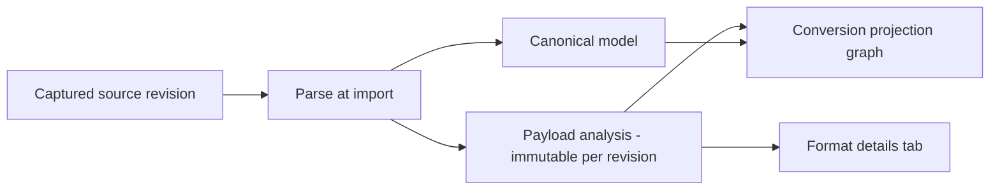

# How do I… read a catalog item's format details? (X12, COBOL copybooks, statuses, redaction)

Every imported catalog item carries a **payload analysis**: a persisted, revision-scoped
record of the payload's *native* structure — X12 envelopes and segments, copybook levels
and PICTURE clauses — captured once at import time, in the format's own vocabulary. The
**Format details** tab renders that record. This page explains the status vocabulary,
what redaction withholds, exactly where the X12 and copybook inspectors' knowledge ends,
and — most importantly — how to read *absence*.

> **The two rules of reading format details:**
> 1. **An analysis describes an observed sample, not a specification.** An X12 record
>    shows what one interchange declared about itself; no implementation guide was
>    consulted and nothing was validated against one.
> 2. **Absence in the record is not absence in the source.** A construct the parser does
>    not model (a "parsing limit") may well be in your source; only a construct the
>    analyzer *models and did not observe* is genuinely absent. The capability panel at
>    the bottom of the tab states which is which.



---

## In the UI

1. Open **Control Panel → Dashboard → Catalog** and select an item. The detail page has
   eight tabs: **Overview**, **Format details**, **Source & Code**, **Provenance**,
   **Conversions**, **Lint & Score**, **Test Bench**, **Versions**.
2. Select **Format details**. The analysis is fetched only when the tab is selected —
   opening the item alone never loads (or logs access to) the native tree.
3. Use the filter box (**Filter structure…**) and the tree's arrow keys to navigate;
   select a construct to see its evidence — kind, source location, value statement, and
   warnings — below the tree. **Link to this construct** copies a shareable deep link
   (`?tab=format&node=<id>`).
4. Where the analyzer recorded a source position, the evidence offers **View source at
   line _n_** (or **Highlight _n_ characters in the source**), which opens the
   **Source & Code** tab at exactly that range.

Reading the analysis requires the `imports:view` permission, and every read is
audit-logged (`catalog.analysis.view`), as is raw-source access (`catalog.source.view`).

## The analysis record

Each analysis is **immutable for its source revision**. Re-importing the item (or an
analyzer upgrade) mints a *new* analysis with new node ids — node deep links are only
stable within one analysis, and the tab says so if a linked node is gone. The record
carries its own provenance: a `schemaVersion`, the `sha256:` hash of the exact source
analyzed, and an analyzer stamp (`edix12@1.1.0`, `cobolcopybook@1.1.0`, or the
format-agnostic `generic@1.0.0`) with tool versions, so every claim is attributable.

## Statuses

The record declares exactly one of four statuses:

| Status | UI label | Meaning |
|---|---|---|
| `available` | **Available** | The analyzer described the whole captured source within its budget. |
| `partial` | **Partial** | The analyzer described part of the source and stated which parts it could not — what is here is real, and it is not everything. |
| `unavailable` | **Unavailable** | Nothing was analysed for this revision, so there is no native structure to show. |
| `failed` | **Analyzer failed** | The analyzer ran and errored, so no native structure was recorded. |

Any status other than `available` names a **reason**, from a closed vocabulary:

| Reason code | Meaning |
|---|---|
| `not_analyzed` | The revision predates payload analysis (imported before the analyzer existed, or the analyzer has not run). Re-import to produce one. |
| `no_source_captured` | No source material was captured for this revision — there is nothing to analyse. |
| `unsupported_format` | apiome has no native analyzer for this format. A capability boundary, not a parse failure; the source itself is unaffected. |
| `bounds_exceeded` | The analyzer hit its node or depth budget. The record is real and `partial`. |
| `analyzer_failed` | The analyzer raised. The import itself still completed. |

Analyzer **warnings** ride alongside the tree with severities `info`, `warning`, and
`error`; the tab lists them and badges the nodes they attach to.

## Values and redaction

What the record carries *about values* is governed by a **value-visibility policy**,
separate from structure (structure is never redacted):

| Visibility | What a node carries |
|---|---|
| `none` | Nothing about the value — not even whether one was there. |
| `structural` | *(default)* Whether a value was present and how long it was; never what it said. |
| `full` | Observed values, truncated to the record's preview limit (120 characters). Never a default — it must be granted. |

Practical consequences:

- At the default `structural` visibility, an X12 element renders a statement like *"A
  value of 9 characters was present."* — presence and length are facts; content is not
  carried. Withheld values show a `redacted` chip and count into the **values
  withheld** badge.
- Visibility only narrows on read: requesting `full` over a record stored `structural`
  returns the structural record. A record never held values it can later reveal.
- The structure filter searches names, constructs, and source locations — **never
  observed values**.
- X12 envelope metadata (sender/receiver ids, control numbers, dates, delimiters) is
  *structure*, not payload value, and is shown at every visibility level.
- The policy source (`default`, `tenant`, `format`, or `request`) is recorded with the
  analysis.

## Bounds: when the tree is cut

Analysis is bounded by design: at most **5000 stored nodes** and **32 levels of
depth** (with a 50000-node traversal budget). A source that exceeds them is admitted
**breadth-first** — the top of the structure survives, envelopes before leaves — and the
record is stored `partial` / `bounds_exceeded` with an exact dropped-node count. The tab
says it plainly: the missing nodes are *absent from the record, not from your source*.
A bounded record can never claim to be `available`.

## The X12 inspector

For EDI X12 sources the tab renders the native hierarchy — **interchange → functional
group → transaction set → segment → element**, with composite components grouped under
their element position:

- **Envelope facts**: sender (ISA06), receiver (ISA08), date/time (ISA09/ISA10),
  acknowledgment requested (ISA14), interchange version (ISA12), usage indicator
  (Production/Test), and the **declared delimiters** (element, component, repetition,
  segment terminator) each shown with its `U+XXXX` code point.
- **Control totals**: the counts the SE, GE, and IEA trailers *declared* are shown
  beside the counts actually *observed* — an interchange that disagrees with itself can
  be seen to.
- **Element presence** distinguishes five facts: *Has a value*, *Present, empty*,
  *Withheld*, *Not present*, *Not recorded*. An element position the source wrote and
  left empty is a different fact from a position the source never wrote, and the two are
  never rendered as one.
- **Conversion scope**: the canonical model (and therefore the converted OpenAPI) is
  derived from the **first functional group's first transaction set**. Every group and
  transaction set the interchange carried is in the analysis — and only there. An
  analysis of a multi-transaction interchange states explicitly which set the conversion
  was derived from (warning `x12.canonical_projection_subset`).

**Where the X12 inspector's knowledge ends** (also stated in the capability panel):

- **No implementation-guide validation.** As the inspector itself puts it: everything
  shown is what the interchange itself declared. No 4010 or 5010 implementation guide
  was consulted, no segment or element was checked against one, and an ST03
  implementation convention reference is recorded as the sender's claim rather than as
  a verified fact. For guide-level semantics, consult your licensed X12 publications.
- **HL loops** are described as the segments they are, not as the hierarchy they encode.
- **TA1 acknowledgements** are removed by the parser before analysis runs, and the
  trailer segments (SE/GE/IEA) are recorded as control totals, not tree nodes.
- A repetition separator only exists where the interchange version defines one (ISA11
  at `00501` and later — never at `00401`).

## The COBOL copybook inspector

For copybook sources the tab renders the record layout — **record → group → field →
88-level condition** — plus a byte-accurate **storage map**:

- Each item shows its level number, PICTURE, USAGE (`COMP-3`, binary, display…), byte
  offset range, computed length, sign and decimal-place notes, and OCCURS bounds.
- **Variable-length tables** (`OCCURS … DEPENDING ON`) name their controller; an item
  *after* a variable table has a range of offsets rather than an offset, and carries
  none — a minimum presented as the offset would be worse than no answer.
- **REDEFINES is parsed and shown**: the **Shared storage (REDEFINES)** section lists
  each base item and the items that describe its bytes again, and warns when a
  redefining item needs more storage than its target (both lengths shown as computed;
  neither adjusted to fit).
- **88-level conditions** are listed with their values on the field they belong to.
- **Byte counts are conditional, not observed.** Offsets and lengths are computed from
  PICTURE and USAGE under assumptions the copybook does not state — a single-byte
  encoding, packed decimal at two digits per byte plus a sign nibble, the common binary
  width table, an overpunched sign, no SYNCHRONIZED slack. Every record names its
  assumptions in **What these byte counts assume**.
- **A copybook is a record layout, not data**: the analyzer observes no runtime values
  at any policy level. "No value here" is the absence of data to observe, not a
  redaction.

**Where the copybook inspector's knowledge ends**:

- **Level-66 `RENAMES`** and **`COPY … REPLACING`** are not read by the parser. They are
  detected by scanning the source, and each one found makes the record `partial` with a
  stated reason — a partial layout is never presented as a complete one.
- `VALUE` clauses, `SIGN`/`SYNCHRONIZED` clause semantics, and character-encoding
  detection are likewise declared unsupported rather than guessed at.
- An item whose PICTURE cannot be sized has no length, and nothing after it has an
  offset.

## What absence means: the capability panel

At the bottom of the tab, the **"_Format_ — what apiome records"** panel is the honest
boundary statement for the item's format: its structure/source-location/value facets,
the constructs it **models** ("if one of these is absent from an analysis, the source
did not contain it") versus **Not modelled (parsing limits)** ("their absence says
nothing about the source, which may well contain them"), its numeric budgets, and its
reviewed boundary notes. X12 and COBOL copybook entries are hand-reviewed; other
formats derive their entry from their adapter.

When a detail is missing, the panel names one of eight causes rather than letting you
guess:

| Category | UI label | What it tells you |
|---|---|---|
| `source_missing` | **Source not captured** | No source material was captured for this revision. |
| `not_analyzed` | **Not analysed yet** | The revision has not been analysed — nothing is known either way. |
| `format_unsupported` | **Format not analysed** | apiome has no native analyzer for this format. |
| `parse_limit` | **Parser limit** | apiome's analyzer does not describe this construct; the source may well contain it. |
| `analyzer_failed` | **Analysis failed** | The analyzer failed on this revision; the import completed. |
| `value_redacted` | **Value withheld** | The structure is known; the value is withheld by policy. |
| `absent_in_source` | **Not in the source** | The analyzer models this construct and did not observe it — a statement about the source. |
| `undeclared` | **No statement** | The registry makes no claim about this construct — its absence means nothing either way. |

Only `absent_in_source` is a statement about your source's content. Everything else is a
statement about what apiome recorded.

## With the REST API

```http
GET /v1/catalog/{tenant}/{item_id}/analysis?valueVisibility=structural&maxNodes=500&maxDepth=8
X-API-Key: <key with imports:view>
```

The response is the full analysis document (`status`, `statusReason`, `sourceHash`,
`analyzer`, `capabilities`, `tree`, `metrics`, `warnings`, `redaction`). `maxNodes`
(1–5000) and `maxDepth` (1–32) bound the read lazily — a read-bounded tree reports
itself `partial` / `bounds_exceeded` with the drop count, exactly like a write-bounded
one. `valueVisibility` can only narrow what the record stored.

| Purpose | Route |
|---|---|
| Analysis summary (embedded in the item detail) | `GET /v1/catalog/{tenant}/{item_id}` |
| Full payload analysis | `GET /v1/catalog/{tenant}/{item_id}/analysis` |
| Raw captured source | `GET /v1/catalog/{tenant}/{item_id}/source` |
| Capability registry, all formats | `GET /v1/import/format-capabilities` |
| Capability registry, one format | `GET /v1/import/format-capabilities/{format_key}` |

## Verify

- **UI:** import the X12 or copybook sample from the import wizard, open the item,
  select **Format details**, and confirm the status badge, the analyzer stamp, and — for
  X12 — the conformance note that no implementation guide was consulted.
- **REST:** `GET …/analysis` and check `status`, `metrics.nodeCount`, and
  `redaction.valueVisibility` match what the tab shows.

## Related

- [convert-to-openapi.md](convert-to-openapi.md) — the projection graph this analysis feeds
- [import-a-spec.md](import-a-spec.md) — getting a payload into the catalog
- [export-fidelity.md](export-fidelity.md) — the export-side twin of this evidence model

### Authoritative format references

- [EDI X12 message hierarchy](https://docs.oracle.com/en/cloud/paas/application-integration/integration-b2b/edi-x12.html)
  (Oracle) — interchange → functional group → transaction set → segments/elements.
- [Enterprise COBOL for z/OS Language Reference](https://www.ibm.com/docs/en/SS6SG3_6.5/pdf/lrmvs.pdf)
  (IBM) — data-description levels, PICTURE, OCCURS, REDEFINES, USAGE semantics.
- [OCCURS DEPENDING ON](https://www.ibm.com/docs/en/cobol-zos/6.4.0?topic=clause-occurs-depending)
  (IBM) — variable-length table requirements and limitations.
- [COBOL copybooks](https://www.ibm.com/docs/en/cobol-zos/latest?topic=programs-copybook)
  (IBM) — what a copybook is and how programs use it.
