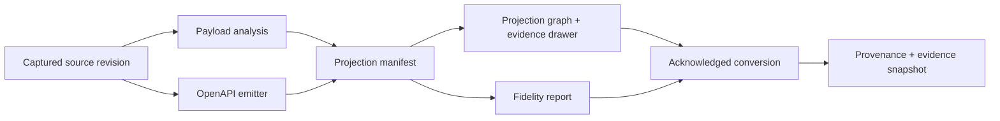

# How do I… convert a catalog item to OpenAPI? (projection graph, reason codes, evidence history)

Converting a catalog item to an OpenAPI project is an **evidence-first** operation:
before anything is created, apiome computes a deterministic **projection manifest** —
which source construct becomes which OpenAPI construct, and *why anything does not* —
and renders it as a graph, a fidelity report, and an evidence drawer. Approving the
conversion freezes that evidence into the item's history. This page is the walkthrough
plus the reference for the graph legend, status and reason vocabulary, safe defaults,
and historical-versus-fresh evidence.

> **Rule of thumb:** `dropped` means "this construct exists in the source and is not in
> the OpenAPI document". It never means "the source lacked it" (`not-applicable`) and
> never means "apiome couldn't tell" (`unavailable`). The legend keeps those three
> apart — read it before judging a conversion.



---

## Walkthrough: in the UI

1. Open **Control Panel → Dashboard → Catalog**, select the item, and open the
   **Convert** preview (dialog title **Convert to OpenAPI Project — _item_**). Nothing
   is created until you convert.
2. The header shows the **fidelity score** (`Fidelity n/100`), tier pill, and a banner.
   Every preview carries the same caution: *"The fidelity of the original API may not be
   complete enough to create a fully defined OpenAPI Specification — review the gaps
   below before converting."*
3. The dialog has three tabs — **Summary**, **Projection graph**, **Conversion**:
   - **Summary** lists *What the source provides* and *What OpenAPI favors but is
     missing*, with coverage badges (`from source`, `inferred`, `partial`, `missing`,
     `no OpenAPI form`).
   - **Projection graph** is the per-construct evidence (next section).
   - **Conversion** holds the target project settings.
4. **Select any graph node or table row** to open the evidence drawer; use the safe
   defaults it offers (**Apply & recompute**) to close cheap gaps.
5. Tick the acknowledgement if the tier requires it, then **Convert** — or **Cancel**,
   which persists nothing.

## The projection graph

The graph shows three lanes — **In the OpenAPI document**, **Omitted from OpenAPI**, and
**Unavailable or not applicable** — from source/native construct to OpenAPI outcome. The
**table below it is the accessible source of truth**: every graph node has one row with
the same status, construct, landing location, scope, and reason, and both are rendered
from the same server manifest, so their counts always agree.

The legend (status is always readable without color — label plus symbol, distinct dash
patterns on edges):

| Status | UI label | Symbol | Meaning |
|---|---|---|---|
| `retained` | **Retained** | `✓` | Carried onto OpenAPI faithfully. |
| `transformed` | **Transformed** | `⇄` | Carried, partly faithful and partly derived. |
| `inferred` | **Inferred** | `∴` | Emitted, but derived rather than read from the source (e.g. a placeholder version). |
| `dropped` | **Dropped** | `×` | In the source; not in the emitted OpenAPI document. |
| `unavailable` | **Unavailable** | `⊘` | apiome cannot determine the construct's fate (analysis was missing, bounded, or failed). |
| `not-applicable` | **Not applicable** | `—` | The source has no such construct — nothing was lost. |

Every row also carries a **scope** — `checklist` (a fidelity-checklist item),
`construct` (an emitted-document construct), `loss` (a recorded loss), or `analysis`
(what the payload analysis could or could not contribute) — and a severity (`info`,
`warn`, `critical`).

Graph mechanics worth knowing:

- **Zoom / reset / keyboard**: scroll to pan, arrow keys move between constructs, Enter
  selects, Escape resets the view.
- **Copy Mermaid** copies (and the download button saves) the graph as sanitized
  Mermaid flowchart text (`conversion-projection.mmd`) — handy for design docs and
  reviews.
- **Aggregation is honesty-preserving**: clean rows may collapse into expandable
  aggregate rows to keep the graph readable, but `dropped`, `unavailable`, and
  `inferred` evidence is **never** aggregated away.
- **Bounds are stated, worst-first**: very large manifests are bounded (construct and
  analysis edges have server-side limits, worst outcomes admitted first) and the graph
  says how many edges were left out. Checklist and loss evidence is never bounded.
- The **snapshot chip** (`snapshot <hash>`) names the manifest hash; the graph warns if
  the report and graph describe different snapshots (the source changed mid-preview).

The manifest is **deterministic**: the same source revision, defaults, and tool
versions produce a byte-identical manifest and hash — what the API and CLI return is
what the UI draws.

## Reason codes: why, and what to do

Every status except `retained` carries exactly one reason code. The drawer shows the
reason's category label, its explanation, and a remediation. The wording is reviewed so
an OpenAPI limit is never blamed for an apiome-side gap (and vice versa):

| Reason code | Category label | What to do |
|---|---|---|
| `destination_unsupported` | **Format limit** | OpenAPI has no equivalent construct; keep the source artifact as the system of record for this detail. |
| `emitter_unsupported` | **Emitter gap** | apiome's converter does not yet place this construct in the OpenAPI document; the source detail is intact and a later converter version can carry it. |
| `source_incomplete` | **Source incomplete** | Supply the missing detail — re-convert with `--title` / `--api-version` / `--server`, or complete the source artifact and re-import it. |
| `source_parse_limit` | **Source incomplete** (parser limit) | apiome's analyzer could not fully read this from the source; the source data itself may be intact. Re-import once analyzer support lands. |
| `option_excluded` | **Excluded by option** | A conversion option excluded this construct; change the option and preview again. |
| `security_redacted` | **Redacted** | A redaction policy withheld this construct; adjust the policy if it should be converted. |
| `target_tool_unavailable` | **Toolchain unavailable** | The toolchain this conversion path needs is unavailable; install or enable it and re-convert. |
| `not_applicable` | **Not applicable** | No action needed — the source has no such construct. |

The `analysis`-scope lane is where parser honesty lives: when the payload analysis was
missing, bounded, or failed, those rows are `unavailable` with `source_incomplete` or
`source_parse_limit` — a parser limit is surfaced as *unknown*, never claimed as a
conversion drop. (See
[catalog-format-details.md](catalog-format-details.md) for what each format's analyzer
can and cannot read.)

## The evidence drawer

Selecting a node or row shows, for that construct: the status chip and severity, the
reason category and raw reason code, the related **fidelity finding** (checklist or
loss), the **canonical object**, the source path/range (**From the source**), the target
JSON Pointer (**In the OpenAPI document**), further evidence references
(file:line/offset), the remediation (**What you can do**), and the provenance line —
which tool versions produced the evidence, under which snapshot hash.

## Safe defaults: title, version, servers

Exactly three gaps can be closed from the preview — **API title**, **API version**, and
**server URLs**. Each fills its OpenAPI location (`/info/title`, `/info/version`,
`/servers`) **only where the source left it empty** — a default never overwrites a
source-declared value, and no other default exists.

Applying recomputes the fidelity report and the graph **together** and re-asks for
acknowledgement, so what you accept is always the recomputed state. Defaults are
normalized into the snapshot hash (a blank default is the same snapshot as no default),
and the same values can be supplied in the CLI, so the manifest is reproducible.

## Severity and the acknowledgement

| Fidelity tier | Banner | Acknowledgement |
|---|---|---|
| `high` | High fidelity — a near-lossless conversion | Optional confirmation. |
| `medium` | Partial fidelity — some constructs had to be inferred | Optional confirmation. |
| `low` | Low fidelity — this conversion will be substantially incomplete | **Required** — Convert stays disabled until you tick *"I understand the converted spec will be incomplete and want to convert anyway."* |

Recomputing (changed defaults, changed source) always resets the acknowledgement.
**Cancel produces no persisted conversion state** — no project, no history entry.

## Historical evidence vs a fresh preview

The item's **Conversions** tab lists every conversion, newest first, each with the exact
evidence it was approved with:

- Selecting an entry replays its graph **from the stored snapshot — it is never
  rebuilt**, so what you see is what was approved: *"Historic evidence captured
  \<date\> · snapshot \<hash\>. This is the evidence this conversion was approved
  with."*
- If the item's captured source has changed since, the entry is badged **Source changed
  since** and the panel says so: *"The source has changed since this conversion was
  approved. Open the Convert preview to compute fresh evidence."* Historical evidence is
  never silently passed off as current.
- A conversion that predates stored snapshots (or whose snapshot is missing or no
  longer readable) degrades safely: the recorded fidelity grade and tool versions
  remain authoritative, and the panel states that the graph cannot be replayed.
- The converted project's **Versions** page shows the same history from the project's
  side, linking each project revision back to the conversion that created it.

Snapshots are content-addressed and write-once; a snapshot referenced by any conversion
is never purged.

## With the CLI

```bash
# 1. Preview only — no project is created; the full manifest JSON goes to a file (or - for stdout):
apiome convert my-x12-item --to openapi --dry-run --projection-out manifest.json

# 2. Close the cheap gaps the graph showed, exactly like the UI's safe defaults:
apiome convert my-x12-item --to openapi \
  --title "Claims API" --api-version 1.0.0 --server https://api.example.com \
  --projection-out manifest.json

# 3. Convert. A low-fidelity conversion exits non-zero unless you --force:
apiome convert my-x12-item --to openapi --out openapi.yaml --force
```

The manifest JSON contains the same nodes, edges, statuses, reasons, and
`manifest_hash` the UI renders — same source revision and defaults, same bytes.

## With the REST API

| Purpose | Route |
|---|---|
| Convert, or dry-run preview | `POST /v1/catalog/{tenant}/{item_id}/convert?dryRun=true` |
| Projection manifest, cursor-paginated (read-only despite POST) | `POST /v1/catalog/{tenant}/{item_id}/projection` |
| Conversion history | `GET /v1/catalog/{tenant}/{item_id}/conversions` |
| Historical evidence page | `GET /v1/catalog/{tenant}/{item_id}/conversions/{provenance_id}/evidence` |
| Project-side history | `GET /v1/projects/{tenant}/{project_id}/conversions` |

All routes require `imports:view` for the evidence surfaces; item lookups are
tenant-scoped.

## Verify

- **UI:** run a dry-run preview on a multi-transaction X12 item and confirm the graph's
  legend counts equal the table's rows, and that the extra transaction sets appear as
  evidence rather than silently vanishing.
- **CLI:** `apiome convert … --dry-run --projection-out -` twice; the `manifest_hash`
  is identical both times.
- **History:** convert, then open **Conversions** and confirm the replayed graph carries
  the snapshot hash you approved.

## Related

- [catalog-format-details.md](catalog-format-details.md) — the payload analysis feeding the graph's `analysis` lane
- [export-fidelity.md](export-fidelity.md) — the export-side projection map (shared status vocabulary)
- [import-a-spec.md](import-a-spec.md) — getting the source into the catalog
- [`apiome-cli/README.md`](../../apiome-cli/README.md) — full `convert` flag reference
- [OpenAPI Specification](https://spec.openapis.org/oas/latest.html) — the conversion target
